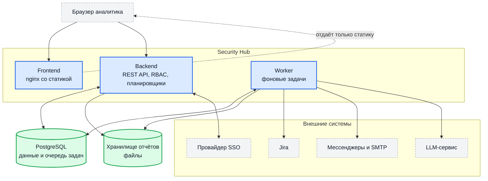
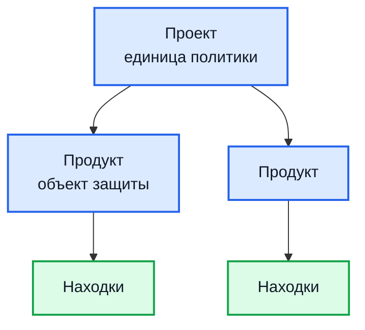

# Архитектура

Страница описывает, из чего состоит решение целиком, как компоненты связаны
между собой и какие из них обязательны. Расчёт мощности вынесен в
[Расчёт ресурсов](sizing.md), поведение при отказах — в
[Отказоустойчивость](ha.md).

## Общая схема

Ключевое свойство: **очередь фоновых задач живёт в той же PostgreSQL**.
Отдельного брокера сообщений решение не требует — ни Redis, ни RabbitMQ, ни
Kafka. Это сокращает список того, что нужно разворачивать и поддерживать, но
означает, что база данных — единственная точка, потеря которой
останавливает всё.

## Состав компонентов

### Обязательные

| Компонент | Что делает | Технология | Порт |
| --- | --- | --- | --- |
| `backend` | REST API, разграничение доступа, приём отчётов, периодические планировщики | Go, Gin | `8080` в коде, `8082` в чарте |
| `worker` | Фоновые задачи: разбор отчётов, задачи в Jira, уведомления, AI-триаж, очистка | Go | — |
| `frontend` | Веб-интерфейс: отдача собранной статики | React, TypeScript, nginx | `3000` |
| `postgres` | Данные и очередь задач | PostgreSQL 15 | `5432` |

Backend и worker собираются из одной кодовой базы и читают одни и те же
переменные окружения. Различия такие:

- **backend** дополнительно обслуживает HTTP и запускает периодические
  планировщики;
- **worker** занимается только фоновыми задачами.

При этом **обработчик очереди работает в обоих процессах**: backend не просто
ставит задачи, он и сам их выполняет. Практическое следствие — установка без
отдельного worker формально работоспособна: отчёты разбираются, уведомления
уходят. Отдельный worker нужен, чтобы фоновая нагрузка не конкурировала с
обслуживанием запросов и масштабировалась независимо; для любой установки
сверх ознакомительной он рекомендуется.

Обратная сторона: параметры параллелизма очередей действуют **в каждом**
процессе. Если не хотите, чтобы backend брал на себя тяжёлые задачи, задайте
ему нулевое или малое значение соответствующей переменной — так, например,
поступают с разбором находок языковой моделью (`LLM_WORKERS=0` в backend).

### Опциональные

| Компонент | Когда нужен |
| --- | --- |
| Провайдер SSO | Если вход не по локальным учётным записям. Может быть внешним — своего разворачивать не обязательно |
| `DomainScope` + собственная PostgreSQL | Обследование внешнего периметра. Базу с Hub не разделяет |
| OpenVAS | Проверка известных уязвимостей по узлам, найденным DomainScope |
| OWASP ZAP | Активная проверка веб-приложений |
| Сканер конфигураций инфраструктуры | Проверка репозиториев с описанием инфраструктуры |
| Grafana | Просмотр метрик |
| LLM-сервис | Разбор находок языковой моделью. Внешний или развёрнутый у вас |

## Как устроены проекты и продукты

Прежде чем разворачивать, стоит понять модель — от неё зависят и права
доступа, и дедупликация, и настройки интеграций.

**Проект** — уровень, на котором задаются правила. У проекта свои:

- сроки устранения по критичности;
- настройки Jira;
- каналы уведомлений — Mattermost, MAX, почта, плагины;
- периметр сканирования;
- владелец и права доступа;
- источник описаний инфраструктуры для проверки конфигураций.

**Продукт** — то, что защищаем: репозиторий, сервис, группа узлов. У продукта
свои адрес репозитория, ветка по умолчанию, метки и — главное — **находки и
загруженные отчёты**.

Что из этого следует на практике:

| Вопрос | Ответ |
| --- | --- |
| Где живут находки | В продукте |
| В каких границах работает дедупликация | В пределах **одного продукта** |
| Где задаются сроки и интеграции | В проекте — сразу для всех его продуктов |
| Куда загружаются отчёты | В конкретный продукт |
| На каком уровне выдаются права | На проект — тогда действует на все его продукты — либо на отдельный продукт |

Главное следствие для планирования: **один объект защиты должен быть одним
продуктом**. Если тот же узел или репозиторий заведён в двух продуктах, вы
получите две независимые находки с двумя жизненными циклами. Подробнее:
[Жизненный цикл находки](findings.md#дедупликация).

Разумная отправная точка — проект на команду или направление, продукт на
репозиторий или сервис.

## Разделение по слоям

### Приём и хранение

Отчёт приходит на backend, сохраняется в файловое хранилище (`STORAGE_PATH`),
и в базе создаётся запись отчёта в состоянии «ожидает». Разбор в тот же
HTTP-запрос не выполняется: backend ставит задачу в очередь и отвечает
`202 Accepted`.

Файлы отчётов и база — два независимых состояния, и оба нужно резервировать.
Файлы удаляются по срокам хранения (`CLEANUP_RETENTION_*`), а файлы без
записи в базе — как «осиротевшие», по истечении заданного числа часов.

### Очередь задач

Очередь реализована поверх PostgreSQL. Задачи разложены по именованным
очередям со своей степенью параллелизма:

| Очередь | Назначение | Воркеров по умолчанию |
| --- | --- | --- |
| по умолчанию | Диспетчер событий | 10 |
| `sarif_processing` | Разбор загруженных отчётов | 4 |
| `report_cleanup` | Удаление отчётов по сроку хранения | 1 |
| `mattermost_notifications` | Уведомления в Mattermost | 10 |
| `maxru_notifications` | Уведомления в MAX | 5 |
| `email_notifications` | Уведомления по электронной почте | 5 |
| `finding_copy` | Копирование находок между продуктами | 4 |
| `dual_verify` | Перепроверка находки вторым источником | 2 |
| `llm_analysis` | Разбор языковой моделью | 5 |
| `finding_enrichment` | Обогащение находок плагинами | 3 — на единицу меньше предела одновременных запусков одного плагина |
| `plugin_finding_source_sync` | Опрос внешних источников находок плагинами | 4 |

Очередей `jira_sync` и `jira_reverse_sync` больше нет: заведение задач
переехало в плагин (0.33). `telegram_notifications` тоже удалена — доставку
ведёт плагин, а очередь осталась без исполнителя и выглядела рычагом
нагрузки, не будучи им.

Разбор отчётов вынесен из очереди по умолчанию в свою: он делил её с
рассылкой уведомлений, поэтому его параллелизм настраивали переменной,
названной про другое. Один отчёт на 2400 находок при десяти параллельных
заданиях давал 326 МиБ пиковой памяти.

Три последние очереди создаются только тогда, когда соответствующая
возможность включена. Все значения меняются переменными окружения — см.
[Hub — backend и worker](env-hub.md).

### Периодические задачи

Планировщики запускаются **только в процессе backend** и ставят задачи в
очередь. Исполнить задачу может любой процесс, читающий очередь, — и worker, и
сам backend.

Отсюда следствие для эксплуатации: остановка backend прекращает не только
обслуживание запросов, но и **постановку** всех периодических задач. Остановка
worker обработку не прекращает — она продолжится силами backend, конкурируя с
обслуживанием запросов.

| Планировщик | Что делает |
| --- | --- |
| Проверка сроков | Ежечасно ищет находки с истекающим и нарушенным сроком |
| Возврат принятых рисков | Возвращает на пересмотр находки, у которых истёк срок принятия риска или ожидания |
| Очистка отчётов | Удаляет отчёты и файлы по срокам хранения |
| Очистка токенов обновления | Удаляет просроченные токены |
| Синхронизация периметра | Обмен данными периметра с внешним инвентарём |
| Опрос источников-плагинов | Периодический сбор данных плагинами-источниками |
| Обратная синхронизация Jira | Опрос Jira на предмет закрытых задач |
| Перепроверка вторым источником | Постановка кандидатов на повторную проверку |
| Проверка лицензии | Периодическое обращение к серверу лицензий, если он задан |

### Доступ и разграничение прав

Вход возможен в двух режимах, задаётся `AUTH_MODE`:

- **`SSO`** (по умолчанию) — вход через внешний провайдер по протоколу OIDC.
  Одновременно можно подключить несколько провайдеров: на странице входа
  появится по кнопке на каждый.
- **`LOCAL`** — локальные учётные записи с паролем. Первый администратор
  создаётся при старте из `LOCAL_ADMIN_PASSWORD`.

После успешного входа Hub выдаёт **собственный** токен доступа — токен
провайдера дальше не используется:

| Токен | Где хранится | Срок по умолчанию |
| --- | --- | --- |
| Доступа | В памяти вкладки браузера | 15 минут |
| Обновления | Cookie `HttpOnly`, ограниченная путём `/api/v1/auth` | 7 суток |

Токен обновления одноразовый: при каждом обновлении выдаётся новый, старый
отзывается. Предусмотрено короткое окно совместимости, чтобы несколько
вкладок не выбивали друг друга. Выход из системы отзывает все токены
обновления пользователя.

Права проверяются на двух уровнях: роль пользователя (`admin`, `user`,
`viewer`) и принадлежность ресурса — проекта или продукта. Отдельно
существуют **сервисные учётные записи** для систем сборки и внешних
сканеров: они работают по ключу в заголовке `X-API-Key`, а набор их
разрешений выбирается из фиксированного списка (загрузка отчётов, чтение
находок, управление периметром и другие).

### Плагины

Плагины исполняются **в отдельном процессе**, а не внутри backend. Общение с
внешним миром идёт через фиксированный набор обращений к среде исполнения:
выполнить HTTP-запрос, получить секрет, получить секрет проекта, записать
сообщение в журнал. Адреса, к которым разрешено обращаться, ограничены
списком; по умолчанию запрещены обращения к локальным и внутренним адресам.

Плагины распространяются как артефакты реестра образов с подписью;
устанавливаются и включаются через административный раздел интерфейса.
Подробнее: [Плагины](plugins.md).

## Потоки данных наружу

Все исходящие обращения выполняет worker или backend — у браузера прямого
доступа к внешним системам нет.

| Куда | Зачем | Инициатор |
| --- | --- | --- |
| Провайдер SSO | Получение метаданных, обмен кода на токен, ключи проверки подписи | backend |
| Jira | Создание и обновление задач, опрос статусов | worker |
| Telegram, MAX, Mattermost, SMTP | Уведомления | worker |
| LLM-сервис | Разбор находок | worker |
| NetBox | Синхронизация периметра | backend |
| Реестр плагинов | Установка и обновление плагинов | backend |
| Сервер лицензий | Периодическая проверка, если адрес задан | backend |

Обращения к Jira, реестру плагинов и из плагинов защищены от подделки
запросов на стороне сервера: по умолчанию запрещены схема `http` и обращения
к локальным и внутренним адресам, есть списки разрешённых узлов. В
промышленном режиме (`APP_ENV=production`) адреса, по которым передаются
секреты, обязаны использовать `https` — иначе запуск прерывается.

## Хранение времени

Все отметки времени хранятся и передаются в UTC; преобразование в местное
время выполняется только при отображении. Колонки с временем используют тип
с часовым поясом, сессия базы данных работает в UTC.

## Версионирование

Компоненты Hub собираются из одной кодовой базы с общей версией вида
`X.Y.СБОРКА+КОММИТ`, например `0.30.20260702093200+a1b2c3d`:

- `X.Y` — мажорная и минорная части, общие для всех компонентов;
- `СБОРКА` — отметка времени сборки в UTC;
- `КОММИТ` — короткий идентификатор ревизии.

Версия видна в нижней части интерфейса, в стартовой записи журнала и по
адресу `/version`. Интерфейс сравнивает свою версию `X.Y` с версией backend и
предупреждает при расхождении. DomainScope версионируется независимо.

Подробнее об обновлении: [Обновления](upgrades.md).
