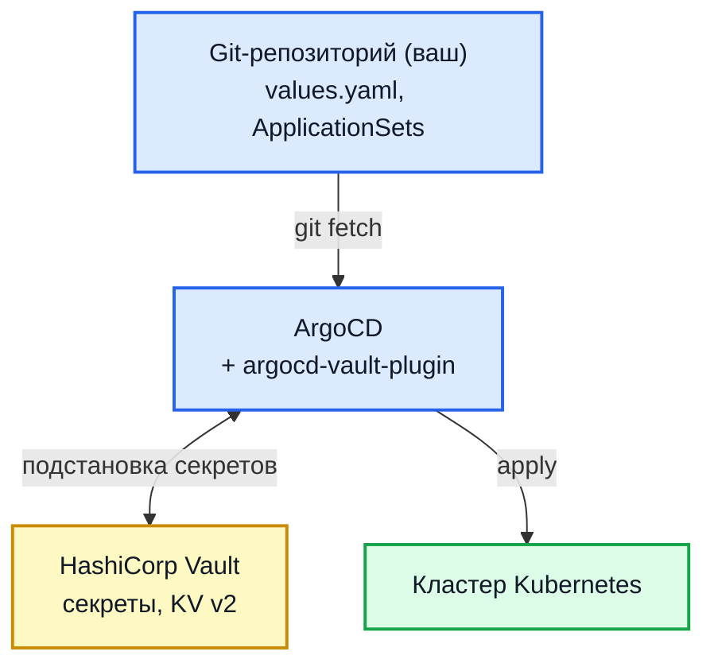

# Развёртывание в Kubernetes

Production-сценарий через Helm-чарты. Поддерживает single-node k3s и multi-node k8s.

> Поставка — Helm-чарт `hub-platform` (umbrella) с готовыми образами Hub. Сборка из исходников не предполагается.

## Что входит

Umbrella-чарт `hub-platform` собирает следующие subcharts:

| Чарт                | Что деплоит                                               |
| ------------------- | --------------------------------------------------------- |
| `security-scan-hub` | Hub backend + worker + frontend + PostgreSQL              |
| `domainscope`       | DomainScope daemon + PostgreSQL (опц. WireGuard sidecar)  |
| `openvas` (опц.)    | Greenbone Community Edition (gvmd/gsad/ospd/pg-gvm/redis) |
| `owasp-zap` (опц.)  | OWASP ZAP daemon (StatefulSet с PVC)                      |
| `netbox` (опц.)     | NetBox IPAM/DCIM                                          |

Дополнительно (вне umbrella): `sshub-atlassian-secrets-scanner` — CronJob для сканирования секретов в Jira/Confluence.

!!! warning "Сканерам с PVC нужен `fsGroup`"

    OWASP ZAP работает под uid/gid `1000` и хранит сессии на томе. Без `fsGroup`
    том у обычного CSI приезжает как `root:root`, и под уходит в
    `CrashLoopBackOff` с «The home path is not writable». Чарт задаёт нужный
    `podSecurityContext` сам — не вычищайте его при переопределении значений.
    На k3s (`local-path`, права `0777`) поломка не воспроизводится, поэтому
    проверка на нём такой дефект не ловит. Подробнее:
    [Сканеры](env-scanners.md#owasp-zap).

## Получение чартов

Помимо стандартного `helm repo` или OCI-pull, поставка может приходить tarball'ом со всеми чартами и `values.yaml`:

```bash
tar -xzf hub-platform-charts.tar.gz -C /opt/hub-charts
cd /opt/hub-charts
```

Или через helm OCI registry:

```bash
helm pull oci://<your-registry>/securityhub/hub-platform --untar
cd hub-platform
```

## Сценарий A: всё-в-одном (рекомендуется для пилотов)

Подходит для evaluation и небольших инсталляций. Полный стек на одной VM.

### Предусловия

- Linux VM (Ubuntu 22.04+, Debian 12+, RHEL 9+, Astra Linux 1.7)
- 8 vCPU / 16 GB RAM / 60 GB disk (с OpenVAS); 4/8/30 без OpenVAS
- Root-доступ
- DNS-запись `hub.example.com` → IP вашей VM (для Let's Encrypt и UI)
- Outbound HTTPS к registry с образами

### Установка

Установите k3s (или используйте свой кластер):

```bash
curl -sfL https://get.k3s.io | sh -
sudo mkdir -p ~/.kube
sudo cp /etc/rancher/k3s/k3s.yaml ~/.kube/config
sudo chown $(id -u):$(id -g) ~/.kube/config
```

Установите helm и cert-manager:

```bash
curl -fsSL https://get.helm.sh/helm-v3.13.0-linux-amd64.tar.gz | tar -xz
sudo mv linux-amd64/helm /usr/local/bin/

helm repo add jetstack https://charts.jetstack.io
helm repo update
helm install cert-manager jetstack/cert-manager \
  --namespace cert-manager --create-namespace \
  --set installCRDs=true
```

Создайте `ClusterIssuer` для Let's Encrypt:

```yaml
# letsencrypt-issuer.yaml
apiVersion: cert-manager.io/v1
kind: ClusterIssuer
metadata:
  name: letsencrypt-prod
spec:
  acme:
    email: admin@example.com
    server: https://acme-v02.api.letsencrypt.org/directory
    privateKeySecretRef: { name: letsencrypt-prod }
    solvers:
      - http01:
          ingress: { class: traefik } # или nginx
```

```bash
kubectl apply -f letsencrypt-issuer.yaml
```

Заготовьте `values.yaml` (override поверх дефолтов):

```yaml
# values.yaml
global:
  domain: hub.example.com
  ingressClass: traefik # или nginx
  tls:
    issuer: letsencrypt-prod

securityScanHub:
  image:
    tag: "0.33"

  env:
    appEnv: production
    frontendUrl: https://hub.example.com
    allowedOrigins: https://hub.example.com
    authMode: LOCAL # или SSO

  pvc:
    postgresData:
      size: 100Gi # рассчитайте на год вперёд
    backendStorage: 10Gi
    workerStorage: 5Gi

  secrets:
    existingSecretName: hub-secrets # см. ниже

  backend:
    replicas: 2
  worker:
    replicas: 2

domainscope:
  enabled: true
  image:
    tag: "0.33"

openvas:
  enabled: false # включите если нужен CVE-scanner

owaspZap:
  enabled: false
```

Создайте секрет руками или через sealed-secrets / external-secrets:

```bash
kubectl create namespace hub
kubectl -n hub create secret generic hub-secrets \
  --from-literal=dbPassword='<strong-random>' \
  --from-literal=jwtSecret="$(openssl rand -hex 32)" \
  --from-literal=localAdminPassword='<strong-admin>' \
  --from-literal=domainscopeDbPassword='<strong-random>' \
  --from-literal=hubApiToken='<заполните после первого старта>'
```

Установка:

```bash
helm install hub /opt/hub-charts/hub-platform \
  -n hub \
  -f values.yaml
```

Hub стартует через 2-5 минут. OpenVAS дополнительно качает CVE-фиды ~10-30 минут после первого старта.

## Сценарий B: GitOps (ArgoCD + Vault)

Для боевого деплоя с git-as-source-of-truth и централизованным хранением секретов.

### Архитектура



ArgoCD читает чарт и values из вашего git, `argocd-vault-plugin` подменяет плейсхолдеры `<path:kv/data/...>` на реальные секреты из Vault, helm накатывает в кластер.

### Минимальный Application для ArgoCD

```yaml
apiVersion: argoproj.io/v1alpha1
kind: Application
metadata:
  name: hub
  namespace: argocd
spec:
  destination:
    namespace: hub
    server: https://kubernetes.default.svc
  project: default
  source:
    repoURL: <your-git-repo-with-values>
    path: hub-platform
    targetRevision: main
    helm:
      valueFiles:
        - values.yaml
  syncPolicy:
    automated: { prune: true, selfHeal: true }
    syncOptions:
      - CreateNamespace=true
```

## Сценарий C: WireGuard egress (изолированный сканинг)

Если DomainScope должен сканировать перимметр через выделенный egress IP (например, для попадания в allowlist облачных провайдеров), DomainScope ходит через WG sidecar к отдельному WG-серверу. WG-server разворачивается отдельно — поставщик может предоставить готовый скрипт.

В `values.yaml`:

```yaml
domainscope:
  wireguard:
    enabled: true
    config: |
      [Interface]
      PrivateKey = <client-priv-key>
      Address = 10.99.0.2/24

      [Peer]
      PublicKey = <server-pub-key>
      Endpoint = <wg-vps-ip>:51820
      AllowedIPs = 0.0.0.0/0
      PersistentKeepalive = 25
```

## Секреты

Минимальный набор для production:

- Hub DB password
- Hub JWT secret
- Hub local admin password
- DomainScope DB password
- DomainScope Hub API token (из Service Account Hub, см. [Загрузка отчётов внешних сканеров](integration-sarif.md))
- Keycloak client secret (если SSO)
- LLM API key (если AI-триаж)
- Учётные данные трекера задач — токен Jira, GitHub или Trello (если ведёте
  задачи; задаются в настройках плагина-провайдера, а не переменными)
- NetBox token (если sync)
- OpenVAS admin password (если CVE-scanner)
- ZAP API key (если DAST)

Все секреты — через k8s Secret (ручное создание / sealed-secrets / external-secrets / Vault+AVP).

!!! note "Секреты плагинов живут в базе, а не в k8s Secret"

    Токены каналов уведомлений и провайдеров задач задаются в настройках
    плагина — для установки целиком или отдельно для проекта — и хранятся в
    базе Hub. В переменные окружения они не выносятся.

## Метрики и непривилегированный frontend

С 0.33:

- каждый долгоживущий процесс отдаёт метрики Prometheus на **отдельном порту**
  (`METRICS_PORT`, по умолчанию `9090`). Prometheus скрейпит порт пода
  напрямую; ingress на него маршрутизировать не нужно и не следует —
  аутентификации у порта нет;
- образ `sshub-frontend` запускается от uid/gid `101`. Чарт из этой поставки
  задаёт тот же `podSecurityContext`, поэтому обновление действий не требует.
  Проверьте окружение, только если переопределяли `securityContext`
  (например, `runAsUser: 0`) или монтировали тома с расчётом на root.

## Проверка после установки

```bash
# Статус pods
kubectl -n hub get pods

# Логи backend (миграции должны прокатиться)
kubectl -n hub logs deploy/hub-backend

# Версия
curl https://hub.example.com/version

# Войти в UI
# https://hub.example.com — admin@localhost.local / <localAdminPassword>

# Swagger UI (документация API)
# https://hub.example.com/swagger/index.html
```

## Upgrade

Обновление: смените тег в значениях чарта и примените их. Подробнее — [Обновления](upgrades.md#выбор-версии).

```bash
# Обновить чарт (если поставщик прислал новую версию)
tar -xzf hub-platform-charts-new.tar.gz -C /opt/hub-charts-new

# Apply
helm upgrade hub /opt/hub-charts-new/hub-platform -n hub -f values.yaml

# Поды пересоздадутся последовательной заменой
kubectl -n hub rollout restart deploy
```

Подробнее: [Обновления](upgrades.md).


Состав компонентов и что из них обязательно — [Архитектура](architecture.md).
Значения ресурсов из чартов — [Расчёт ресурсов](sizing.md).


## Что дальше

[Первые шаги после установки](first-steps.md) — проект, продукт, ключ для
системы сборки и первый загруженный отчёт.
