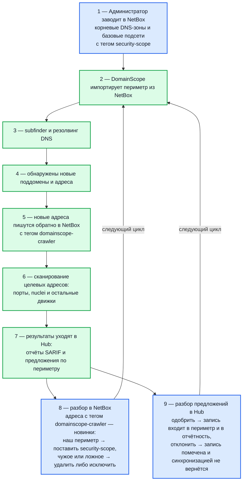

# Синхронизация с NetBox

DomainScope умеет двусторонне работать с NetBox:

- **Импорт целей** (NetBox → DomainScope): IP-адреса с указанным тегом становятся targets для сканирования
- **Экспорт обнаруженных IP** (DomainScope → NetBox): новые IP, найденные через discovery, добавляются в NetBox с тегом
- **Экспорт доменов в NetBox DNS** (опц., DomainScope → NetBox): обнаруженные домены публикуются как DNS-зоны и A/AAAA-записи в NetBox-DNS plugin

## Включение

```ini
DOMAINSCOPE_NETBOX_ENABLED=true
DOMAINSCOPE_NETBOX_API_ENDPOINT=https://netbox.example.com
DOMAINSCOPE_NETBOX_API_TOKEN=<NetBox API token, формат nbt_...>
```

После рестарта DomainScope в discovery-цикле появится этап NetBox sync.

## Импорт IP-целей (NetBox → DomainScope)

DomainScope тянет IP-адреса из NetBox по тегам и добавляет их к targets для port-scan / nuclei / openvas / tlsx.

### Конфигурация

```ini
DOMAINSCOPE_NETBOX_ENABLED=true
DOMAINSCOPE_NETBOX_API_ENDPOINT=https://netbox.example.com
DOMAINSCOPE_NETBOX_API_TOKEN=nbt_xxxxxxxxxxxx

# Фильтрация — какие IP тянуть
DOMAINSCOPE_NETBOX_TAG=security-scope             # один основной тег
DOMAINSCOPE_TRUSTED_IP_TAGS=internal,production   # доп. теги для маркировки "наших"
```

### Что попадает в targets

- Все `ipam.IPAddress` с указанным тегом
- Все `ipam.Prefix` с тегом — разворачиваются до отдельных IP
  - **Ограничение**: только сети /20 и меньше (макс 4096 IP)
  - Для большего диапазона — создайте дочерние prefix'ы с более узкими масками

### Метаданные

В БД DomainScope для каждого IP сохраняются NetBox-теги, которые потом попадают в SARIF (как `properties.netbox_tags`). В Hub их видно в карточке находка'а.

Полезно: `owner_team`, `environment`, `compliance_zone` теги в NetBox автоматически переедут в Hub.

## Экспорт обнаруженных IP (DomainScope → NetBox)

Когда DomainScope находит новый IP через subfinder + DNS, он опционально пишет его обратно в NetBox с маркер-тегом:

```ini
DOMAINSCOPE_NETBOX_CRAWLER_TAG=domainscope-crawler   # default
```

### Что записывается

- IP-address (если уже существует — обновляется description)
- Tag `domainscope-crawler` (для отличия от человеческих записей)
- `description` = «Discovered by DomainScope from <source-domain>»
- `custom_fields.discovered_at` = timestamp (если custom field существует)

### Зачем это нужно

- NetBox становится единым inventory всего перимметра — и того, что описано вручную, и того, что DomainScope нашёл
- Админ может ревьюить crawler-теги и решать: подтвердить как `security-scope` (попадёт в Hub-scope) или удалить

### Отключение экспорта

```ini
DOMAINSCOPE_NETBOX_CRAWLER_TAG=
```

Пустой тег — DomainScope не пишет в NetBox.

## Экспорт доменов в NetBox DNS (NetBox-DNS plugin)

Опционально DomainScope **публикует** обнаруженные домены в NetBox через установленный DNS-plugin (направление DomainScope → NetBox, НЕ импорт). Семантика именно экспортная: флаг включает запись discovered-доменов в NetBox как DNS-зон и записей.

```ini
DOMAINSCOPE_NETBOX_DNS_EXPORT_ENABLED=true
# Обязателен при enabled=true: FQDN nameserver для SOA MNAME.
DOMAINSCOPE_NETBOX_DNS_EXPORT_SOA_MNAME=ns1.example.com
# Опц. — имя DNS view (default "default").
DOMAINSCOPE_NETBOX_DNS_EXPORT_VIEW=default
# Опц. — email SOA RNAME (default "hostmaster.<zone>", @ конвертируется в точку).
DOMAINSCOPE_NETBOX_DNS_EXPORT_SOA_RNAME=hostmaster@example.com
```

DomainScope (операция идемпотентна — повторный вызов не плодит дубли):

- Создаёт/находит DNS view и nameserver (из `SOA_MNAME`)
- Для каждой целевой зоны создаёт/находит Zone
- Для каждого обнаруженного домена записывает A/AAAA-записи по его IP

Требования:

- `DOMAINSCOPE_NETBOX_DNS_EXPORT_ENABLED=true` требует включённой основной NetBox-интеграции (`DOMAINSCOPE_NETBOX_ENABLED=true`)
- `DOMAINSCOPE_NETBOX_DNS_EXPORT_SOA_MNAME` **обязателен** при enabled — без него конфиг не пройдёт валидацию
- NetBox-DNS plugin должен быть установлен; токен должен иметь write-permission на DNS-объекты

Если plugin не установлен или экспорт не нужен — оставьте `false` (default).

## NetBox: что админ должен подготовить

### 1. API token

NetBox UI → Profile → API Tokens → Add:

- **Description:** `domainscope-rw`
- **Permissions:** `ipam.view_ipaddress`, `ipam.add_ipaddress`, `ipam.change_ipaddress` (только если используете экспорт)
- **Allowed IPs:** IP, с которого DomainScope ходит
- **Expires:** опц. +1 год

Token будет в формате `nbt_xxxxxxxxxxxxxx`.

### 2. Теги

Создайте теги:

- `security-scope` — для IP, которые DomainScope должен сканировать
- `domainscope-crawler` — будет проставляться автоматически
- `production`, `staging`, `dmz`, и т.п. — для классификации (опц.)

### 3. Custom fields (опционально)

Чтобы DomainScope писал метаданные при экспорте, заведите custom fields на `ipam.IPAddress`:

| Имя              | Тип      | Назначение                            |
| ---------------- | -------- | ------------------------------------- |
| `discovered_at`  | DateTime | Когда найден DomainScope'ом           |
| `discovered_via` | Text     | Какой scanner / источник              |
| `last_seen`      | DateTime | Последний раз видели в perimeter scan |

## Порядок управления периметром

Типовая последовательность:



## Hub + DomainScope + NetBox: единая картина

| Слой            | Зачем                                                                     |
| --------------- | ------------------------------------------------------------------------- |
| **NetBox**      | Источник правды по инфраструктуре. Кто чем владеет, какие IP/домены живут |
| **DomainScope** | Активная разведка. Что НА САМОМ ДЕЛЕ доступно снаружи                     |
| **Hub** | Разбор находок и работа по их устранению |

Идеальная схема: NetBox = inventory, DomainScope = recon, Hub = vuln-management. Каждый слой знает только свою часть.

## Производительность

NetBox sync — лёгкая операция (тысячи объектов читаются за секунды). Запускается в составе discovery-цикла (`TIME_LOOP_DISCOVERY=21600`).

Если NetBox в той же сети — sync обычно < 5 секунд. Если NetBox в облаке через интернет — несколько десятков секунд.

## Безопасность

- **Read-only по умолчанию**: если экспорт не нужен (`DOMAINSCOPE_NETBOX_CRAWLER_TAG=""`), token может иметь только `ipam.view_*` permissions
- **IP allowlist в NetBox**: ограничьте, откуда DomainScope ходит к API

## Проверка интеграции

### 1. Проверка чтения

```bash
# Из контейнера DomainScope
docker compose exec domain-scope curl -fs \
  -H "Authorization: Token $DOMAINSCOPE_NETBOX_API_TOKEN" \
  "$DOMAINSCOPE_NETBOX_API_ENDPOINT/api/ipam/ip-addresses/?tag=security-scope" | jq '.count'
```

Должно вернуть число IP с этим тегом.

### 2. Проверка sync в логах

```bash
docker compose logs domain-scope | grep -i netbox
```

Ожидаем:

```
INFO NetBox sync starting (endpoint=https://netbox.example.com)
INFO NetBox sync: pulled 142 IP addresses, 23 prefixes
INFO NetBox sync: pushed 5 new IPs as domainscope-crawler
INFO Discovery cycle finished
```

### 3. Проверка в NetBox

После цикла зайдите в NetBox UI → IPAM → IP Addresses → filter `Tag: domainscope-crawler` — должны увидеть новые записи.

## Типовые проблемы

| Симптом                      | Что проверить                                                                               |
| ---------------------------- | ------------------------------------------------------------------------------------------- |
| `401 Unauthorized` от NetBox | Токен неверный / истёк / не имеет permission                                                |
| `403 Forbidden`              | Token имеет IP allowlist — добавьте IP DomainScope                                          |
| Sync долго (>30s)            | NetBox медленно отвечает; проверьте load на NetBox-стороне                                  |
| Crawler-теги не появляются   | `DOMAINSCOPE_NETBOX_CRAWLER_TAG` не пустой, токен имеет write-permission                    |
| Дубликаты в NetBox           | DomainScope создаёт через POST — если уже есть, обновляет. Дубль возможен если разные `vrf` |

## Связанные документы

- [Интеграция с NetBox](integration-netbox.md) — NetBox sync со стороны Hub
- [Происхождение записей периметра](domainscope-trails.md) — provenance в DomainScope
