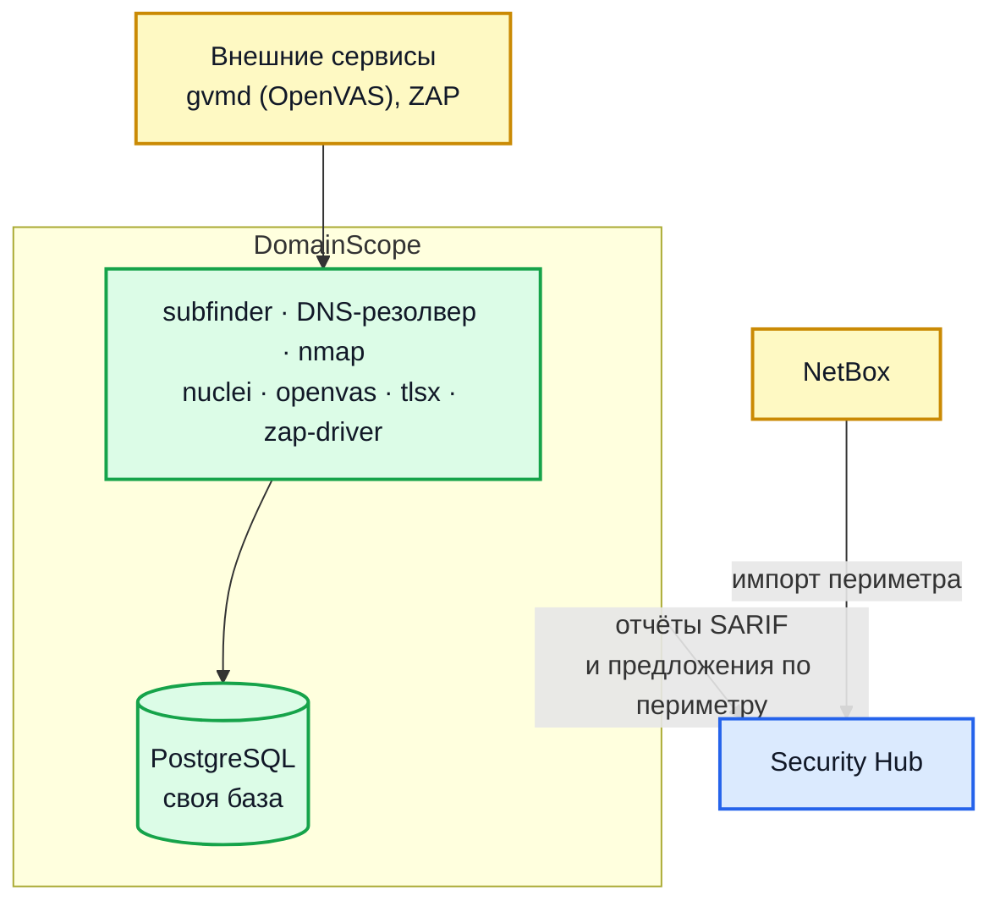

# Обзор DomainScope

**DomainScope** — отдельный сервис непрерывного мониторинга атакуемой поверхности. Собирает данные о периметре (домены, IP, открытые порты, версии сервисов, TLS-сертификаты, web-уязвимости) и отдаёт их Hub'у в формате SARIF и через scope-proposals.

## Что делает

1. **Discovery** — subfinder + DNS-резолвинг → расширяет seed-домены до полного inventory поддоменов
2. **Port scan** — nmap по обнаруженным IP, fingerprinting сервисов
3. **Nuclei HTTP** — vulnerability templates по HTTP/HTTPS эндпоинтам
4. **OpenVAS** (опц.) — CVE-сканирование (Greenbone Community Edition)
5. **TLSX** — анализ TLS-сертификатов (expiry, weak ciphers)
6. **OWASP ZAP** (опц.) — активный DAST против найденных web-приложений
7. **NetBox sync** — импорт scope из NetBox IPAM, экспорт обнаруженных IP

## Интеграция с Hub



### Два потока данных

**1. SARIF reports (DomainScope → Hub):**

DomainScope формирует SARIF из результатов каждого цикла сканирования (nuclei, openvas, tlsx и др.) и шлёт в Hub стандартным upload эндпоинтом (см. [Загрузка отчётов внешних сканеров](integration-sarif.md)):

```
POST https://hub.example.com/api/v1/products/<product_id>/reports
X-API-Key: <ключ сервисной учётной записи>
```

DomainScope использует тот же механизм, что и любой внешний сканер. Hub относится к нему как к обычному SARIF-источнику.

**2. Scope proposals (DomainScope → Hub):**

Когда DomainScope находит новый домен или IP (не в текущем scope проекта), он шлёт proposal — тело запроса всегда массив, до 100 элементов:

```
POST https://hub.example.com/api/v1/projects/<project_id>/scope/proposals
X-API-Key: <ключ сервисной учётной записи>

[
  {
    "entry_type": "domain",
    "value": "new.example.com",
    "scanner_name": "domainscope",
    "source_domain": "example.com",
    "source_ip": "1.2.3.4"
  }
]
```

В Hub UI админ видит proposal'ы, подтверждает (добавляет в scope) или отклоняет.

Помимо этих двух потоков DomainScope шлёт в Hub инвентарь обнаруженных пар домен ↔ IP и отчёт о доменах, переставших резолвиться, а периметр для сканирования забирает из Hub. Полный процесс связки — [Связка DomainScope и Hub](perimeter-integration.md).

!!! warning "Заголовок `Authorization: Bearer` для сервисных учётных записей не работает"
    Он проверяется как JWT, и ключ вида `sa_...` будет отклонён с кодом `401`.

## Связь конфигов

| В DomainScope                  | Что хранит                 | В Hub                    |
| ------------------------------ | -------------------------- | ------------------------ |
| `DOMAINSCOPE_HUB_API_ENDPOINT` | URL Hub                    | —                        |
| `DOMAINSCOPE_HUB_API_TOKEN`    | API key из Service Account | Service Account в Hub UI |
| `DOMAINSCOPE_HUB_PROJECT_IDS`  | UUID проекта в Hub (список принимается, но используется только первый — один воркер обслуживает один проект) | Project ID |
| `DOMAINSCOPE_SARIF_PRODUCT_ID` | UUID продукта (default)    | Product в проекте        |
| `DOMAINSCOPE_SARIF_API_TOKEN`  | API key                    | тот же SA или отдельный  |

Часто разные сканеры (nuclei/openvas/tlsx) шлются в **разные products** одного проекта — чтобы аналитик мог фильтровать по типу сканера. Тогда задаются override-переменные:

```ini
DOMAINSCOPE_NUCLEI_SARIF_PRODUCT_ID=<product-nuclei>
DOMAINSCOPE_OPENVAS_SARIF_PRODUCT_ID=<product-openvas>
DOMAINSCOPE_TLSX_SARIF_PRODUCT_ID=<product-tlsx>
DOMAINSCOPE_ZAP_SARIF_PRODUCT_ID=<product-zap>
```

## Компоненты сервиса

| Сервис                  | Назначение                    | Где                     |
| ----------------------- | ----------------------------- | ----------------------- |
| `domain-scope` (daemon) | Основной runner всех циклов   | Docker / systemd        |
| `postgresql`            | Своя БД (отдельная от Hub!)   | 5432 внутри сети compose; наружу не публикуется |
| `nuclei-templates-init` | Клонирует/обновляет templates | One-shot init           |
| `openvas` (опц.)        | Внешний сервис, gvmd на :9390 | Отдельный compose / k8s |
| `zap` (опц.)            | OWASP ZAP daemon              | Отдельный compose / k8s |

## БД и схемы данных

DomainScope имеет собственную БД `domainscope`. Не общая с Hub.

Ключевые таблицы:

| Таблица                   | Содержит                                                                     |
| ------------------------- | ---------------------------------------------------------------------------- |
| `domains`                 | Все известные домены с провенансом (source, parent, root, status)            |
| `domain_ips`              | История связей домен ↔ IP (используется при построении цепочек обнаружения)  |
| `ip_data`                 | IP-адреса: открытые порты и данные о владельце (организация, ASN, ISP, страна) |
| `findings`                | Результаты сканирования портов: `(ip, port, transport, protocol)` с временем первого и последнего наблюдения |
| `http_fingerprints`       | Отпечатки HTTP-сервисов                                                       |
| `nuclei_findings`         | Результаты nuclei (шаблон, критичность, детали)                              |
| `openvas_findings`        | Результаты OpenVAS; `openvas_state` — состояние задач сканирования            |
| `tlsx_findings`           | Результаты анализа TLS-сертификатов                                           |
| `zap_findings`            | Результаты OWASP ZAP                                                          |
| `discovered_root_domains` | Корневые зоны, найденные через альтернативные имена в сертификатах            |

Локальной копии периметра в базе воркера нет: периметр запрашивается у Hub
каждый цикл и держится в памяти не дольше часа. Из-за этого сужение периметра и
отзыв ключа доезжают до сканера без перезапуска.

## CLI

```
domain-scope daemon run [--config=FILE]
domain-scope --version
domain-scope --help
```

Других подкоманд нет — это однозадачный daemon. Управление — через env vars или конфиг.

## Сценарии использования

### Сценарий 1: continuous perimeter monitoring

DomainScope запускается как daemon, циклически:

- Раз в 6 часов: discovery (новые поддомены)
- Раз в 2 часа: port scan (новые открытые порты)
- Раз в час: nuclei (новые HTTP-уязвимости)
- Раз в сутки: OpenVAS (CVE)

Hub получает результаты как обычные SARIF-отчёты и обрабатывает.

### Сценарий 2: ad-hoc сканирование

Через `DOMAINSCOPE_DOMAINS` задаётся одноразовый список → запускается daemon, дожидается завершения первого цикла → стопается. Подходит для one-off аудитов.

### Сценарий 3: тестовый стенд без NetBox

```ini
DOMAINSCOPE_DOMAINS=example.com,subsidiary.com
DOMAINSCOPE_NETBOX_ENABLED=false
DOMAINSCOPE_SARIF_AUTO_UPLOAD=true
```

Hub принимает scope как proposals, админ ревьюит.

### Сценарий 4: полная prod-сборка

```ini
DOMAINSCOPE_NETBOX_ENABLED=true            # тянет scope из NetBox
DOMAINSCOPE_NETBOX_API_ENDPOINT=https://netbox.example.com
DOMAINSCOPE_NETBOX_API_TOKEN=<...>

DOMAINSCOPE_HUB_API_ENDPOINT=https://hub.example.com
DOMAINSCOPE_HUB_API_TOKEN=<...>
DOMAINSCOPE_HUB_PROJECT_IDS=<uuid-проекта>

DOMAINSCOPE_OPENVAS_ENABLED=true           # GVM кластер рядом
DOMAINSCOPE_NUCLEI_ENABLED=true
DOMAINSCOPE_TLSX_ENABLED=true
DOMAINSCOPE_ZAP_ENABLED=true
```

## Проверки состояния

DomainScope экспонирует HTTP эндпоинты (если `DOMAINSCOPE_HEALTH_ENABLED=true`):

| Эндпоинт      | Что                                                 |
| ------------- | --------------------------------------------------- |
| `GET /health` | Liveness — всегда 200 если процесс жив              |
| `GET /ready`  | Readiness — 200 если БД доступна и нет stuck циклов |

Для k8s используется в `livenessProbe`/`readinessProbe`.

## Связанные документы

- [Установка DomainScope](domainscope-install.md) — установка
- [Управление сканерами DomainScope](domainscope-scanners.md) — управление сканерами
- [Синхронизация с NetBox](domainscope-netbox.md) — NetBox sync
- [Происхождение записей периметра](domainscope-trails.md) — discovery trails / провенанс
