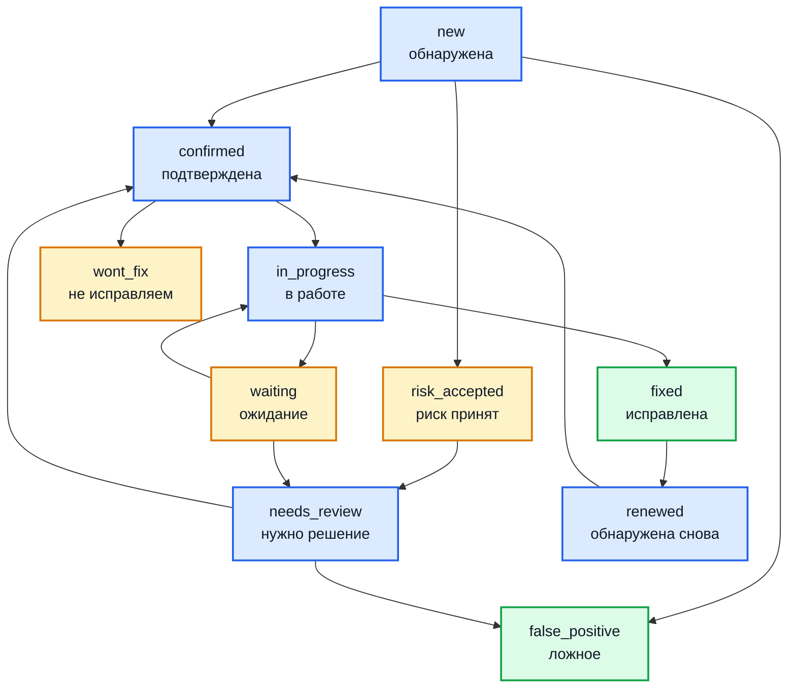

# Жизненный цикл находки

Находка — центральная сущность Hub. Эта страница описывает, как из результата
работы сканера получается находка, что считается одной и той же находкой при
повторных сканированиях, какие состояния она проходит и как считается срок
устранения.

## Из чего складывается находка

Отчёт сканера содержит набор результатов. Каждый результат Hub приводит к
общему виду независимо от того, каким инструментом он получен:

| Поле | Откуда берётся |
| --- | --- |
| Правило | Идентификатор сработавшего правила из отчёта |
| Местоположение | Файл со строками, либо узел с портом и протоколом, либо адрес веб-ресурса |
| Критичность | Явное поле отчёта, иначе уровень результата, иначе уровень правила, иначе `INFO` |
| Описание | Текст сообщения из отчёта |
| Сканер и его версия | Из отчёта либо из параметров загрузки |
| Ревизия | Идентификатор коммита — из отчёта, заголовка, поля формы или параметра запроса |

Уровни критичности: `CRITICAL`, `HIGH`, `MEDIUM`, `LOW`, `INFO`.

## Дедупликация

Ключевой вопрос: если тот же сканер отработал завтра, а послезавтра то же
самое нашёл другой сканер — это одна находка или три? Hub считает, что одна,
и определяет тождество по **правилу и местоположению**. Имя сканера в расчёт
не входит намеренно: разные инструменты по-разному называют одну и ту же
проблему.

Для каждого результата считается хеш; результаты с совпавшим хешом внутри
одного продукта — одна и та же находка.

| Тип находки | Что определяет тождество |
| --- | --- |
| Код: файл, строки, фрагмент | Продукт + правило + местоположение в файле |
| Веб-ресурс: адрес начинается с `http://` или `https://` | Продукт + правило + полный адрес |
| Сетевая: есть узел или адрес, и это не веб-ресурс, **и известен CVE** | Продукт + CVE + узел с портом и протоколом |
| Сетевая, **CVE неизвестен** | Продукт + узел с портом и протоколом |

Из последних двух правил следуют два практических вывода:

- Один и тот же CVE на одном и том же порту — одна находка, сколько бы
  сканеров его ни нашли и как бы по-разному они ни называли своё правило.
- Несколько находок без CVE на одном и том же порту схлопываются в одну
  «аномалию на порту». Это осознанный компромисс: он убирает шум, но
  скрывает различия между такими результатами.

Дедупликация работает **в пределах продукта**. Тот же узел, привязанный к
двум продуктам, даст две независимые находки.

!!! note "Что не влияет на тождество"

    Расширенные поля отчёта — состояние относительно базовой линии, признак
    подавления, вид результата, отпечатки — сохраняются и доступны для
    фильтрации, но в расчёт тождества не входят. Иначе первая же загрузка
    отчёта от сканера, начавшего их выставлять, продублировала бы все
    существующие находки.

## Состояния

Всего десять состояний. Новая находка создаётся в состоянии `new`.

| Состояние | Смысл |
| --- | --- |
| `new` | Только что обнаружена, никто не смотрел |
| `renewed` | Ранее закрытая находка обнаружена снова |
| `needs_review` | Требует повторного решения — например, истёк срок принятия риска |
| `in_progress` | Взята в работу |
| `confirmed` | Подтверждена как настоящая |
| `waiting` | Ожидает внешнего события; таймер срока приостановлен |
| `risk_accepted` | Риск принят на срок |
| `wont_fix` | Решено не исправлять |
| `false_positive` | Ложное срабатывание |
| `fixed` | Исправлена |

Состояния сгруппированы — группы используются в счётчиках и на дашбордах:

- **Требуют внимания**: `new`, `renewed`, `needs_review`, `confirmed`,
  `in_progress`, `waiting`.
- **Открытые в широком смысле**: то же плюс `risk_accepted` и `wont_fix` —
  проблема существует, но решение по ней принято.
- **Закрытые**: `false_positive` и `fixed`.



Схема показывает типичные переходы, а не полный список: интерфейс позволяет
перевести находку в любое состояние вручную.

### Состояния с датой пересмотра

Два состояния не бывают вечными:

- **`risk_accepted`** — принятие риска с датой, до которой оно действует.
  Периодическая задача возвращает такие находки в `needs_review`, когда дата
  проходит.
- **`waiting`** — ожидание внешнего события. Обязательны причина и дата, до
  которой действует ожидание; дальше чем на **30 суток** вперёд её задать
  нельзя. По истечении находка возвращается в `needs_review`, а причина и дата
  очищаются.

Состояние `waiting` нельзя назначить массово: причина и дата задаются для
каждой находки отдельно, поэтому массовое изменение с таким состоянием
отклоняется.

## Сроки устранения

Таймер запускается при взятии находки в работу. Срок зависит от критичности и
задаётся в настройках проекта. Значения по умолчанию для нового проекта:

| Критичность | Срок по умолчанию |
| --- | --- |
| `CRITICAL` | 7 суток |
| `HIGH` | 14 суток |
| `MEDIUM` | 30 суток |
| `LOW` | 90 суток |

Для `INFO` срок по умолчанию не задан.

**Пауза — это действительно пауза, а не пометка.** При переходе в состояние,
которое не может нарушить срок (`waiting`, `risk_accepted`, `needs_review`),
фиксируется момент остановки. При возврате в работу срок сдвигается ровно на
время простоя — проведённое в ожидании время дедлайн не съедает.

Проверка сроков выполняется **ежечасно**. Она находит находки с приближающимся
и с нарушенным сроком и ставит задачи на оповещение. При переходе в
завершающее состояние (`fixed`, `wont_fix`, `false_positive`) открытые
нарушения срока закрываются.

## Автоматическое закрытие после исправления

Hub умеет сам закрывать находки, которых больше нет в результатах
сканирования. Механизм намеренно осторожен: неполное или сбойное сканирование
не должно закрыть массив настоящих находок.

Автозакрытие требует **одновременного** выполнения трёх условий:

1. возможность включена глобально (`FEATURE_AUTO_VERIFY_FIXES`);
2. она включена в настройках конкретного проекта;
3. при загрузке отчёта явно передано, что этот отчёт пригоден для проверки
   исправлений (`verify_fixes=true`).

Даже когда все три условия выполнены, закрытие происходит не с первого раза:

- отсутствие находки проверяется **несколько раз подряд** внутри одной
  проверки (по умолчанию 3 попытки); любой ответ «на месте» или
  «неопределённо» немедленно оставляет находку открытой;
- закрытие происходит только после **нескольких последовательных проверок**,
  давших «отсутствует» (по умолчанию 3). Любое обнаружение сбрасывает счётчик.

!!! warning "Почему так сложно"

    Ранняя версия закрывала находку по одному наблюдению «отсутствует». На
    работающей установке это привело к массовому ложному закрытию: значительная
    часть находок вернулась при следующем сканировании, причём среди закрытых
    оказались настоящие открытые сервисы. Оба уровня — повторы внутри проверки
    и кворум между проверками — добавлены как реакция на этот случай и по
    отдельности недостаточны.

Отдельно существует **перепроверка вторым источником**: находка считается
исправленной, только если это подтвердили два независимых механизма. Есть
предел числа закрытий в час на проект, чтобы сбой одного источника не привёл
к лавине. Подробнее: [Ручная перепроверка](manual-rescan.md).

## Несколько источников у одной находки

Когда одну и ту же проблему нашли несколько сканеров, находка остаётся одна,
но сохраняет вклад каждого источника. В карточке находки они показаны
отдельными вкладками: какой сканер, когда сканировал, какой CVE и какую оценку
сообщил, каким было исходное описание.

Это важно при разборе: расхождение оценок между сканерами — сам по себе
сигнал, и он не должен теряться при слиянии.

## Группы находок

Однотипные находки можно объединить в группу и работать с ней как с целым:
изменение состояния распространяется на всех участников. При этом каждый
участник обрабатывается как отдельная находка — со своей записью в журнале
действий, своим таймером срока и своими последствиями вроде создания задачи в
Jira.

## Журнал действий

Изменения находок фиксируются в журнале действий: кто, что и когда изменил.
Журнал — источник данных для отчётов руководству, в том числе для расчёта
среднего времени устранения. Действия, выполненные автоматически, отличаются
от действий пользователя.

## Ручной ввод находки

Не всё приходит сканером: результат ручного тестирования, письмо от
исследователя, находка из системы, которая SARIF не умеет. Такую находку
заводят руками — на продукте (`POST /api/v1/products/<id>/findings`), из
интерфейса или командой `sshub findings create`.

Ручная находка дальше ничем не отличается от загруженной: та же
дедупликация, те же состояния, те же сроки и те же интеграции. Источник
виден в карточке — по названию «сканера», которое указали при заведении.

Повторный ввод той же находки не создаёт дубля и не считается ошибкой.

## Теги

У находки два вида тегов, и они намеренно разделены:

| Вид | Кто ставит | Можно ли править руками |
| --- | --- | --- |
| Теги обогащения | Плагины обогащения (CMDB, БДУ ФСТЭК, Threat Intelligence) | Нет — их перезапишет следующее обогащение |
| Ручные теги | Люди | Да, с записью в журнал действий |

Ручные теги ставятся на находку (`POST`/`DELETE /api/v1/findings/<id>/tags`)
или сразу на выборку (`POST /api/v1/findings/bulk-tags`). Каждая простановка и
снятие попадают в журнал: кто, что и когда.

По тегам работают отбор в списке, поиск и правила подавления.

## Поиск: язык запросов

Кроме обычного полнотекстового поиска, на странице аналитики есть режим
`field:value` — он включается кнопкой `</>` рядом со строкой поиска.

```
severity:critical status:confirmed|needs_review tags:prod -tags:legacy
host:*.internal.example.com sla_days>5
severity:critical OR severity:high status:confirmed
```

| Конструкция | Что значит |
| --- | --- |
| `field:value` | Равенство для перечислимых полей, вхождение подстроки для строковых |
| `-field:value` | Отрицание |
| `field:a\|b` | Любое из значений (до 20 в списке) |
| `field>N`, `field<N`, `field>=N`, `field<=N` | Сравнение, только для числовых полей |
| `field:*glob*` | Шаблон; не меньше трёх символов помимо звёздочек |
| `host:"my host"` | Значение с пробелами — в кавычках |
| `sql injection` | Терм без поля — обычный полнотекстовый поиск |

Доступные поля: `severity`, `status`, `baseline_state`, `kind`, `suppressed`,
`host`, `ip`, `file_path`, `service`, `cve`, `cwe`, `component`,
`component_version`, `scanner`, `tags`, `sla_days`, `project`, `product`.

Особенности, о которых стоит знать:

- между термами подразумевается «и»; `AND` и `OR` можно написать явно.
  Разбор идёт слева направо, **без скобок и приоритета**: `severity:critical
  OR severity:high status:confirmed` означает «(critical или high) и
  confirmed»;
- обычные фильтры-списки (критичность, статус, сканер, теги) продолжают
  работать и складываются с запросом по «и», а не заменяются им;
- запрос ограничен областью видимости пользователя. Имя недоступного проекта
  и несуществующего проекта дают одинаковый — пустой — результат: по ответу
  нельзя перебрать чужие проекты;
- ошибка синтаксиса показывается под строкой поиска, запрос не выполняется.

## Правила подавления

Правило подавления описывает, что считать неинтересным: по сканеру, правилу,
пути, тегу и другим признакам. Совпавшие находки помечаются подавленными —
они остаются в базе и в отчётах по требованию, но не шумят в работе.

| Метод и путь | Назначение |
| --- | --- |
| `GET`/`POST /api/v1/projects/<id>/suppression-rules` | Список и создание |
| `PUT`/`DELETE /api/v1/projects/<id>/suppression-rules/<rule_id>` | Изменение и удаление |
| `POST /api/v1/projects/<id>/suppression-rules/<rule_id>/run` | Применить к накопленным находкам |

Новое правило действует на будущие находки сразу; к уже накопленным его
применяют отдельным запуском — так видно, сколько находок оно затронуло.

## Объединение находок руками

Автоматическая дедупликация покрывает не всё: две находки могут описывать одну
проблему, не совпадая ни по одному ключу. Такие находки объединяются вручную
(`POST /api/v1/findings/merge`), объединение видно в карточке и **отменяется**
(`POST /api/v1/findings/<id>/unmerge`).

Отдельно работает автоматическая связь по **значению секрета**: находки,
указывающие на один и тот же утёкший ключ, связываются между собой, включая
накопленные ранее.

## Свод инвентарных находок

Находки, пришедшие из инвентаря (узлы и их уязвимости), удобнее смотреть не
списком, а сводом — по пакету, по узлу или по CVE:

| Метод и путь | Назначение |
| --- | --- |
| `GET /api/v1/findings/inventory-rollup` | Свод по выбранной оси |
| `GET /api/v1/findings/inventory-rollup/members` | Что именно попало в строку свода |
| `POST /api/v1/findings/inventory-rollup/bulk-status` | Массовое действие по строке свода |

Из строки свода можно провалиться в состав, а можно действовать целиком:
принять риск, отметить «не будем исправлять», завести **одну задачу на всю
группу**. Одна уязвимость в пакете, установленном на сотне узлов, обрабатывается
как одно решение, а не как сто.

## Оси группировки

У находки есть «оси» — признаки, по которым она группируется с другими: тот же
пакет, тот же узел, тот же CVE, то же правило.

| Метод и путь | Назначение |
| --- | --- |
| `GET /api/v1/findings/<id>/group-axes` | По каким осям у находки есть соседи |
| `GET /api/v1/findings/<id>/group-axes/members` | Состав группы по выбранной оси |

Отсюда же заводится одна задача на выбранный набор
(`POST /api/v1/findings/ticket/bulk`) — см. [Учёт задач](integration-jira.md).
