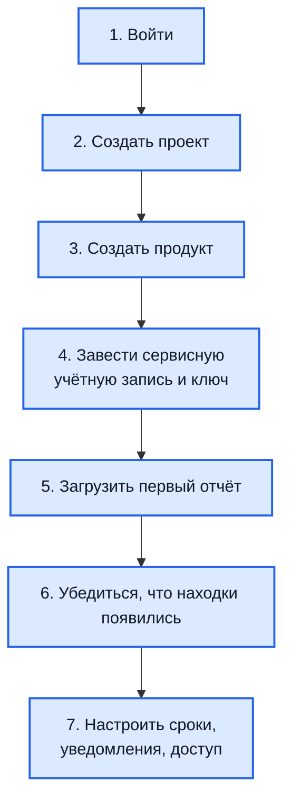

# Первые шаги после установки

Hub развёрнут и открывается — дальше нужно довести его до состояния, в
котором в нём появляются находки. Ниже — минимальный путь: примерно
двадцать минут, если сканер и отчёт у вас уже есть.

Порядок такой:



## 1. Войти

**Локальные учётные записи** (`AUTH_MODE=LOCAL`) — вход `admin@localhost.local`
и пароль из `LOCAL_ADMIN_PASSWORD`. Если переменная не была задана при первом
запуске, администратор не создан: задайте её и перезапустите backend.

**Внешний провайдер** (`AUTH_MODE=SSO`) — кнопка провайдера на странице входа.
Первый вошедший пользователь получает роль `viewer` и не увидит почти ничего,
пока ему не назначат права. Настройка: [Вход через SSO и OIDC](integration-sso.md).

Проверить, в каком режиме работает установка:

```bash
curl -s https://hub.example.com/api/v1/auth/config | jq '.data.auth_mode'
```

## 2. Создать проект

Проект — уровень, на котором задаются сроки устранения, интеграции и права.
Разумная отправная точка — проект на команду или направление.

Через интерфейс: **Проекты → Создать**. Через API:

```bash
curl -X POST https://hub.example.com/api/v1/projects \
  -H "Authorization: Bearer $JWT" \
  -H "Content-Type: application/json" \
  -d '{"name":"Платформа","description":"Команда платформы"}'
```

Сроки устранения для нового проекта задаются автоматически: 7 суток для
критичных находок, 14 для высоких, 30 для средних, 90 для низких. Изменить их
можно в настройках проекта.

## 3. Создать продукт

Продукт — то, что защищаем: репозиторий, сервис, группа узлов. Находки живут
именно здесь, и дедупликация работает в границах одного продукта.

```bash
curl -X POST https://hub.example.com/api/v1/projects/$PROJECT_ID/products \
  -H "Authorization: Bearer $JWT" \
  -H "Content-Type: application/json" \
  -d '{"name":"backend-api","repository_url":"https://git.example.com/team/backend-api"}'
```

!!! tip "Не заводите один объект дважды"

    Тот же узел или репозиторий, привязанный к двум продуктам, даст две
    независимые находки с двумя жизненными циклами. Подробнее:
    [Архитектура](architecture.md#как-устроены-проекты-и-продукты).

## 4. Завести сервисную учётную запись и ключ

Система сборки обращается к Hub не от имени человека, а по ключу.

```bash
SA_ID=$(curl -s -X POST https://hub.example.com/api/v1/service-accounts \
  -H "Authorization: Bearer $JWT" -H "Content-Type: application/json" \
  -d '{"name":"ci-backend","description":"Загрузка отчётов из сборки"}' | jq -r '.data.id')

curl -s -X POST https://hub.example.com/api/v1/service-accounts/$SA_ID/keys \
  -H "Authorization: Bearer $JWT" -H "Content-Type: application/json" \
  -d '{"name":"key-1","expires_in_days":180}' | jq -r '.data.key'
```

Выдайте учётной записи право `upload_report` на созданный продукт или на весь
проект.

!!! warning "Ключ показывается один раз"

    Сохраните его сразу в защищённые переменные вашей системы сборки. В базе
    хранится только хеш — восстановить значение нельзя, можно лишь выпустить
    новый ключ.

## 5. Загрузить первый отчёт

Подойдёт любой отчёт в формате SARIF 2.1.0 от вашего сканера.

```bash
curl -X POST "https://hub.example.com/api/v1/products/$PRODUCT_ID/reports" \
  -H "X-API-Key: $SA_KEY" \
  -F "file=@scan.sarif"
```

Ответ — `202 Accepted` с идентификаторами отчёта и фоновой задачи. Это
означает «принято в обработку», а не «разобрано»: счётчиков найденного здесь
нет.

## 6. Убедиться, что находки появились

Обработка асинхронная, поэтому проверять нужно по состоянию отчёта:

```bash
curl -s -H "X-API-Key: $SA_KEY" \
  "https://hub.example.com/api/v1/reports/$REPORT_ID" | jq '.data.status'
```

- `pending` — ещё в очереди;
- `completed` — разобран, находки в продукте;
- `failed` — разбор не удался.

Если состояние долго не меняется, посмотрите очередь задач:

```bash
curl -s -H "Authorization: Bearer $JWT" \
  https://hub.example.com/api/v1/jobs/stats | jq
```

Растущее число задач в ожидании означает, что обработка не идёт. Что делать —
[Диагностика](troubleshooting.md).

Если отчёт `failed`, самые частые причины — размер больше 50 МиБ и
недопустимое расширение файла: принимаются только `.sarif` и `.json`, архивы
отклоняются. Подробнее: [Загрузка отчётов](integration-sarif.md).

## 7. Что настроить дальше

Порядок можно менять — обязательного здесь нет ничего.

| Что | Зачем | Где |
| --- | --- | --- |
| Права пользователей | Пока доступ есть только у администратора | [Вход через SSO и OIDC](integration-sso.md) |
| Сроки устранения | Значения по умолчанию редко совпадают с вашим регламентом | Настройки проекта |
| Уведомления | Иначе о находках узнают, только зайдя в интерфейс | [Уведомления](integration-notifications.md) |
| Jira | Чтобы работа попадала исполнителю | [Интеграция с Jira](integration-jira.md) |
| Загрузка из сборки | Чтобы отчёты приходили сами | [Загрузка отчётов](integration-sarif.md) |
| Обследование периметра | Если нужен внешний контур, а не только код | [Обзор DomainScope](domainscope-overview.md) |
| Резервное копирование | До того, как в Hub появятся данные, которые жалко потерять | [Эксплуатация](operations.md) |

## Чего делать не нужно сразу

Две возможности выключены по умолчанию намеренно — включайте их осознанно и
не на старте:

- **автоматическое закрытие исправленных находок**: до того как убедитесь, что
  сканирование покрывает объект целиком, оно способно массово закрыть
  настоящие находки — см. [Жизненный цикл находки](findings.md#автоматическое-закрытие-после-исправления);
- **разбор языковой моделью**: сначала решите, какие данные о находках
  допустимо передавать внешнему сервису — см.
  [AI-триаж и песочница](integration-llm.md).
