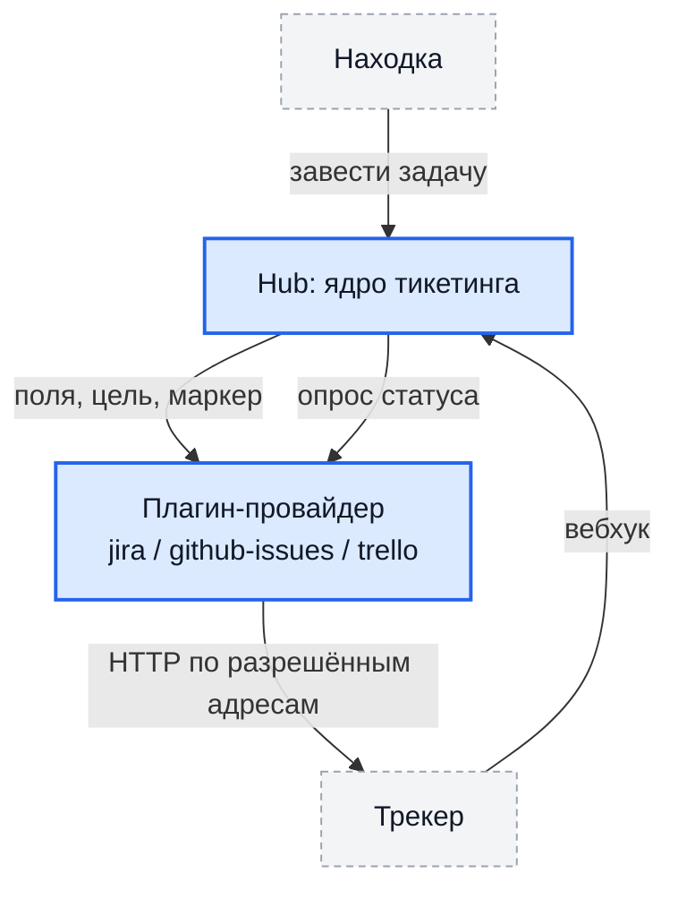

# Учёт задач

Находку можно завести задачей во внешнем трекере: Jira, GitHub Issues,
Trello. Hub ведёт задачу дальше — комментирует, переводит по статусам, читает
её состояние обратно и закрывает находку, когда задача закрыта.

!!! warning "С 0.33 это делают плагины — встроенной интеграции Jira больше нет"

    Маршруты `jira-ticket*`, приёмник вебхука Jira, воркеры `jira_sync` и
    `jira_reverse_sync` и их переменные окружения (`FEATURE_JIRA_REVERSE_SYNC`,
    `JIRA_REVERSE_SYNC_*`, `JIRA_SYNC_WORKERS`, `FALLBACK_JIRA_URL`,
    `FEATURE_JIRA_ENGINE_ROUTING`) удалены. Настройки Jira на карточке проекта
    больше не читает никто.

    Порядок перехода — [ниже](#переход-со-встроенной-интеграции-jira). Задачи,
    заведённые до перехода, не теряются: их ключи остаются на находках и
    считаются существующими задачами, так что вторая задача по той же находке
    не заводится.

## Как это устроено



Разделение ответственности жёсткое:

- **ядро** собирает поля задачи, считает значения плейсхолдеров, обеспечивает
  идемпотентность, ретраи и группировку, решает, что делать с находкой;
- **плагин** знает только свою систему: как называется её API, как выглядит
  разметка, как называются переходы, какие бывают цели заведения.

Поэтому адаптер под свою систему учёта можно написать самому — ядро при этом
не меняется. Провайдеры задач обязаны быть WASM-плагинами: нативный рантайм
для этой возможности запрещён, и запрет проверяется и при установке, и при
вызове.

## Установка и привязка

1. Установите плагин провайдера — `jira-ticketing`, `github-issues-ticketing`
   или `trello-ticketing`, см. [Плагины](plugins.md).
2. Заполните настройки установки: адрес системы, учётные данные, цель по
   умолчанию.
3. Привяжите провайдера к проекту и, если нужно, переопределите настройки для
   этого проекта.

Перечень доступных провайдеров отдаёт `GET /api/v1/ticket-providers`.

### Настройки: установка и проект

Конфигурация проекта **перекрывает** конфигурацию установки ключ за ключом.
Проект без собственной строки работает на настройках установки.

| Метод и путь | Назначение |
| --- | --- |
| `GET /api/v1/projects/<id>/ticket-provider/config` | Настройки провайдера для проекта |
| `PUT /api/v1/projects/<id>/ticket-provider/config` | Изменение настроек (право `write` на проект) |

Что важно знать о правке:

- поля формы рисуются по схеме установленного плагина, а не по списку внутри
  интерфейса;
- запись **сливается**, а не заменяет: ключи, которых схема не знает
  (перенесённые шаблоны, справочники), переживают сохранение;
- секреты пишутся только по полям, объявленным секретными; **пустая строка
  означает «не менять»**, наружу отдаётся лишь список заданных ключей;
- провайдер берётся из привязки проекта, а не из параметра запроса: обратиться
  к чужому установленному плагину нельзя даже с правом на свой проект.

### Настройки плагина Jira

Основное (полный перечень — в карточке плагина):

| Поле | Назначение |
| --- | --- |
| `base_url` | **Только базовый адрес**, без пути: `/rest/api/2/issue` плагин дописывает сам |
| `project_key`, `issue_type`, `labels` | Куда и чем заводить |
| `auth_method` | `basic` (email + API-токен, Cloud), `personal_access_token` (Bearer, Data Center), `oauth_client_credentials` (Cloud) |
| `email`, `api_token`, `client_id`, `client_secret` | Учётные данные; токен и секрет — секретные поля |
| `projects` | Курируемый список целей: среди них человек выбирает при заведении |
| `pid` | Числовой идентификатор проекта — нужен только для полуручного режима: форма адресуется id, а не ключом |
| `summary_template`, `description_template` | Шаблоны задачи |
| `partial_summary_template`, `partial_description_template`, `partial_row_template` | Шаблоны для полуручного режима |
| `extra_fields`, `transition_fields`, `value_maps`, `payload_template` | Дополнительные и кастомные поля, словари подстановки, полностью своё тело запроса |
| `issuetype_by_engine` | Тип задачи в зависимости от сканера |

Адрес с уже дописанным путём плагин отвергает: половина пути в настройках плюс
половина в коде даёт тихий 404, неотличимый от «система не приняла задачу».

## Два режима

Режим задаётся настройкой проекта (`partial_automation` в конфигурации
провайдера для проекта), а не выбирается пользователем в момент заведения:

| Режим | Что происходит |
| --- | --- |
| Полная автоматизация | Hub заводит задачу сам и записывает её ключ и ссылку в находку |
| Полуручной | Hub собирает **ссылку на форму создания** с заполненными полями; задачу создаёт человек |

Неизвестный режим трактуется как полуручной: ошибка в эту сторону стоит
лишнего клика, в обратную — десятков задач во внешней системе, которых никто
не просил.

## Куда заводить: цели

У провайдера есть операция «перечислить цели» — Hub спрашивает список и
показывает его, но сам цель не выбирает и её значение не разбирает. Для Jira
цель — проект из курируемого списка, для GitHub — репозиторий, для Trello —
доска и список.

| Метод и путь | Назначение |
| --- | --- |
| `GET /api/v1/projects/<id>/ticket-targets` | Цели, доступные проекту |
| `GET /api/v1/findings/<id>/ticket-targets` | То же в контексте находки |

У каждой цели может быть свой набор полей формы — выбор цели меняет не только
проект, но и то, чем форма заполняется.

Диалог выбора показывается тогда, когда есть из чего выбирать. Если провайдер
один и цель у него одна, действие выполняется сразу.

## Заведение и привязка

| Метод и путь | Назначение |
| --- | --- |
| `POST /api/v1/findings/<id>/ticket` | Завести задачу по находке |
| `POST /api/v1/findings/<id>/ticket/link` | Привязать существующую задачу |
| `POST /api/v1/findings/ticket/bulk` | Одна задача на выбранную группу находок |
| `POST /api/v1/findings/ticket/bulk-link` | Привязка существующей задачи к группе |
| `POST /api/v1/findings/ticket-url` | Ссылка на форму создания (полуручной режим) |
| `POST /api/v1/findings/ticket-destination` | Предпросмотр: режим и настроена ли цель |
| `POST /api/v1/projects/<id>/tickets/backfill` | Завести задачи по накопленной истории проекта |

Заведение требует права на **изменение** находки: в неё пишется ссылка.

**Автосоздание при подтверждении** включается на проект — подтверждённая
находка сразу получает задачу. Бэкфилл (`tickets/backfill`) догоняет историю:
берёт подтверждённые находки без задачи, по 5000 за вызов, и в ответе
сообщает остаток — вызывайте, пока он не станет нулём.

### Дубли исключены маркером

Hub кладёт в текст задачи невидимый маркер находки и **до создания** спрашивает
провайдера, нет ли уже задачи с таким маркером. Поэтому повтор запроса,
перезапуск воркера или гонка двух операторов не дают второй карточки на одну
уязвимость. Задача, заведённая до перехода на плагин, тоже считается
существующей.

Своя идемпотентность в адаптере не нужна и вредна: она уже есть, общая для
всех провайдеров.

## Обратная связь: вебхук и опрос

Закрытие задачи в трекере закрывает находку в Hub. Каналов два, и они
взаимодополняющие.

### Вебхук

```
POST /api/v1/webhooks/ticketing/<project_id>/<secret>
```

Разбор тела делает плагин — он знает формат своей системы; решение принимает
Hub. Секрет вебхука ротируется запросом
`POST /api/v1/projects/<id>/ticket-webhook/rotate` и возвращается **один раз**,
в ответе.

### Опрос статусов

Вебхук требует, чтобы трекер дотягивался до Hub. В закрытом контуре этого нет
по построению, поэтому есть второй канал: фоновая задача раз в интервал берёт
находки с задачей в нетерминальном статусе и спрашивает у плагина её
состояние.

| Переменная | Назначение | По умолчанию |
| --- | --- | --- |
| `TICKET_STATUS_POLL_INTERVAL_MINUTES` | Интервал опроса | `60` |
| `TICKET_STATUS_POLL_BATCH_SIZE` | Потолок находок за прогон | `500` |

Свойства, о которых стоит знать:

- **терминальность статуса решает плагин**, а не список имён в ядре: «Done,
  Closed, Готово, Выполнено» за все системы сразу не перечислить;
- **недоступная или удалённая задача не означает «исправлено»** — находка
  остаётся открытой;
- отказ по одной находке не роняет прогон;
- упёршийся потолок виден в журнале — тихо усечённая выборка читалась бы как
  «проверены все».

Отдельного выключателя у опроса нет: он ходит только по проектам, привязанным
к провайдеру.

## Отражение исправления в задаче

Когда находка закрывается после проверки исправления, Hub отражает это в
задаче: добавляет комментарий и, если задан переход, переводит её.

| Ключ настройки | Назначение |
| --- | --- |
| `auto_verify_close_comment` | Текст комментария |
| `auto_verify_close_transition` | Целевой статус. **Пусто — только комментарий** |

Пустой переход — осознанный вариант: у части команд закрытие задачи руками
является частью процесса. Ошибка провайдера не роняет цикл закрытия находок,
но попадает в журнал и в статистику прогона.

## Отказы провайдера

Отказы классифицируются: постоянный (нет прав, цель не существует, задача
удалена) завершает задание с объяснением, временный (сеть, 5xx, лимит частоты)
уходит в повтор. Раньше любой отказ крутился в очереди до исчерпания попыток —
теперь видно, что именно не так.

## Переход со встроенной интеграции Jira

Настройки из `projects.jira_config` переносятся админскими запросами:

```bash
# сводка: что будет перенесено, что мешает
curl -H "Authorization: Bearer $TOKEN" \
  "https://hub.example.com/api/v1/admin/jira-migration/preview"

# перенос; plugin_id обязателен, если провайдеров несколько
curl -X POST -H "Authorization: Bearer $TOKEN" -H "Content-Type: application/json" \
  -d '{"plugin_id":"<uuid установленного плагина>"}' \
  "https://hub.example.com/api/v1/admin/jira-migration/apply"
```

Что делает перенос:

- копирует настройки в конфигурацию провайдера для каждого проекта (включая
  шаблоны, словари и курируемый список проектов Jira);
- привязывает проект к провайдеру и включает автосоздание, если оно было
  включено;
- оставляет исходный `projects.jira_config` нетронутым — переезд не считается
  состоявшимся, пока не подтверждён на живой инсталляции.

Чего перенос **не делает**, намеренно:

| Не делает | Почему |
| --- | --- |
| Не перенаправляет проект, уже привязанный к другому провайдеру | Это увело бы задачи в чужой трекер, и узнали бы об этом по факту |
| Не выключает автосоздание | Флаг только включается: старое `false` иначе отменило бы более позднее решение оператора |
| Не копирует секрет вебхука | Адрес приёмника всё равно другой, настройку в трекере менять руками. Такие проекты помечаются в отчёте |

Мультипроектная настройка переносу не мешает: курируемый список целей
переезжает как есть, а выбор цели делает человек при заведении. Годным
считается список, где хотя бы у одной записи есть числовой идентификатор
проекта — список из одних названий дал бы конфигурацию, которая выглядит
настроенной и не работает.

## Создание учётной записи в Jira

### Cloud

Профиль → Security → Create and manage API tokens. `auth_method: basic`,
поля `email` и `api_token`.

### Data Center / Server

Profile → Personal Access Tokens → Create token. `auth_method:
personal_access_token`, поле `api_token`.

Для полуручного режима дополнительно нужен числовой `pid` проекта: форма
создания адресуется им, а не ключом. Проверить можно в адресе формы создания
задачи в самой Jira.

## Проверка

1. `GET /api/v1/ticket-providers` — плагин установлен, включён и виден.
2. `GET /api/v1/projects/<id>/ticket-targets` — цели приходят.
3. Завести задачу по тестовой находке; убедиться, что в находке появились ключ
   и ссылка.
4. Повторить запрос — второй задачи появиться не должно.
5. Закрыть задачу в трекере и дождаться вебхука либо интервала опроса —
   находка должна закрыться.

## Типовые проблемы

| Симптом | Что проверить |
| --- | --- |
| Кнопка заведения неактивна | Проект не привязан к провайдеру либо у плагина нет цели |
| «base_url не задан» после переноса | Настройки перенесены, но проект не привязан к провайдеру — перенос без `plugin_id` при нескольких провайдерах отвечает 400 со списком кандидатов |
| Форма Jira открывается пустой | Полуручной режим требует адрес формы вида `/secure/CreateIssueDetails!init.jspa`; на `/secure/CreateIssue.jspa` Jira молча игнорирует параметры |
| Форма открывается не для той цели | Устаревший интерфейс не передаёт выбранную цель — обновите frontend до версии backend |
| Задача заведена дважды | Проверьте, что у находки не было legacy-ключа Jira, и что адаптер не реализует своё создание в обход маркера |
| Находка не закрывается за задачей | Нет вебхука и не настроен опрос; либо статус не помечен плагином как терминальный |
| Тихий 404 при заведении | В `base_url` дописан путь API |

## Связанные документы

- [Плагины](plugins.md) — установка, версии, разрешения
- [Жизненный цикл находки](findings.md) — подтверждение, группировка, закрытие
- [Обновление на 0.33](upgrades.md#обновление-на-033) — порядок перехода
