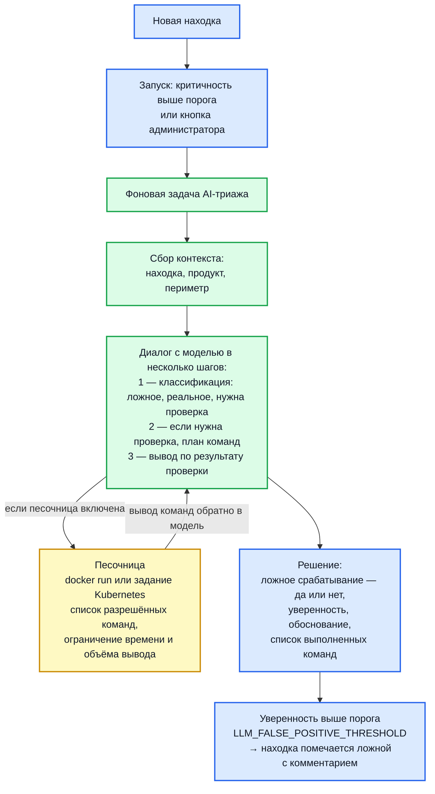

# AI-триаж и песочница

Hub использует LLM для триажа находки: оценить, является ли находка false-positive, предложить план верификации, опционально выполнить активную проверку через sandbox (запустить `nmap`/`curl`/`nuclei` против цели).

## Архитектура



## Переменные окружения

### LLM

| Переменная                     | Default       | Описание                                                    |
| ------------------------------ | ------------- | ----------------------------------------------------------- |
| `LLM_BASE_URL`                 | —             | Базовый URL OpenAI-compatible API                           |
| `LLM_API_KEY`                  | —             | API-ключ                                                    |
| `LLM_MODEL`                    | `glm-4-plus`  | Модель (рекомендация для prod: `glm-4-plus` или эквивалент) |
| `LLM_DRY_RUN`                  | `false`       | Логировать диалог, не отправлять реальные запросы           |
| `LLM_FALSE_POSITIVE_THRESHOLD` | `0.9`         | Порог confidence для авто-пометки FP                        |
| `LLM_WORKERS`                  | `5`           | **0 в backend, > 0 только в worker-pod**                    |
| `LLM_REQUEST_TIMEOUT_SECONDS`  | `180`         | Timeout на один LLM-запрос                                  |

> **КРИТИЧНО:** В backend задавайте `LLM_WORKERS=0` — backend только ставит jobs в очередь. В worker-pod (компонент `worker`) — `LLM_WORKERS=N` (типично 1-5).

### Sandbox

| Переменная                | Default                           | Описание                            |
| ------------------------- | --------------------------------- | ----------------------------------- |
| `SANDBOX_TYPE`            | `""` (выключен)                   | `""` / `docker` / `kubernetes`      |
| `SANDBOX_IMAGE`           | `<registry>/sandbox-tools:latest` | Образ с инструментами               |
| `SANDBOX_TIMEOUT_SECONDS` | `120`                             | Timeout на одну команду             |
| `SANDBOX_OUTPUT_LIMIT_KB` | `10`                              | Лимит stdout+stderr                 |
| `SANDBOX_NAMESPACE`       | —                                 | K8s namespace (только `kubernetes`) |
| `SANDBOX_KUBECONFIG`      | —                                 | Путь к kubeconfig                   |

## Требования к языковой модели

Hub обращается к сервису, совместимому по API с интерфейсом дополнения чата
в стиле OpenAI. Подойдёт как облачный сервис, так и модель, развёрнутая у вас
— перечня провайдеров, совместимость с которыми подтверждена испытаниями, мы
не приводим.

Задаются три параметра:

| Переменная | Что указать |
| --- | --- |
| `LLM_BASE_URL` | Базовый адрес API. В промышленной среде обязан быть `https` — иначе запуск прервётся, поскольку ключ передаётся в каждом запросе |
| `LLM_API_KEY` | Ключ доступа |
| `LLM_MODEL` | Имя модели в терминах выбранного сервиса |

Выбирая модель, учитывайте: разбор выполняется по каждой новой находке, и на
крупном потоке это заметный объём обращений. Начинать разумно с недорогой
модели и ограниченного набора проектов, а `LLM_WORKERS` держать небольшим,
пока не станет понятен фактический расход.

!!! warning "Что уходит наружу"

    В запрос попадают сведения о находке: правило, местоположение, описание, а
    для находок в коде — фрагмент исходника. Если сервис внешний, это
    передача данных за периметр. Решите этот вопрос до включения возможности —
    и рассмотрите вариант с моделью, развёрнутой внутри контура.

## Включение LLM (без sandbox)

Самый безопасный первый шаг — только классификация без активной проверки.

```ini
# backend
LLM_WORKERS=0

# worker
LLM_BASE_URL=https://open.bigmodel.cn/api/paas/v4/
LLM_API_KEY=<secret>
LLM_MODEL=glm-4-flash
LLM_WORKERS=3
LLM_FALSE_POSITIVE_THRESHOLD=0.9
SANDBOX_TYPE=    # пусто = выключен
```

После рестарта worker:

- Worker начнёт триажить новые находки
- В UI Hub в карточке находка появится секция `LLM Analysis` с reasoning и confidence
- При `is_false_positive=true && confidence ≥ threshold` находка помечается `false_positive` автоматически

## Включение Sandbox (активная верификация)

Sandbox запускает команды (nmap/curl/nuclei) против цели находка. Используется когда нужна реальная проверка — например, "точно ли порт 22 открыт".

### Docker-режим (dev / single-host)

```ini
SANDBOX_TYPE=docker
SANDBOX_IMAGE=<registry>/sandbox-tools:latest
SANDBOX_TIMEOUT_SECONDS=120
SANDBOX_OUTPUT_LIMIT_KB=10
```

Требования:

- Worker должен иметь доступ к Docker daemon (mount `/var/run/docker.sock` или `DOCKER_HOST`)
- Образ должен быть доступен (приватный registry — `docker login`)

### Kubernetes-режим (production)

```ini
SANDBOX_TYPE=kubernetes
SANDBOX_IMAGE=registry.example.com/sandbox-tools:1.0
SANDBOX_TIMEOUT_SECONDS=180
SANDBOX_OUTPUT_LIMIT_KB=20
SANDBOX_NAMESPACE=hub-sandbox
SANDBOX_KUBECONFIG=/var/run/secrets/kubernetes.io/serviceaccount
```

Hub создаёт `Job` в указанном namespace с RBAC и NetworkPolicy для изоляции.

### Allowlist команд

В образе sandbox-tools прибиты только разрешённые инструменты:

- `nmap` — порт-сканирование
- `curl` — HTTP запросы
- `nc` (netcat) — TCP-проверка
- `openssl` — TLS-проверка
- `dig` — DNS-запросы
- `wget` — скачивание
- `nuclei` — vulnerability templates
- `traceroute` — трассировка
- `ping` — ICMP

**Python намеренно исключён** — слишком широкая поверхность атак.

LLM формирует команду из allowlist. Если LLM попытается выполнить что-то вне списка — sandbox откажет, находка получит флаг `sandbox_refused`.

### Изоляция

В docker-режиме:

- Запуск с `--network=bridge`, без host-network
- Read-only filesystem (writes только в `/tmp`)
- `--user nobody`, без privileges
- CPU/memory limits (1 CPU, 512 MB)
- Без mount-ов хост-системы

В k8s-режиме:

- Отдельный namespace с NetworkPolicy "только egress к internet"
- Pod Security Standards: restricted
- `runAsNonRoot: true`, `readOnlyRootFilesystem: true`
- Лимиты ресурсов

## Безопасность

### Что НЕЛЬЗЯ делать

- ❌ Запускать sandbox без изоляции (без `SANDBOX_TYPE` лучше, чем плохой `SANDBOX_TYPE=host`)
- ❌ Дать LLM возможность выполнять произвольный shell — только allowlist
- ❌ Слать в LLM содержимое HTTP responses без редактирования (могут попасть PII / credentials из тела)
- ❌ Включать LLM-триаж в `LLM_WORKERS > 0` сразу в backend — это распылит активность и сломает изоляцию очередей

### Что обязательно

- ✅ Регулярно проверять `SANDBOX_OUTPUT_LIMIT_KB` (защита от prompt-injection через большой output)
- ✅ Использовать отдельный API-key для LLM-провайдера, ротировать раз в квартал
- ✅ Мониторить расходы (LLM-провайдеры могут стоить дорого при росте находки)
- ✅ Sandbox-образ — приватный registry, тегированный по SHA (не `:latest`)

## Стоимость

Грубая оценка для 1000 находки/день:

- Многошаговый диалог: примерно 10 тыс. входных и 2 тыс. выходных токенов на одну находку
- Sandbox: добавляет ещё ~5k tokens (для парсинга stdout)

При $1.5/1M output tokens (glm-4-plus) и 1000 находки:

- Без sandbox: ~$3-5/день
- С sandbox: ~$8-12/день

Подключите budget alerts у провайдера.

## Режим без отправки

Для оценки качества LLM без расхода квоты:

```ini
LLM_DRY_RUN=true
```

Hub будет логировать промпт и реальный ответ, но не помечать находка автоматически. Полезно для калибровки `LLM_FALSE_POSITIVE_THRESHOLD`.

## Мониторинг


- Queue `llm_triage` — глубина
- Failed jobs — ошибки от провайдера

### Метрики (если включены)

- `hub_llm_requests_total{model,outcome}`
- `hub_llm_tokens_consumed_total{type=input|output}`
- `hub_llm_duration_seconds`
- `hub_sandbox_executions_total{result}`

### Логи

```bash
docker compose logs -f worker | grep llm
docker compose logs -f worker | grep sandbox
```

## Типовые проблемы

| Симптом                           | Что проверить                                                                              |
| --------------------------------- | ------------------------------------------------------------------------------------------ |
| LLM jobs не выполняются           | `LLM_WORKERS>0` только в worker-pod. Backend должен иметь `=0`                             |
| `429 Too Many Requests`           | Превышен rate limit провайдера. Уменьшите `LLM_WORKERS` или включите задержку в провайдере |
| `Sandbox failed: image not found` | Образ недоступен. Проверьте `docker pull $SANDBOX_IMAGE` или `kubectl get pods`            |
| Sandbox команды timeout           | Увеличьте `SANDBOX_TIMEOUT_SECONDS`                                                        |
| False-positive mass-marked        | Снизьте threshold (например, `0.95`) или временно `LLM_DRY_RUN=true` для аудита            |
