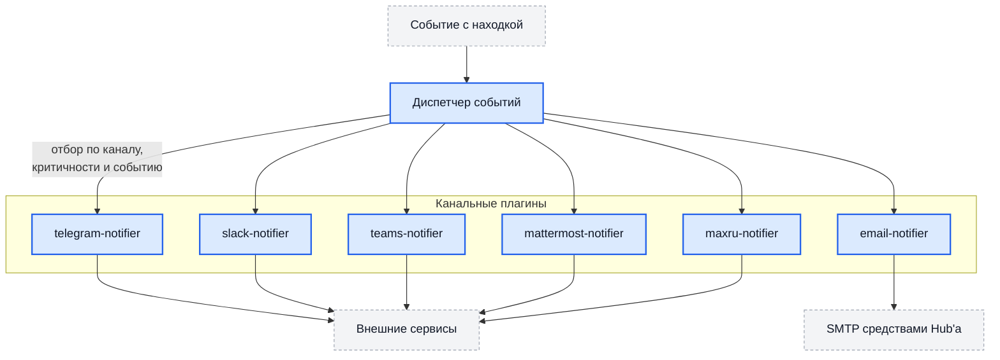

# Уведомления

Hub оповещает о событиях с находками по шести каналам: **Telegram**,
**Slack**, **Microsoft Teams**, **Mattermost**, **MAX** и **электронная
почта**. Каналы включаются независимо и настраиваются на уровне проекта — у
разных проектов могут быть разные получатели.

!!! warning "С 0.33 доставку ведут плагины"

    Кода каналов в ядре нет: каждый канал — отдельный плагин, и **пока плагин
    не установлен, уведомления по его каналу не отправляются**. Все шесть —
    нативные (Tier 2), то есть исполняются отдельным процессом вне песочницы
    WASM, поэтому источнику каталога нужно разрешение на исполнение нативных
    плагинов; без него плагин виден в каталоге и не ставится. Сначала установите плагин — см. [Плагины](plugins.md), — и
    только потом настраивайте канал в проекте.

    Обновляетесь с 0.32 и раньше, а Mattermost или MAX уже настроены?
    Настройки нужно перенести отдельным запросом — порядок шагов в разделе
    [Обновление на 0.33](upgrades.md#обновление-на-033).

## Как это устроено



Диспетчер получает событие и для каждого установленного канального плагина
проверяет: включён ли канал в проекте, проходит ли критичность находки порог и
подписан ли канал на этот тип события. Прошедшие проверку задачи расходятся
отдельными заданиями — сбой одного канала не задерживает остальные.

Плагин не выбирает, куда доставлять, и не видит чужих проектов: секрет канала
Hub выдаёт под конкретное событие, а исходящее соединение разрешает только к
адресам из описания плагина (`egress_hosts`).

## События

| Событие | Когда возникает |
| --- | --- |
| `new` | Появилась новая находка |
| `renewed` | Ранее закрытая находка обнаружена снова |
| `severity_increased` | Критичность выросла — например, с `MEDIUM` на `HIGH` |
| `needs_review` | Находка вернулась на пересмотр: истёк срок принятия риска или ожидания |
| `fixed` | Находка закрыта как исправленная |
| `sla_at_risk` | Срок устранения приближается |
| `sla_breached` | Срок нарушен |
| `sla_breached_escalated` | Нарушение срока эскалировано |

## Общие настройки канала

У всех каналов есть общий набор полей — они задаются в настройках канала на
карточке проекта:

| Поле | Назначение |
| --- | --- |
| `enabled` | Включён ли канал |
| `min_severity` | Порог критичности: находки ниже не отправляются |
| `fixed_min_severity` | Отдельный порог для сообщений об исправлении |
| `notify_on_close` | Сообщать ли о закрытии находок |

Пороги раздельные не случайно: обычно об открытии проблемы хотят знать шире,
чем о её закрытии.

Канал считается настроенным, когда заполнены обязательные поля его схемы. Если
канал включён, а обязательного поля нет, доставки не будет — но это **не
молчаливый отказ**: в журнале worker появляется предупреждение «канал включён,
но обязательные поля не заполнены».

Для изменения настроек канала нужно право `manage_notifications`. Оно даёт
доступ к секрету канала (токену бота, адресу webhook) — выдавайте его так же
осторожно, как административные права.

## Telegram

Плагин `telegram-notifier`. Доставка — Bot API, `api.telegram.org`.

### 1. Создать бота

Через `@BotFather` в Telegram: команда `/newbot`, затем имя и имя
пользователя бота. BotFather выдаст токен вида `7123456789:AAH…`.

### 2. Узнать идентификатор чата

Напишите боту `/start`, затем:

```bash
curl "https://api.telegram.org/bot<ТОКЕН>/getUpdates" | jq '.result[].message.chat'
```

Возьмите `id`: положительное число — личная переписка, отрицательное —
группа. Для канала добавьте бота в него с правами администратора; тогда
идентификатор начнётся с `-100`.

### 3. Настроить канал в проекте

| Поле | Значение |
| --- | --- |
| `chat_id` | Идентификатор чата. **Обязательное** |
| `bot_token` | Токен бота. **Секрет**, в ответах API не возвращается |
| `min_severity`, `fixed_min_severity`, `notify_on_close` | Пороги и подписка |

Сообщение длиннее лимита Telegram (4096 символов) не отбрасывается: если текст
не влезает даже после сокращения полей, уходит короткое сообщение со ссылкой
на находку.

## Slack

Плагин `slack-notifier`. Доставка — входящий webhook, `hooks.slack.com`.

Создайте Incoming Webhook в Slack и укажите его адрес в настройках канала:

| Поле | Значение |
| --- | --- |
| `webhook_url` | Адрес webhook. **Секрет**; он же адрес доставки, поэтому «канал настроен» означает «секрет задан» |
| `min_severity`, `fixed_min_severity`, `notify_on_close` | Пороги и подписка |

Формат сообщения — attachments с цветной полосой по критичности.

## Microsoft Teams

Плагин `teams-notifier`. Доставка — webhook Workflows (Power Automate),
адреса `webhook.office.com` и `logic.azure.com`.

| Поле | Значение |
| --- | --- |
| `webhook_url` | Адрес webhook. **Секрет** (у Teams секрет лежит в пути адреса) |
| `min_severity`, `fixed_min_severity`, `notify_on_close` | Пороги и подписка |

!!! note "Вебхук на своём поддомене"

    Вебхуки Workflows живут на поддомене арендатора, и точный хост заранее
    неизвестен. Если ваш адрес не попадает в `webhook.office.com` или
    `logic.azure.com`, доставку отклонит egress-гард — такой инсталляции нужен
    плагин с собственным перечнем адресов в описании.

## Mattermost

Плагин `mattermost-notifier`, версия не ниже **1.0.1**.

### 1. Разрешить свой сервер

Mattermost размещают у себя, поэтому его адрес заранее неизвестен и в
подписанном описании плагина отсутствует. Заполните в конфигурации **установки
плагина** поле **«Адрес сервера Mattermost»** (`mattermost_base_url`),
например `https://mattermost.example.com`. Оно же разрешает доставку на этот
сервер: без него установка и настройка проходят, а доставка отклоняется.

Переменная окружения `PLUGIN_EGRESS_ALLOWLIST` к этому отношения не имеет —
она про обращения внутрь вашей сети и перечень адресов плагина не расширяет.

### 2. Создать входящий webhook

В Mattermost: канал → Integrations → Incoming Webhooks → Add. Скопируйте
адрес вида `https://mattermost.example.com/hooks/xxxxxxxx`.

### 3. Настроить в проекте

| Поле | Значение |
| --- | --- |
| `webhook_url` | Адрес входящего webhook. **Секрет** |
| `channel` | Канал, если нужно переопределить заданный в webhook |
| `min_severity`, `fixed_min_severity`, `notify_on_close` | Пороги и подписка |

## MAX

Плагин `maxru-notifier`. Адрес облака MAX известен заранее
(`botapi.max.ru`), дополнительных разрешений канал не требует.

| Поле | Значение |
| --- | --- |
| `chat_id` | Идентификатор чата. **Обязательное** |
| `access_token` | Токен бота. **Секрет** |
| `base_url` | Адрес API, если он отличается от облачного |
| `min_severity`, `fixed_min_severity`, `notify_on_close` | Пороги и подписка |

## Электронная почта

Плагин `email-notifier`. В сеть плагин не ходит вообще: письмо отправляет сам
Hub, а плагин только собирает его. Поэтому назвать произвольный SMTP-сервер из
плагина нельзя — это сделало бы из него открытый релей от имени инсталляции.

Почта — единственный канал, у которого **на каждого адресата своё письмо**:
адрес получателя приходит вместе с событием и он же ограничивает доставку.

### Настройки проекта

| Поле | Значение |
| --- | --- |
| `recipients` | Адреса получателей, список. **Обязательное** |
| `subject_prefix` | Префикс темы — удобно для почтовых правил |
| `min_severity`, `fixed_min_severity`, `notify_on_close` | Пороги и подписка |
| `smtp_host`, `smtp_port`, `smtp_username`, `smtp_from`, `smtp_tls_mode`, `smtp_password` | SMTP проекта. Действуют только при `allow_project_smtp` (см. ниже) |

### Настройки установки плагина

| Поле | Значение |
| --- | --- |
| `smtp_host`, `smtp_port`, `smtp_username`, `smtp_from`, `smtp_tls_mode`, `smtp_password` | SMTP для всей установки. Пусто — берутся переменные окружения `SMTP_*` самого Hub'а |
| `allow_project_smtp` | Разрешить проектам свой SMTP. Без этого проектные `smtp_*` игнорируются, а в журнал пишется предупреждение |
| `smtp_allowed_hosts` | Если список непуст, хост проекта обязан в нём быть, иначе отправка отклоняется. Сравнение точное, без шаблонов |

Hub идёт по цепочке **проект → установка плагина → переменные окружения**.

### SMTP самого Hub'а

Если плагин не задаёт своего сервера, работают переменные окружения — они же
используются встроенным путём почты, пока плагин не установлен:

| Переменная | Назначение | По умолчанию |
| --- | --- | --- |
| `SMTP_HOST` | Сервер отправки. Пусто — почта не работает | `""` |
| `SMTP_PORT` | Порт | `587` |
| `SMTP_USERNAME` | Учётная запись | `""` |
| `SMTP_PASSWORD` | Пароль | `""` |
| `SMTP_FROM` | Адрес отправителя | `""` |
| `SMTP_TLS_MODE` | `starttls`, `implicit` либо `none` | `starttls` |

!!! note "Встроенный путь почты ещё жив"

    В отличие от Mattermost и MAX, встроенная отправка почты из ядра не
    удалена: она работает, пока `email-notifier` не установлен. Как только
    плагин установлен, канал обслуживает он, а встроенный путь молчит —
    дублей не будет.

## Параллелизм и отладка

| Переменная | Назначение | По умолчанию |
| --- | --- | --- |
| `DISPATCHER_WORKERS` | Параллелизм диспетчера событий | `10` |
| `EMAIL_NOTIFICATION_WORKERS` | Отправка почты встроенным путём | `5` |
| `NOTIFICATIONS_DRY_RUN` | Не отправлять по-настоящему, только записывать в журнал | `false` |
| `FRONTEND_BASE_URL` | Основа для ссылок внутри сообщений | `http://localhost:3000` |

Переменные `MATTERMOST_NOTIFICATION_WORKERS`, `MAXRU_NOTIFICATION_WORKERS` и
`TELEGRAM_NOTIFICATION_WORKERS` **больше не читаются**: очередей, которыми они
управляли, нет — доставку ведут плагины через общий механизм событий.
Оставленные в конфигурации значения ни на что не влияют.

Режим без отправки удобен, чтобы проверить пороги и подписки, ничего не
рассылая: включите `NOTIFICATIONS_DRY_RUN=true`, перезапустите worker и
посмотрите журнал — там будет то, что было бы отправлено.

## Повторные попытки

Неудачная отправка повторяется механизмом очереди задач с нарастающей
задержкой (1 мин → 5 мин → 15 мин → 1 ч → 6 ч). Задача, исчерпавшая попытки,
остаётся в очереди в состоянии ошибки — её видно в разделе фоновых задач, и
повтор можно запустить вручную.

Отсюда следует свойство, которое стоит учитывать: доставка выполняется
**не менее одного раза**. Если процесс умер после отправки, но до отметки о
завершении, сообщение придёт повторно. Дубликат сообщения не означает
дубликат находки.

Удалённая находка задание не повторяет: оно отменяется сразу, с записью уровня
`WARN`. Повторять нечего — находки уже нет.

## Типовые проблемы

| Симптом | Что проверить |
| --- | --- |
| По каналу ничего не приходит, в журнале ничего | Плагин канала не установлен — доставка пропускается |
| В каталоге плагин есть, кнопка установки выключена | Источнику каталога не разрешено исполнение нативных плагинов — см. [Плагины](plugins.md) |
| В журнале «плагин выключен — находки не доставлены» | Плагин установлен, но выключен администратором |
| В журнале «канал включён, но обязательные поля не заполнены» | Не задан `chat_id` (Telegram, MAX), `recipients` (почта) или секрет канала |
| Telegram: `chat not found` | Бот не добавлен в группу или канал |
| Telegram: ошибка запроса для канала | Идентификатор канала должен начинаться с `-100`, бот должен быть администратором |
| Mattermost: доставка отклонена, хотя webhook верный | Не заполнен `mattermost_base_url` в конфигурации установки плагина |
| Mattermost: webhook удалён | Интеграцию удалили на стороне Mattermost — создайте заново и обновите адрес |
| Teams: ответ успешный, сообщения нет | Адрес вебхука не Workflows-формата либо ведёт на поддомен вне разрешённых |
| Почта не уходит | Не задан `SMTP_HOST` (или `smtp_host` в конфигурации плагина). Проверьте также, что порт и режим TLS соответствуют друг другу |
| Почта: в журнале предупреждение о проектном SMTP | Не включён `allow_project_smtp` либо хост проекта не в `smtp_allowed_hosts` |
| Ничего не приходит ни по одному каналу | Критичность находки ниже `min_severity`, либо канал не подписан на этот тип события |
| Сообщения приходят повторно | Ожидаемо при сбое доставки: гарантия — «не менее одного раза» |

Записи о доставке ищите в журнале worker по слову `notification`.
