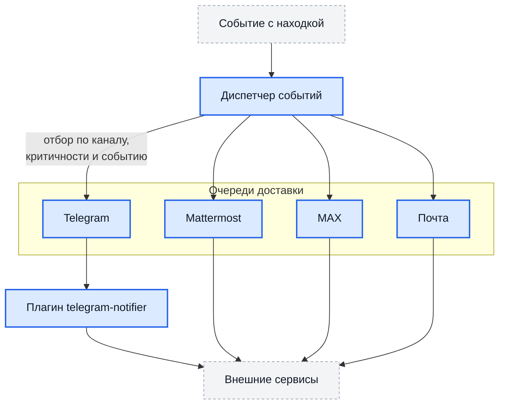

# Уведомления

Hub оповещает о событиях с находками по четырём каналам: **Telegram**,
**Mattermost**, **MAX** и **электронная почта**. Каналы включаются независимо
и настраиваются на уровне проекта — у разных проектов могут быть разные
получатели.

## Как это устроено



Диспетчер получает событие, для каждого канала проверяет: включён ли канал,
проходит ли критичность находки порог и подписан ли канал на этот тип события.
Прошедшие проверку задачи расходятся по отдельным очередям — сбой одного
канала не задерживает остальные.

## События

| Событие | Когда возникает |
| --- | --- |
| `new` | Появилась новая находка |
| `renewed` | Ранее закрытая находка обнаружена снова |
| `severity_increased` | Критичность выросла — например, с `MEDIUM` на `HIGH` |
| `needs_review` | Находка вернулась на пересмотр: истёк срок принятия риска или ожидания |
| `fixed` | Находка закрыта как исправленная |
| `sla_at_risk` | Срок устранения приближается |
| `sla_breached` | Срок нарушен |
| `sla_breached_escalated` | Нарушение срока эскалировано |

## Общие настройки канала

У всех каналов есть общий набор полей:

| Поле | Назначение |
| --- | --- |
| `enabled` | Включён ли канал |
| `min_severity` | Порог критичности: находки ниже не отправляются |
| `fixed_min_severity` | Отдельный порог для сообщений об исправлении |
| `notify_on_close` | Сообщать ли о закрытии находок |

Пороги раздельные не случайно: обычно об открытии проблемы хотят знать шире,
чем о её закрытии.

## Telegram

!!! warning "Telegram работает через плагин"

    Доставка в Telegram выполняется плагином `telegram-notifier`. **Если он не
    установлен, уведомления в Telegram просто не отправляются** — без ошибки,
    только запись в журнале с уровнем отладки. Если плагин установлен, но
    выключен администратором, в журнале появляется отдельное сообщение об
    этом.

    Сначала установите плагин — см. [Плагины](plugins.md), — и только потом
    настраивайте канал в проекте.

### 1. Создать бота

Через `@BotFather` в Telegram: команда `/newbot`, затем имя и имя
пользователя бота. BotFather выдаст токен вида `7123456789:AAH…`.

### 2. Узнать идентификатор чата

Напишите боту `/start`, затем:

```bash
curl "https://api.telegram.org/bot<ТОКЕН>/getUpdates" | jq '.result[].message.chat'
```

Возьмите `id`: положительное число — личная переписка, отрицательное —
группа. Для канала добавьте бота в него с правами администратора; тогда
идентификатор начнётся с `-100`.

### 3. Настроить канал в проекте

Настройки задаются в разделе плагинов проекта: токен бота (`bot_token`),
идентификатор чата (`chat_id`), пороги критичности. Токен — секрет, в ответах
API он не возвращается.

Для изменения нужно право `manage_notifications`. Оно даёт доступ к токену
бота — выдавайте его так же осторожно, как административные права.

## Mattermost

### 1. Создать входящий webhook

В Mattermost: канал → Integrations → Incoming Webhooks → Add. Скопируйте
адрес вида `https://mattermost.example.com/hooks/xxxxxxxx`.

### 2. Настроить в проекте

Настройки проекта, раздел Mattermost:

| Поле | Значение |
| --- | --- |
| `webhook_url` | Адрес входящего webhook. **Секрет** |
| `channel` | Канал, если нужно переопределить заданный в webhook |
| `min_severity`, `fixed_min_severity`, `notify_on_close` | Пороги и подписка |

## MAX

Настройки проекта, раздел MAX:

| Поле | Значение |
| --- | --- |
| `access_token` | Токен бота. **Секрет** |
| `chat_id` | Идентификатор чата |
| `all_members` | Оповещать всех участников |
| `min_severity`, `fixed_min_severity`, `notify_on_close` | Пороги и подписка |

## Электронная почта

В отличие от остальных каналов, параметры SMTP-сервера задаются **на всю
установку** переменными окружения, а не для каждого проекта:

| Переменная | Назначение | По умолчанию |
| --- | --- | --- |
| `SMTP_HOST` | Сервер отправки. Пусто — почта не работает | `""` |
| `SMTP_PORT` | Порт | `587` |
| `SMTP_USERNAME` | Учётная запись | `""` |
| `SMTP_PASSWORD` | Пароль | `""` |
| `SMTP_FROM` | Адрес отправителя | `""` |
| `SMTP_TLS_MODE` | `starttls` либо прямой TLS | `starttls` |

Получатели и пороги задаются в настройках проекта. Почтой также
отправляются оповещения о нарушении сроков и периодические сводки об
исправленных находках.

## Параллелизм и отладка

| Переменная | Назначение | По умолчанию |
| --- | --- | --- |
| `DISPATCHER_WORKERS` | Параллелизм диспетчера событий | `10` |
| `MATTERMOST_NOTIFICATION_WORKERS` | Отправка в Mattermost | `10` |
| `MAXRU_NOTIFICATION_WORKERS` | Отправка в MAX | `5` |
| `EMAIL_NOTIFICATION_WORKERS` | Отправка почты | `5` |
| `NOTIFICATIONS_DRY_RUN` | Не отправлять по-настоящему, только записывать в журнал | `false` |
| `FRONTEND_BASE_URL` | Основа для ссылок внутри сообщений | `http://localhost:3000` |

Режим без отправки удобен, чтобы проверить пороги и подписки, ничего не
рассылая: включите `NOTIFICATIONS_DRY_RUN=true`, перезапустите worker и
посмотрите журнал — там будет то, что было бы отправлено.

## Повторные попытки

Неудачная отправка повторяется механизмом очереди задач с нарастающей
задержкой. Задача, исчерпавшая попытки, остаётся в очереди в состоянии
ошибки — её видно в разделе фоновых задач, и повтор можно запустить вручную.

Отсюда следует свойство, которое стоит учитывать: доставка выполняется
**не менее одного раза**. Если процесс умер после отправки, но до отметки о
завершении, сообщение придёт повторно. Дубликат сообщения не означает
дубликат находки.

## Типовые проблемы

| Симптом | Что проверить |
| --- | --- |
| Telegram молчит, в журнале ничего | Плагин `telegram-notifier` не установлен — доставка пропускается без ошибки |
| Telegram молчит, в журнале запись о выключенном плагине | Плагин установлен, но выключен администратором |
| Telegram: `chat not found` | Бот не добавлен в группу или канал |
| Telegram: ошибка запроса для канала | Идентификатор канала должен начинаться с `-100`, бот должен быть администратором |
| Mattermost: ошибка запроса | Проверьте адрес webhook целиком, вместе с `/hooks/` |
| Mattermost: webhook удалён | Интеграцию удалили на стороне Mattermost — создайте заново и обновите адрес |
| Почта не уходит | Не задан `SMTP_HOST`. Проверьте также, что порт и режим TLS соответствуют друг другу |
| Ничего не приходит ни по одному каналу | Критичность находки ниже `min_severity`, либо канал не подписан на этот тип события |
| Сообщения приходят повторно | Ожидаемо при сбое доставки: гарантия — «не менее одного раза» |

Записи о доставке ищите в журнале worker по слову `notification`.
