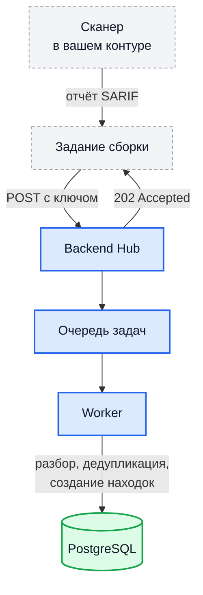

# Загрузка отчётов внешних сканеров

Любой сканер, умеющий выгружать SARIF 2.1.0, может загружать результаты в Hub:
формат стандартный, и никакой доработки на стороне Hub под конкретный
инструмент не требуется. Помимо SARIF принимается формат выгрузки SonarQube.

!!! note "О совместимости с конкретными инструментами"

    Требование одно — корректный SARIF 2.1.0. Перечня сканеров, совместимость
    с которыми подтверждена испытаниями, мы не приводим: заявление «проверено
    с таким-то инструментом» требует подтверждения, а версии сканеров и их
    выгрузка меняются независимо от нас. Практическая проверка занимает одну
    загрузку: отправьте отчёт и посмотрите на состояние обработки.

## Как это устроено



Формула дедупликации и жизненный цикл находки описаны отдельно:
[Жизненный цикл находки](findings.md).

## Создание сервисной учётной записи

Системам сборки и сканерам нужны не пользователи, а машинные клиенты.
Сервисная учётная запись состоит из:

- имени и описания;
- одного или нескольких ключей доступа со сроком действия;
- прав, выданных на конкретные проекты или продукты.

### Права

Право выдаётся на проект, продукт или на всю установку — набор допустимых
уровней у каждого права свой. Выдача права с несовместимым уровнем
отклоняется с кодом `400`.

| Право | Что разрешает | Уровни |
| --- | --- | --- |
| `upload_report` | Загружать отчёты | проект, продукт, общий |
| `read_findings` | Читать находки | проект, продукт, общий |
| `read_reports` | Читать загруженные отчёты | проект, продукт |
| `list_products` | Искать продукты по адресу репозитория | проект, общий |
| `create_project` | Создавать проекты | общий |
| `create_product` | Создавать продукты | проект, общий |
| `update_product` | Изменять свойства продукта | проект, продукт, общий |
| `delete_product` | Удалять продукт | проект, продукт, общий |
| `read_metrics` | Читать показатели | общий |
| `manage_scope` | Управлять периметром | проект |
| `manage_notifications` | Управлять настройками каналов уведомлений | проект |

Для загрузки отчётов из системы сборки достаточно `upload_report`. Права
`delete_product` и `manage_notifications` дают доступ к разрушительным
действиям и к секретам каналов — выдавайте их осознанно.

### Через интерфейс

1. **Администрирование → Сервисные учётные записи → Создать**
   - имя, например `gitlab-ci-backend`;
   - описание.
2. **Ключи → Добавить**
   - имя ключа;
   - срок действия — рекомендуется задавать конечный, например 180 суток;
   - право `upload_report`;
   - привязка к нужному проекту или продукту.
3. Hub покажет полный ключ **один раз**. Скопируйте его сразу и положите в
   защищённые переменные вашей системы сборки — с маскированием и, если
   поддерживается, ограничением на защищённые ветки.

### Через API

```bash
# 1. Create SA
SA_ID=$(curl -X POST https://hub.example.com/api/v1/service-accounts \
  -H "Authorization: Bearer $ADMIN_JWT" \
  -H "Content-Type: application/json" \
  -d '{"name":"gitlab-ci-backend","description":"Auto-upload SARIF"}' \
  | jq -r '.data.id')

# 2. Create API Key
curl -X POST "https://hub.example.com/api/v1/service-accounts/$SA_ID/keys" \
  -H "Authorization: Bearer $ADMIN_JWT" \
  -H "Content-Type: application/json" \
  -d '{"name":"key-prod-1","expires_in_days":180}' \
  | jq
```

Ответ:

```json
{
  "data": {
    "id": "uuid",
    "name": "key-prod-1",
    "key": "sa_1a2b3c4d_AAA...full-key-shown-once...ZZZ",
    "prefix": "1a2b3c4d",
    "expires_at": "2026-12-02T...",
    "created_at": "2026-06-05T..."
  }
}
```

Формат ключа: `sa_<8hex>_<base64url>` (`sa` — фиксированный префикс, `<8hex>` — первые 4 байта в hex, `<base64url>` — секрет). Поле `prefix` (те самые 8 hex-символов) хранится в БД для аудита (можно отслеживать, какой ключ использовался). Полный ключ хешируется (SHA-256) и сравнивается при каждом запросе.

### Область действия прав

Сервисная учётная запись по умолчанию **не имеет прав ни на что** — права
назначаются явно:

- **на проект** — действие разрешено во всех его продуктах, включая созданные
  позже;
- **на продукт** — только в указанном продукте;
- **на всю установку** — для тех прав, которые допускают такой уровень.

## Эндпоинт загрузки

```
POST /api/v1/products/<product_id>/reports
X-API-Key: <api-key>
Content-Type: multipart/form-data
```

### Поля формы

Handler читает только перечисленные ниже поля. Файл должен иметь расширение `.sarif` или `.json` — никакие другие (включая `.gz`) не принимаются.

| Поле | Тип | Обязательное | Описание |
| --- | --- | --- | --- |
| `file` | файл | да | Отчёт с расширением `.sarif` или `.json`, без сжатия |
| `format` | строка | нет | `sarif` либо `sonarqube`. Если не указан — определяется по содержимому |
| `engine` | строка | нет | Имя сканера, если в отчёте его нет |
| `engine_version` | строка | нет | Версия сканера, если в отчёте её нет |
| `verify_fixes` | булево | нет | Пометить отчёт как пригодный для [автоматического закрытия исправленных находок](findings.md#автоматическое-закрытие-после-исправления) |
| `commit_id` | строка | нет | Идентификатор ревизии; приоритет ниже, чем у заголовка |

> Поле формы `branch` обработчиком не читается и игнорируется. Передавать его
> не нужно.

### Заголовки

| Заголовок                           | Описание                                    |
| ----------------------------------- | ------------------------------------------- |
| `X-API-Key: <key>`                  | API key сервисного аккаунта (основной способ) |
| `X-Commit-Id: <sha>`                | Альтернатива form-полю                       |
| `Content-Type: multipart/form-data` | Стандарт                                     |

### Аутентификация

Service-account API-ключи передаются через `X-API-Key`. **Не** используйте `Authorization: Bearer <api-key>` — заголовок `Bearer` валидируется как JWT, и ключ `sa_...` будет отклонён с `401`.

Поддерживается также форма:

```
Authorization: ApiKey <key>
```

(JWT-пользователи, в отличие от сервисных аккаунтов, аутентифицируются через `Authorization: Bearer <jwt_token>`.)

## Поддерживаемые SARIF поля

Hub извлекает следующие поля стандарта 2.1.0:

| SARIF поле                                     | Hub field                          | Комментарий                                                   |
| ---------------------------------------------- | ---------------------------------- | ------------------------------------------------------------- |
| `runs[].tool.driver.name`                      | `findings.engine`                  | Например, `gosec`, `semgrep`                                  |
| `runs[].results[].ruleId`                      | `findings.rule_id`                 |                                                               |
| `runs[].results[].message.text`                | `findings.description`             |                                                               |
| `runs[].results[].level`                       | используется для severity fallback | `error`/`warning`/`note`                                      |
| `runs[].results[].locations[]`                 | `findings.location`                | physicalLocation, logicalLocations                            |
| `runs[].results[].properties.severity`         | `findings.severity`                | приоритет №1 для severity                                     |
| `runs[].results[].baselineState`               | `findings.baseline_state`          | `new`/`unchanged`/`updated`/`absent`                          |
| `runs[].results[].suppressions[].status`       | `findings.suppressed`              | `accepted` → `true`                                           |
| `runs[].results[].kind`                        | `findings.kind`                    | `fail`/`pass`/`open`/`review`/`notApplicable`/`informational` |
| `runs[].results[].codeFlows[]`                 | сохраняется                        | детали для UI                                                 |
| `runs[].results[].fixes[]`                     | сохраняется                        | предложенные фиксы                                            |
| `runs[].results[].taxonomies[]`                | сохраняется                        | CWE/OWASP mapping                                             |
| `runs[].versionControlProvenance[].revisionId` | используется как commit_id         | приоритет №2                                                  |

### Severity fallback (порядок приоритета)

1. `result.properties.severity` (явное поле)
2. `result.level` (`error` → HIGH, `warning` → MEDIUM, `note` → LOW)
3. `tool.driver.rules[ruleID].defaultConfiguration.level`
4. `"INFO"` (если ничего не задано)

### Commit ID (порядок приоритета)

1. `runs[].results[].properties.commit_id` (per-result)
2. `runs[].versionControlProvenance[].revisionId`
3. `runs[].properties.commit_id` (per-run)
4. HTTP header `X-Commit-Id`
5. Form field `commit_id`
6. Query param `?commit_id=`

## Жёсткие лимиты безопасности

| Что | Предел | Зачем |
| --- | --- | --- |
| Размер файла при разборе | 50 МиБ | Память |
| `runs[]` на отчёт | 100 | Защита от намеренно раздутых файлов |
| `results[]` на run | 100 000 | Память |
| `locations[]` на result | 1 000 | Отказ в обслуживании |
| `codeFlows[]` на result | 100 | Отказ в обслуживании |
| `threadFlows[]` на codeFlow | 10 | Отказ в обслуживании |
| Шагов в codeFlow, суммарно на result | 10 000 | Отказ в обслуживании |
| `fixes[]` на result | 100 | Отказ в обслуживании |
| Изменений файлов на fix | 1 000 | Отказ в обслуживании |
| Длина отдельной строки | 1 МиБ | Память |
| Глубина вложенности JSON | 256 | Переполнение стека |

!!! warning "Превышение этих пределов не возвращается вызывающей стороне"

    Загрузка асинхронная, и `202` вы получаете **до** разбора. Поэтому:

    - файл **больше 50 МиБ** обрезается по этой границе, после чего разбор
      падает с ошибкой формата — на размер как на причину сообщение не
      указывает;
    - при **более чем 100 разделах** лишние отбрасываются, а отчёт считается
      успешно обработанным: в журнале остаётся предупреждение, в ответе
      API — ничего.

    Практический вывод: если вы грузите крупные отчёты, снизьте
    `MAX_UPLOAD_SIZE_MB` до 50 — тогда отказ придёт сразу и с понятной
    причиной, — и проверяйте итог по состоянию отчёта, а не только по коду
    ответа.

Отдельно действует предел размера **загружаемого** файла
`MAX_UPLOAD_SIZE_MB`, по умолчанию 500 МБ. Он проверяется в момент приёма и
при превышении даёт `413`. Обратите внимание, что по умолчанию он **выше**
предела разбора.

## Пример загрузки

### Bash + curl

```bash
TOKEN="sa_1a2b3c4d_..."
PRODUCT_ID="abc-123-..."
COMMIT=$(git rev-parse --short HEAD)

curl -X POST "https://hub.example.com/api/v1/products/$PRODUCT_ID/reports" \
  -H "X-API-Key: $TOKEN" \
  -H "X-Commit-Id: $COMMIT" \
  -F "file=@scan.sarif" \
  -F "verify_fixes=true"
```

Ответ — `202 Accepted`:

```json
{
  "data": {
    "message": "Report queued for processing",
    "report_id": "rpt-uuid",
    "job_id": 12345
  }
}
```

!!! warning "Обработка асинхронная"

    `202` означает «отчёт принят и поставлен в очередь», а не «отчёт
    разобран». Счётчиков найденного в ответе нет — на момент ответа разбор
    ещё не начинался.

    Чтобы узнать итог, запросите состояние отчёта:

    ```bash
    curl -H "X-API-Key: $HUB_API_KEY" \
      "https://hub.example.com/api/v1/reports/<report_id>"
    ```

    Состояние перейдёт из `pending` в `completed` либо в `failed`. Задание
    видно и в разделе фоновых задач по возвращённому `job_id`.

### GitLab CI пример

```yaml
sast:
  stage: test
  image: securego/gosec:latest
  script:
    - gosec -fmt=sarif -out=gosec.sarif ./... || true
    - |
      curl -X POST "$HUB_URL/api/v1/products/$HUB_PRODUCT_ID/reports" \
        -H "X-API-Key: $HUB_API_KEY" \
        -H "X-Commit-Id: $CI_COMMIT_SHA" \
        -F "file=@gosec.sarif"
  artifacts:
    paths: [gosec.sarif]
  variables:
    HUB_URL: https://hub.example.com
    HUB_PRODUCT_ID: <product-uuid>
    # HUB_API_KEY — в CI/CD variables, masked + protected
```

### GitHub Actions пример

```yaml
- name: Upload SARIF to Hub
  if: always()
  run: |
    curl -X POST "${{ secrets.HUB_URL }}/api/v1/products/${{ secrets.HUB_PRODUCT_ID }}/reports" \
      -H "X-API-Key: ${{ secrets.HUB_API_KEY }}" \
      -H "X-Commit-Id: ${{ github.sha }}" \
      -F "file=@gosec.sarif"
```

## Какие инструменты подойдут

Требование одно: корректный SARIF 2.1.0. Этот формат выгружают
распространённые средства статического анализа кода, проверки зависимостей и
образов контейнеров, анализа конфигураций инфраструктуры, поиска секретов и
динамического сканирования веб-приложений. Отдельно принимается формат
выгрузки SonarQube — укажите `format=sonarqube` либо положитесь на
определение по содержимому.

Находки от DomainScope попадают в Hub тем же путём — см.
[Обзор DomainScope](domainscope-overview.md).

Чтобы дедупликация работала между запусками, от сканера нужно постоянство
двух вещей: идентификатора правила и местоположения. Если сканер меняет
идентификаторы правил между версиями, находки будут пересоздаваться.

## Смена ключа

У ключей есть срок действия. Меняйте их так:

1. создайте новый ключ с теми же правами;
2. обновите переменную в системе сборки;
3. дождитесь одного-двух прогонов и убедитесь, что загрузки проходят;
4. отзовите старый ключ.

Оба ключа действительны одновременно, пока старый не отозван, — окно замены
можно делать любой длины.

## Журнал загрузок

Каждая загрузка отчёта попадает в журнал действий с указанием, кто её
выполнил, в какой продукт и каким сканером получен отчёт. Журнал доступен в
административном разделе интерфейса.

## Типовые проблемы

| Симптом | Что проверить |
| --- | --- |
| `400`, недопустимое расширение | Принимаются только `.sarif` и `.json`. Архивы, включая `.gz`, отклоняются |
| `401` | Ключ неверен, истёк или отозван. Проверьте также, что он передан в `X-API-Key`, а не в `Authorization: Bearer` |
| `403` | У учётной записи нет права `upload_report` на этот продукт |
| `413` | Файл больше `MAX_UPLOAD_SIZE_MB`. Уменьшите отчёт либо поднимите предел и `client_max_body_size` на обратном прокси |
| `503` | Очередь задач недоступна — обычно недоступна база данных |
| Получен `202`, но находок нет | Обработка асинхронная. Посмотрите состояние отчёта: `pending` — ещё в очереди, `failed` — разбор не удался |
| Отчёт в состоянии `failed` без внятной причины | Вероятная причина — размер больше 50 МиБ: файл обрезается, и разбор падает на неполном JSON |
| Часть разделов отчёта пропала | Больше 100 разделов — лишние отбрасываются, отчёт при этом считается успешным |
| Находки не дедуплицируются между сканами | Идентификатор правила или местоположение нестабильны между запусками сканера |
| Критичность всегда `INFO` | Сканер не заполняет ни `properties.severity`, ни `level`, ни уровень правила |
