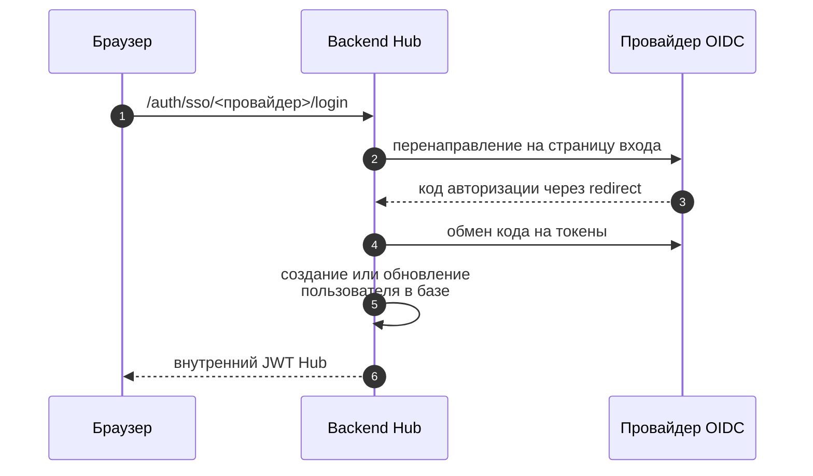

# Вход через SSO и OIDC

Hub поддерживает **подключаемые OIDC-провайдеры**. Keycloak остаётся основным и настраивается через существующие `KEYCLOAK_*` переменные — действующие инсталляции без изменений продолжают работать. Дополнительно можно подключить Azure AD (Entra ID), корпоративный IdP или любой другой OIDC-провайдер через универсальный механизм `OIDC_<NAME>_*`.

Поддерживается два режима входа:

1. **SSO-логин в UI** — пользователь входит через OIDC-провайдер, Hub выпускает свой внутренний JWT
2. **Transparent SSO** — внешнее приложение проксирует запросы в Hub с собственным JWT того же Keycloak realm; Hub валидирует и принимает без повторного логина

## Мульти-провайдерный SSO

### Переменная `SSO_PROVIDERS`

```ini
SSO_PROVIDERS=keycloak           # по умолчанию — только Keycloak (обратная совместимость)
SSO_PROVIDERS=keycloak,azure     # Keycloak + Azure AD
SSO_PROVIDERS=keycloak,okta      # Keycloak + Okta
```

Каждый провайдер из списка отображается отдельной кнопкой на странице логина Hub. Имя в списке — идентификатор провайдера (произвольная строка нижнего регистра).

### Маршруты логина

| Маршрут | Провайдер |
|---|---|
| `/api/v1/auth/sso/<provider>/login` | Любой провайдер по имени |
| `/api/v1/auth/keycloak/login` | Legacy-маршрут Keycloak (работает без изменений) |

**Redirect URI**, который нужно зарегистрировать в каждом IdP:

```
{FRONTEND_URL}/auth/callback
```

### Модель `OIDC_<NAME>_*` (generic OIDC)

Для каждого дополнительного провайдера задаётся набор переменных с префиксом `OIDC_<UPPER(NAME)>_`, где `NAME` — имя провайдера в `SSO_PROVIDERS` в верхнем регистре.

| Переменная | Назначение | Обязательна | По умолчанию |
|---|---|---|---|
| `OIDC_<NAME>_DISPLAY_NAME` | Метка на кнопке входа | Нет | имя провайдера |
| `OIDC_<NAME>_DISCOVERY_URL` | URL OIDC well-known (`/.well-known/openid-configuration`) | Да (или задайте эндпоинт-overrides) | — |
| `OIDC_<NAME>_CLIENT_ID` | Client ID в IdP | Да | — |
| `OIDC_<NAME>_CLIENT_SECRET` | Client Secret | Да | — |
| `OIDC_<NAME>_SCOPES` | Запрашиваемые scopes (через пробел) | Нет | `openid profile email` |
| `OIDC_<NAME>_AUTO_PROVISION` | Автосоздание пользователей при первом входе | Нет | `true` |
| `OIDC_<NAME>_TRUST_EMAIL` | Доверять email из IdP как верифицированному, даже если `email_verified` отсутствует в токене. Обязательна для IdP, не эмитирующих это поле (например, Microsoft Entra ID / Azure AD v2) | Нет | `false` |
| `OIDC_<NAME>_AUTH_URL` | Переопределение authorization эндпоинт | Нет | из discovery |
| `OIDC_<NAME>_TOKEN_URL` | Переопределение token эндпоинт | Нет | из discovery |
| `OIDC_<NAME>_JWKS_URL` | Переопределение jwks_uri | Нет | из discovery |
| `OIDC_<NAME>_ISSUER` | Переопределение issuer | Нет | из discovery |
| `OIDC_<NAME>_END_SESSION_URL` | Переопределение end_session_endpoint | Нет | из discovery |

**Разрешение эндпоинты**: явный override > discovery document > ошибка при старте.

### Идентификация пользователей

- Пользователь сопоставляется по паре `(provider, subject)` (поле `sub` из JWT).
- При первом входе нового пользователя: Hub ищет существующий аккаунт по **верифицированному email** и привязывает к нему; если аккаунта нет и `AUTO_PROVISION=true` — создаёт нового со статусом **active**, ролью **viewer** (расширить доступ к продуктам/проектам может администратор через UI Hub → Admin → Users).
- Hub принимает `email_verified` как булево `true` или строку `"true"`/`"1"`. Если IdP **не эмитирует** поле `email_verified` (например, Microsoft Entra ID v2) — без `OIDC_<NAME>_TRUST_EMAIL=true` вход завершится ошибкой 403. В этом случае оператор явно подтверждает, что IdP берёт на себя ответственность за верификацию email.
- Маппинг ролей из групп IdP **не поддерживается** (роли управляются внутри Hub).

## Архитектура (один провайдер)



## Сценарий A: Keycloak рядом с Hub

!!! note "Провайдера входа в поставке нет"

    Поставляемый `docker-compose.yml` разворачивает Hub в режиме локальных
    учётных записей (`AUTH_MODE=LOCAL`) и провайдера входа не поднимает. Если
    для пилота нужен Keycloak рядом, разверните его самостоятельно — любым
    привычным способом — и подключите Hub переменными ниже. Дальше по тексту
    это тот же **сценарий B**, отличается только адресация.

Разверните Keycloak, затем настройте realm и клиент, как описано в
[сценарии B](#что-админ-настраивает-в-keycloak), и задайте Hub:

```ini
AUTH_MODE=SSO

KEYCLOAK_URL=http://keycloak:8080                 # адрес, по которому ходит backend
KEYCLOAK_PUBLIC_URL=http://localhost:8083         # адрес, куда редиректится браузер
KEYCLOAK_REALM=securityhub
KEYCLOAK_CLIENT_ID=security-hub
KEYCLOAK_CLIENT_SECRET=<из Keycloak: Clients → security-hub → Credentials>
```

Перезапустите backend: `docker compose restart backend`.

!!! warning "Значение по умолчанию не подойдёт"

    Вне `APP_ENV=development` пустой `KEYCLOAK_CLIENT_SECRET` **и** буквальное
    значение `change-me` отвергаются одинаково — старт прерывается. Задайте
    собственный секрет.

## Сценарий B: внешний Keycloak (production)

Стандартный продакшен — Keycloak уже развёрнут отдельно, Hub только использует.

### Что админ настраивает в Keycloak

#### 1. Realm

Создать или использовать существующий. Имя — например `securityhub`.

#### 2. Client `security-hub`

- **Client type:** OpenID Connect
- **Client ID:** `security-hub`
- **Client authentication:** ON (confidential)
- **Authorization:** OFF
- **Authentication flow:**
  - ✅ Standard flow
  - ❌ Implicit, Direct access, OAuth Device, Service account
- **Valid Redirect URIs:** `https://hub.example.com/*`
- **Valid post logout redirect URIs:** `https://hub.example.com/*`
- **Web origins:** `https://hub.example.com`

После создания — закладка `Credentials` → скопировать `Client Secret`.

#### 3. Роли в Keycloak создавать не нужно

Роли живут **внутри Hub**, а не в провайдере входа. Перенос ролей или групп
из провайдера не поддерживается — какие бы роли вы ни завели в realm, на
права в Hub они не повлияют.

Роли Hub:

| Роль | Что даёт |
| --- | --- |
| `admin` | Полный доступ, включая административный раздел |
| `project_owner` | Управление проектами и продуктами |
| `security_analyst` | Работа с находками |
| `developer` | Чтение и комментарии |
| `viewer` | Только чтение |
| `auditor` | Только чтение и выгрузка |
| `user` | Базовая роль |

Роль назначает администратор Hub, либо пользователь запрашивает доступ сам —
запрос попадает на согласование тому, кто управляет ресурсом.

С 0.33 роли и права правятся в интерфейсе матрицей прав: видно, какое право
какой роли выдано, и можно завести свою роль, а не выбирать из встроенных.

#### 4. Mappers

В Client → Client Scopes → Dedicated scope → Mappers добавить:

- **Audience mapper** — `aud=security-hub` в access token
  - Mapper Type: Audience
  - Included Client Audience: `security-hub`
  - Add to access token: ON

- (опционально) **Group membership** — если используете группы для ролей

#### 5. TLS

В production realm должен быть на HTTPS:

```bash
kcadm.sh update realms/securityhub -s sslRequired=EXTERNAL
```

Для dev можно `sslRequired=NONE`, но Hub в `APP_ENV=production` откажется работать с HTTP-Keycloak.

### Переменные окружения Hub

```ini
AUTH_MODE=SSO

# Backend → Keycloak (внутренний)
KEYCLOAK_URL=https://keycloak-internal.example.com    # или прямой K8s service URL
KEYCLOAK_PUBLIC_URL=https://keycloak.example.com      # куда редиректится браузер
KEYCLOAK_REALM=securityhub
KEYCLOAK_CLIENT_ID=security-hub
KEYCLOAK_CLIENT_SECRET=<из Keycloak>
```

### Split-network (Docker/K8s)

Если backend ходит к Keycloak по internal service-name, а браузер — по публичному FQDN, и OIDC discovery возвращает internal URL, переопределите эндпоинты явно:

```ini
KEYCLOAK_JWKS_URL=https://keycloak.example.com/realms/securityhub/protocol/openid-connect/certs
KEYCLOAK_TOKEN_URL=https://keycloak.example.com/realms/securityhub/protocol/openid-connect/token
```

В `APP_ENV=production` оба обязаны быть HTTPS.

## Сценарий C: Transparent SSO (внешний JWT)

Используется, когда стороннее приложение (например, security-портал на базе того же Keycloak) проксирует запросы к Hub с собственным JWT и хочет, чтобы Hub его принимал без повторного логина.

### Включение

```ini
FEATURE_SECURITY_HUB_INTEGRATION=true

KC_JWKS_URL=https://keycloak.example.com/realms/securityhub/protocol/openid-connect/certs
KC_ISSUER=https://keycloak.example.com/realms/securityhub
KC_AUDIENCES=external-app-1,external-app-2
KC_AUTO_PROVISION=true     # автосоздавать юзера при первом запросе

ATOM_IDP_BASE_URL=https://idp.example.com   # для CORS
```

### Поток валидации

При запросе с `Authorization: Bearer <external-jwt>`:

1. Hub валидирует подпись через `KC_JWKS_URL` (с кэшем JWKS)
2. Проверяет `iss == KC_ISSUER`
3. Проверяет `aud ∈ KC_AUDIENCES` (любое из comma-separated)
4. Проверяет `exp > now`
5. Ищет юзера в БД:
   - По `keycloak_id` (sub из JWT)
   - По `email` (только если `email_verified=true`)
   - Если не найден и `KC_AUTO_PROVISION=true` → создаёт нового без ролей

### WARNING: aud=account

В Keycloak `account` — built-in client (для UI самого Keycloak). По умолчанию access token от любого realm-юзера может включать `aud=account`. **Не добавляйте `account` в `KC_AUDIENCES` в production** — это сделает Hub доступным для любого пользователя realm без проверки целевой аудитории.

Используйте отдельные `aud`-значения для каждого внешнего приложения и Audience mappers в их Keycloak-клиентах.

## Audience mapper для atom-idp

Если интегрируетесь с atom-idp:

1. В Keycloak atom-idp создайте Audience mapper: `aud=security-hub`
2. На Hub задайте:

```ini
KC_AUDIENCES=security-hub
ATOM_IDP_BASE_URL=https://atom-idp.example.com
```

## Auto-provisioning

При `KC_AUTO_PROVISION=true`:

- Новый юзер создаётся с `email`, `username`, `keycloak_id` из JWT
- **Без ролей** — для доступа админ должен назначить роль через UI Hub → Admin → Users

!!! note "Первый администратор без выключения SSO"

    На чистой установке назначать роль некому. Перечислите адрес будущего
    администратора в `BOOTSTRAP_ADMIN_EMAILS` — при входе через провайдера он
    получит роль `admin`. Адрес, который провайдер не подтвердил, роли не
    получает; Hub при старте предупреждает, что механизм включён. Уберите
    переменную, как только права розданы.
- Без email юзер не создаётся (логируется warning)

При `KC_AUTO_PROVISION=false`: внешние JWT принимаются только для уже существующих юзеров.

## Настройка Azure AD (Entra ID)

Azure AD — обычный OIDC-провайдер. Имя провайдера в примере — `azure`.

### 1. Регистрация приложения в Azure

1. Azure Portal → **Azure Active Directory** → **App registrations** → **New registration**
2. Название — произвольное (например, `security-hub`)
3. **Supported account types**: выберите тип по политике организации (обычно *Accounts in this organizational directory only*)
4. **Redirect URI**: тип `Web`, значение:
   ```
   https://hub.example.com/auth/callback
   ```
5. После создания скопируйте **Application (client) ID** и **Directory (tenant) ID**
6. **Certificates & secrets** → **New client secret** → скопируйте значение (показывается один раз)
7. **API permissions**: убедитесь, что есть `openid`, `profile`, `email` (Microsoft Graph — delegated)

### 2. Переменные окружения Hub

> **КРИТИЧНО: `OIDC_AZURE_TRUST_EMAIL=true` обязательна для Azure / Entra ID.**
>
> Microsoft Entra ID (Azure AD) v2 **не включает поле `email_verified`** в токены. Hub требует верифицированный email для привязки и создания аккаунта — без `TRUST_EMAIL=true` каждый вход через Azure завершается ошибкой **403**. Выставив этот флаг, оператор подтверждает, что Entra ID гарантирует верификацию корпоративных email-адресов организации.

```ini
AUTH_MODE=SSO
SSO_PROVIDERS=keycloak,azure

# Azure AD
OIDC_AZURE_DISPLAY_NAME=Azure AD
OIDC_AZURE_DISCOVERY_URL=https://login.microsoftonline.com/<tenant-id>/v2.0/.well-known/openid-configuration
OIDC_AZURE_CLIENT_ID=<application-client-id>
OIDC_AZURE_CLIENT_SECRET=<client-secret-value>
OIDC_AZURE_TRUST_EMAIL=true              # ОБЯЗАТЕЛЬНО: Entra ID не эмитирует email_verified
# OIDC_AZURE_SCOPES=openid profile email   # по умолчанию, задавать не нужно
# OIDC_AZURE_AUTO_PROVISION=true           # по умолчанию true
```

Замените `<tenant-id>` на Directory (tenant) ID из Azure Portal.

### 3. Проверка

```bash
# Discovery должен быть доступен из backend
curl -fs "https://login.microsoftonline.com/<tenant-id>/v2.0/.well-known/openid-configuration" | jq .issuer

# Кнопка «Azure AD» появится на странице логина Hub
curl -s https://hub.example.com/api/v1/auth/config | jq '.data.providers'
```

---

## Откат к LOCAL-режиму

Если SSO сломался (например, Keycloak недоступен), временно вернитесь на LOCAL:

```ini
AUTH_MODE=LOCAL
LOCAL_ADMIN_PASSWORD=<пароль>
```

```bash
docker compose restart backend
# Войдите как admin@localhost.local / LOCAL_ADMIN_PASSWORD
```

После починки SSO — верните `AUTH_MODE=SSO`. Существующие SSO-пользователи в БД сохранятся.

## Проверка интеграции

```bash
# 1. Discovery должен быть доступен из backend
docker compose exec backend curl -fs \
  $KEYCLOAK_URL/realms/$KEYCLOAK_REALM/.well-known/openid-configuration | jq

# 2. JWKS отдаёт ключи
curl -fs $KEYCLOAK_PUBLIC_URL/realms/$KEYCLOAK_REALM/protocol/openid-connect/certs | jq '.keys[0].kid'

# 3. UI редиректит на Keycloak
curl -sI https://hub.example.com/auth/keycloak/login | grep Location

# 4. Логи backend при логине
docker compose logs -f backend | grep -i keycloak
```
