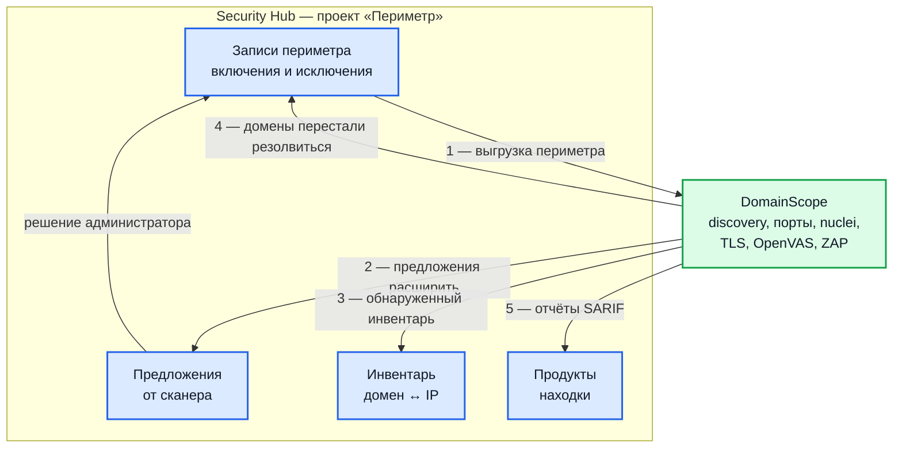

# Сканирование сетевого периметра: связка DomainScope и Hub

Сквозной процесс: как поднять непрерывное сканирование внешнего периметра,
связать воркер DomainScope с проектом в Hub и настроить обмен данными в обе
стороны — периметр из Hub в воркер, находки и предложения по его расширению из
воркера в Hub.

Страница самодостаточна: подготовка на стороне Hub, конфигурация воркера,
контракт обмена, проверка связки, повседневные операции и разбор сбоев. Про сам
сервис — [Обзор DomainScope](domainscope-overview.md), про его установку —
[Установка DomainScope](domainscope-install.md).

## Как это устроено

Hub — источник истины по периметру и приёмник результатов. DomainScope ничего
не решает про границы сканирования сам: каждый цикл он спрашивает Hub, что ему
разрешено трогать, и отдаёт обратно всё, что нашёл.



| № | Направление | Эндпоинт | Что переносит |
| --- | --- | --- | --- |
| 1 | Hub → DomainScope | `GET /projects/<id>/scope/export`, `GET /projects/<id>/scope`, `POST /projects/<id>/scope/filter` | границы сканирования: включения и исключения по доменам и подсетям |
| 2 | DomainScope → Hub | `POST /projects/<id>/scope/proposals` | предложения расширить периметр |
| 3 | DomainScope → Hub | `POST /projects/<id>/scope/assets` | инвентарь: что сканер фактически видит |
| 4 | DomainScope → Hub | `POST /projects/<id>/scope/resolution-report` | домены, переставшие или снова начавшие резолвиться |
| 5 | DomainScope → Hub | `POST /products/<id>/reports` | находки в формате SARIF 2.1.0 |

Все пять вызовов аутентифицируются одним заголовком `X-API-Key` с ключом
сервисной учётной записи.

!!! warning "Заголовок `Authorization: Bearer` для сервисных учётных записей не работает"
    Он проверяется как JWT, и ключ вида `sa_...` будет отклонён с кодом `401`.

## Три значения, которыми связываются воркер и проект

Вся связка сводится к трём идентификаторам, которые переносятся из Hub в
конфигурацию воркера. Больше ничего сопоставлять вручную не нужно.

| Значение в Hub | Переменная DomainScope | Что определяет |
| --- | --- | --- |
| Идентификатор проекта | `DOMAINSCOPE_HUB_PROJECT_IDS` | откуда брать периметр и куда слать предложения, инвентарь и отчёт о резолве |
| Идентификатор продукта | `DOMAINSCOPE_SARIF_PRODUCT_ID` | куда попадают находки |
| Ключ сервисной учётной записи | `DOMAINSCOPE_HUB_API_TOKEN` и `DOMAINSCOPE_SARIF_API_TOKEN` | право делать и то, и другое |

Плюс два адреса — обычно они совпадают:

| Переменная | Значение | На что обратить внимание |
| --- | --- | --- |
| `DOMAINSCOPE_HUB_API_ENDPOINT` | корень Hub, например `https://hub.example.com` | клиент сам дописывает `/api/v1/projects/...`; завершающая косая черта снимается автоматически |
| `DOMAINSCOPE_SARIF_API_ENDPOINT` | корень Hub, **без** `/api/v1` | клиент сам дописывает `/api/v1/products/<id>/reports` |

!!! danger "Не указывайте `/api/v1` в адресе загрузки отчётов"
    Путь удвоится — `/api/v1/api/v1/products/.../reports` — Hub ответит `404`,
    и находки не доедут. В логе воркера это видно как
    «404 — маршрут или продукт не найден (находки НЕ загружены)».

### Один воркер — один проект

`DOMAINSCOPE_HUB_PROJECT_IDS` принимает список через запятую, но используется
**только первый элемент**: воркер создаёт один клиент Hub, привязанный к первому
идентификатору. Нужно несколько проектов — поднимайте отдельные экземпляры
воркера, каждый со своей базой данных.

### Куда попадают находки разных сканеров

По умолчанию все сканеры пишут в продукт из `DOMAINSCOPE_SARIF_PRODUCT_ID`.
Чтобы аналитик мог разделять потоки, каждый движок направляется в свой продукт.

| Движок | Переменная продукта | Переменная ключа | Значение поля `engine` в Hub |
| --- | --- | --- | --- |
| Обнаружение и сканирование портов | общая | общая | `DomainScope` (задаётся `DOMAINSCOPE_SARIF_SCANNER_NAME`) |
| Nuclei | `DOMAINSCOPE_NUCLEI_SARIF_PRODUCT_ID` | `DOMAINSCOPE_NUCLEI_SARIF_API_TOKEN` | `<имя сканера>/Nuclei` |
| OpenVAS | `DOMAINSCOPE_OPENVAS_SARIF_PRODUCT_ID` | `DOMAINSCOPE_OPENVAS_SARIF_API_TOKEN` | `OpenVAS` |
| TLSX | `DOMAINSCOPE_TLSX_SARIF_PRODUCT_ID` | `DOMAINSCOPE_TLSX_SARIF_API_TOKEN` | `TLSX` |
| OWASP ZAP | `DOMAINSCOPE_ZAP_SARIF_PRODUCT_ID` | `DOMAINSCOPE_ZAP_SARIF_API_TOKEN` | `OWASP ZAP` |

Правила разрешения:

- отдельный клиент загрузки для движка создаётся, если задана хотя бы одна из
  двух переменных — продукт или ключ;
- если задан только продукт, используется общий ключ
  `DOMAINSCOPE_SARIF_API_TOKEN`;
- адрес загрузки общий для всех движков, отдельного адреса на движок нет;
- если ничего не задано, движок пишет в общий продукт.

## Что нужно до начала

| Требование | Как проверить |
| --- | --- |
| Лицензия с функцией сканирования периметра | без неё эндпоинты `/projects/<id>/scope/*` закрыты, а раздел «Скоуп» в интерфейсе недоступен |
| Роль, позволяющая создавать проекты, продукты и сервисные учётные записи | обычно администратор |
| Сетевая доступность Hub из контейнера воркера | `curl -sS -o /dev/null -w '%{http_code}' https://hub.example.com/api/v1/version` |
| Исходящий доступ воркера в интернет | нужен для subfinder, DNS, сканирования портов и обновления шаблонов nuclei |
| Отдельная база PostgreSQL для DomainScope | база воркера не общая с Hub |

## Шаг 1. Подготовка на стороне Hub

### Проект

**Проекты → Создать**. Идентификатор проекта — в адресной строке
(`/projects/<идентификатор>`). Это значение пойдёт в
`DOMAINSCOPE_HUB_PROJECT_IDS`.

### Продукты

**Проект → Продукты → Создать**. Минимум — один продукт. Если включено
несколько сканеров, удобнее разделить:

| Продукт | Что принимает |
| --- | --- |
| `perimeter-discovery` | открытые порты, новые домены |
| `perimeter-nuclei` | веб-уязвимости по шаблонам |
| `perimeter-openvas` | уязвимости из базы CVE |
| `perimeter-tls` | проблемы сертификатов |
| `perimeter-zap` | результаты активного веб-сканирования |

Идентификатор продукта — в адресной строке (`/products/<идентификатор>`).

### Сервисная учётная запись и ключ

**Сервисные учётные записи → Создать**, затем **Ключи API → Добавить**. Полный
ключ показывается один раз — скопируйте его сразу. Формат ключа —
`sa_<8 символов>_<секрет>`; в базе хранятся только хеш и префикс для аудита.
Подробнее: [Загрузка отчётов внешних сканеров](integration-sarif.md).

Эндпоинты периметра требуют **точного** права, а не любого права на запись:

| Что делает воркер | Эндпоинт | Требуемое право |
| --- | --- | --- |
| читает периметр | `GET /scope`, `GET /scope/export`, `POST /scope/filter` | любое непустое незаблокированное право на проект |
| шлёт предложения | `POST /scope/proposals` | `upload_report` |
| шлёт инвентарь | `POST /scope/assets` | `upload_report` |
| шлёт отчёт о резолве | `POST /scope/resolution-report` | `upload_report` |
| загружает отчёты | `POST /products/<id>/reports` | `upload_report` на продукт |

**Достаточно одной записи: `upload_report` на проект.** Права наследуются вниз:
такое право авторизует и загрузку отчётов во все продукты проекта, и все четыре
эндпоинта записи периметра.

!!! warning "Право `manage_scope` воркеру не выдавать"
    Это право администратора: подтверждение предложений, ручное управление
    записями, настройка синхронизации с NetBox. Работающий сканер его не
    вызывает. Если выдать его сканеру, утёкший ключ позволит переписать
    периметр и создать задание синхронизации с произвольным адресом.

Явная блокировка сервисной учётной записи на проекте отменяет все её права на
этом проекте — включая продуктовые и общие, независимо от их типа.

### Записи периметра

**Проект → Скоуп** (`/projects/<идентификатор>/scope`). Разделы:

| Раздел | Содержимое |
| --- | --- |
| Скоуп → «Адреса» и «Домены» | активные записи: включения и исключения |
| Скоуп → «Деактив. (адреса)» и «Деактив. (домены)» | отключённые записи: вручную, синхронизацией или как «не резолвится» |
| Скоуп → «Предложения» | предложения сканера, ожидающие решения |
| Синхронизации | периодический импорт из NetBox |
| Инвентарь | пары домен ↔ IP, которые сканер реально видит |

Как читаются записи:

- тип определяется по значению: `192.0.2.0/24` или одиночный адрес — подсеть
  (одиночный превращается в `/32`), `example.com` — домен;
- действие: включить в периметр или исключить из него;
- **побеждает самая точная запись**: для адресов — самая длинная совпавшая
  маска, для доменов — самое длинное совпавшее окончание. То есть включение
  `example.com` вместе с исключением `dev.example.com` означает «сканируем всё,
  кроме `dev.example.com` и всего, что под ним»;
- исключение домена автоматически раскрывается в шаблон `*.<домен>`;
- исключение подсети раскладывается с учётом более точных включений: исключение
  `10.20.30.40/30` вместе с включением `10.20.30.40/32` даёт фактическое
  исключение `10.20.30.41/32` и `10.20.30.42/31`.

Наполнить периметр можно четырьмя способами.

**Вручную** — кнопка «Добавить запись».

**Импортом CSV** — кнопка «Импорт CSV». Заголовок обязателен, порядок колонок
любой:

```csv
scope_action,value,tags,description
include,10.0.0.0/24,corp;prod,Офисная сеть
include,example.com,,Основной домен
exclude,vpn.example.com,,Исключить VPN-шлюз
```

Колонка `entry_type` не обязательна — тип определится сам, теги разделяются
точкой с запятой. Ограничение — 5000 строк на запрос. Импорт частично успешный:
неверные строки попадают в список ошибок, остальные импортируются. Повторный
импорт того же файла ничего не дублирует.

**Синхронизацией с NetBox** — раздел «Синхронизации»: периодический импорт
подсетей, адресов и DNS-зон с фильтрами по тегам, арендаторам, статусам и типу
сетей. Подробнее: [Синхронизация периметра с NetBox](integration-netbox.md).

**Предложениями самого сканера** — после первого цикла обнаружения, см. раздел
«Предложения» ниже.

!!! note "Крупные подсети не разворачиваются в цели"
    DomainScope превращает включённые подсети в список адресов для сканирования
    портов и OpenVAS. Подсети **крупнее `/20`** (больше 4096 адресов)
    пропускаются, чтобы не переполнить очередь: `/24`, `/22` и `/20`
    разворачиваются, `/19` и крупнее — нет, в лог пишется
    «prefix too large to expand, skipping». Адреса IPv6 не разворачиваются
    вовсе. Нужен крупный диапазон — разбейте его на `/20` и мельче.

## Шаг 2. Настройка воркера

### Минимальный рабочий набор

```ini
# База данных воркера — своя, не общая с Hub
DOMAINSCOPE_DSN=host=ds-postgres user=domainscope password=<пароль> dbname=domainscope port=5432 sslmode=disable

# Периметр из Hub
DOMAINSCOPE_HUB_ENABLED=true
DOMAINSCOPE_HUB_API_ENDPOINT=https://hub.example.com
DOMAINSCOPE_HUB_API_TOKEN=sa_1a2b3c4d_...
DOMAINSCOPE_HUB_PROJECT_IDS=<идентификатор проекта>

# Находки в Hub
DOMAINSCOPE_SARIF_ENABLED=true
DOMAINSCOPE_SARIF_AUTO_UPLOAD=true
DOMAINSCOPE_SARIF_API_ENDPOINT=https://hub.example.com
DOMAINSCOPE_SARIF_API_TOKEN=sa_1a2b3c4d_...
DOMAINSCOPE_SARIF_PRODUCT_ID=<идентификатор продукта>
DOMAINSCOPE_SARIF_SCANNER_NAME=DomainScope
DOMAINSCOPE_SARIF_SCANNER_NODE=ds-prod-01

# Что включаем
DOMAINSCOPE_NUCLEI_ENABLED=true
DOMAINSCOPE_TLSX_ENABLED=true
```

`DOMAINSCOPE_DOMAINS` в этой схеме не обязателен: при `HUB_ENABLED=true` воркер
на старте забирает включённые домены из периметра проекта и использует их как
исходные. Если переменная всё же задана, списки объединяются, приоритет у
конфигурации воркера.

Полный перечень переменных: [Переменные окружения
DomainScope](env-domainscope.md).

### Разделение находок по продуктам

```ini
DOMAINSCOPE_SARIF_PRODUCT_ID=<продукт: обнаружение>
DOMAINSCOPE_NUCLEI_SARIF_PRODUCT_ID=<продукт: nuclei>
DOMAINSCOPE_OPENVAS_SARIF_PRODUCT_ID=<продукт: openvas>
DOMAINSCOPE_TLSX_SARIF_PRODUCT_ID=<продукт: tls>
DOMAINSCOPE_ZAP_SARIF_PRODUCT_ID=<продукт: zap>
```

### Поведение при недоступности Hub

Если Hub настроен, но периметр получить не удалось:

| Ситуация | Поведение |
| --- | --- |
| Запрос упал, но в памяти есть копия периметра **свежее часа** | используется копия, в лог — предупреждение `hub scope fetch failed, using cached matcher` |
| Копии нет или она старше часа | ошибка `PAGING: hub scope unavailable`, **активные сканеры — порты, nuclei, OpenVAS, ZAP — пропускают цикл** |
| То же, но задано `DOMAINSCOPE_SCOPE_FAIL_OPEN=true` | активные сканеры работают **без сверки с периметром**, в лог — предупреждение |

Пассивное обнаружение продолжается в любом случае.

Поведение по умолчанию — остановить активное сканирование, а не расширить его.
Ограничение в один час существует специально: отзыв ключа и сужение периметра
доезжают до сканера сами, без перезапуска. `DOMAINSCOPE_SCOPE_FAIL_OPEN=true` —
осознанный риск сканирования вне периметра при потере связи.

### Docker Compose

Готовый стенд из поставки уже связан: служба `bootstrap` создаёт проект,
продукт и сервисную учётную запись с правом `upload_report`, записывает цели из
`DOMAINSCOPE_TARGETS` в периметр проекта и кладёт файл `scanner.env` в общий
том. Точка входа DomainScope читает оттуда идентификатор продукта, ключ и
идентификатор проекта.

Внутри сети Docker Hub доступен по `http://`, поэтому нужны:

```ini
DOMAINSCOPE_HUB_INSECURE=true
DOMAINSCOPE_SARIF_INSECURE=true
```

В промышленной установке эти флаги не выставляют: при
`DOMAINSCOPE_ENV=production` все адреса, по которым передаются секреты, обязаны
быть `https://`.

### Kubernetes и Helm

В зонтичном чарте `hub-platform` связка выполняется автоматически. Задача
первичного наполнения создаёт в базе Hub проект, продукт, сервисную учётную
запись и ключ, а шаблон секретов кладёт те же значения в секрет DomainScope:

| Ключ секрета | Переменная воркера |
| --- | --- |
| `hubApiToken` | `DOMAINSCOPE_HUB_API_TOKEN` |
| `hubProjectId` | `DOMAINSCOPE_HUB_PROJECT_IDS` |
| `sarifApiToken` | `DOMAINSCOPE_SARIF_API_TOKEN` |
| `sarifProductId` | `DOMAINSCOPE_SARIF_PRODUCT_ID` |

Домены засеваются в периметр из `global.defaultProject.scope` — список через
запятую.

Отдельная установка чарта `domainscope`, без зонтичного, требует задать связку
вручную:

```bash
helm upgrade --install domainscope ./charts/domainscope \
  --set domainscope.env.hubEnabled=true \
  --set domainscope.env.hubApiEndpoint=http://hub-backend:8082 \
  --set domainscope.env.sarifAutoUpload=true \
  --set domainscope.env.sarifApiEndpoint=http://hub-backend:8082 \
  --set domainscope.env.sarifProductId=<идентификатор продукта> \
  --set secrets.existingSecretName=domainscope-secrets
```

Секрет должен содержать ключи `hubApiToken`, `hubProjectId`, `sarifApiToken`,
`postgresPassword` и `dsn`.

## Шаг 3. Проверка связки

Выполняйте по порядку — каждый шаг проверяет ровно одно звено.

### Ключ принимается

```bash
curl -sS -H "X-API-Key: $KEY" \
  "https://hub.example.com/api/v1/projects/$PROJECT_ID/scope" | jq '.includes | length'
```

- `200` и число — ключ верен, право на чтение есть;
- `401` — ключ неверный, истёк или отключён;
- `403` — у учётной записи нет ни одного права на этот проект;
- `404` — неверный идентификатор проекта или лишний `/api/v1` в адресе.

### Периметр отдаётся в разобранном виде

```bash
curl -sS -H "X-API-Key: $KEY" \
  "https://hub.example.com/api/v1/projects/$PROJECT_ID/scope/export?format=json" | jq
```

Ожидаемый ответ:

```json
{
  "cidr":   { "include": ["10.0.0.0/24"], "exclude": [] },
  "domain": { "include": ["example.com"],
              "exclude": ["vpn.example.com"],
              "exclude_wildcards": ["*.vpn.example.com"] }
}
```

Пустые списки означают, что периметр не заполнен — сканировать будет нечего,
кроме значений `DOMAINSCOPE_DOMAINS` и `DOMAINSCOPE_TARGET_IPS`, если они
заданы.

### Право на запись есть

```bash
curl -sS -X POST -H "X-API-Key: $KEY" -H "Content-Type: application/json" \
  -d '[{"domain":"probe.example.com","ip":"192.0.2.1","scanner_name":"manual-check"}]' \
  "https://hub.example.com/api/v1/projects/$PROJECT_ID/scope/assets"
```

Ответ `{"accepted":1}` — право `upload_report` на месте.

### Отчёт доходит до продукта

```bash
curl -sS -X POST -H "X-API-Key: $KEY" \
  -F "file=@report.sarif" -F "engine=DomainScope" \
  "https://hub.example.com/api/v1/products/$PRODUCT_ID/reports"
```

Ответ `202` с идентификатором отчёта — маршрут верен.

### Логи воркера

```bash
docker compose logs -f domain-scope
# или
kubectl logs -f deploy/<релиз>-domainscope
```

Признаки исправной связки:

```
INFO  hub scope api enabled                     {"project_id": "..."}
INFO  hub: loaded seed domains from scope        {"hub_domains": 12}
INFO  hub scope targets loaded                   {"count": 256}
INFO  hub scope: CIDR entries expanded to scan targets
INFO  discovered assets posted to hub            {"total": 340, "sent": 340}
INFO  subdomain proposals submitted              {"count": 7}
INFO  SARIF-отчёт загружен
```

### Что появится в интерфейсе

| Через | Где | Что |
| --- | --- | --- |
| один цикл обнаружения | Проект → Скоуп → Инвентарь | пары домен ↔ IP |
| один цикл обнаружения | Проект → Скоуп → Предложения | новые домены и поддомены |
| один цикл сканирования | Продукт → Находки | находки с указанием движка |
| один цикл сканирования | Проект → Отчёты | загруженные отчёты |

## Что происходит с данными дальше

### Периметр превращается в цели

Каждый цикл обнаружения воркер:

1. забирает разобранный периметр и строит локальный сопоставитель, повторяющий
   логику Hub;
2. приводит статусы доменов в своей базе в соответствие текущим исключениям —
   попавшие под новое исключение блокируются, снятое исключение разблокирует их
   обратно;
3. отбрасывает исходные домены, попавшие под исключение, — в лог пишется
   `seed domain blocked by hub scope`;
4. разворачивает включённые подсети в адреса (с учётом ограничения `/20`) и
   складывает их со значением `DOMAINSCOPE_TARGET_IPS`.

Отсюда главное следствие: **чтобы расширить или сузить сканирование, менять
конфигурацию воркера не нужно** — достаточно изменить периметр в интерфейсе.
Изменение подхватится на следующем цикле обнаружения (по умолчанию раз в шесть
часов, `DOMAINSCOPE_TIME_LOOP_DISCOVERY`).

### Предложения расширить периметр

Новые корневые домены (найденные через альтернативные имена в
TLS-сертификатах) и новые поддомены отправляются как предложения. Перед
отправкой воркер сам отсекает кандидатов, уже попадающих под **активное**
исключение, — такие предложения не создаются вообще.

Повторная отправка каждый цикл безопасна: Hub игнорирует дубликаты.

В разделе «Предложения» администратор выбирает одно из трёх:

| Действие | Смысл | Что дальше |
| --- | --- | --- |
| Одобрить и включить | принять в периметр | создаётся (или возвращается из отключённых) запись включения, сканер начнёт её обходить |
| Одобрить и исключить | «никогда» | создаётся активное исключение, воркер больше не предложит этот домен — он отсечётся до отправки |
| Отклонить | «не сейчас» | предложение помечается отклонённым и всплывёт снова на следующем цикле |

Перед одобрением значение можно скорректировать: сократить подсеть с `/32` до
`/24` или убрать поддомен.

Если предлагаемый домен раньше отключали, предложение приходит с пометкой
«ранее деактивирован» — с указанием, кто и почему его отключил и каким было
прежнее действие. Пока предложение ожидает решения, отключённая запись скрыта
из своего раздела, чтобы одна и та же сущность не показывалась в двух местах.

### Инвентарь

Каждый цикл обнаружения воркер собирает все пары «домен — адрес» по
незаблокированным доменам и отправляет порциями по 500 записей.

Собственные ограничители воркера: не более 100 000 записей за цикл (превышение
логируется, остаток отбрасывается) и остановка отправки после трёх неудачных
порций подряд, чтобы не нагружать недоступный Hub.

Инвентарь не требует одобрения — это факт, а не предложение. Раздел нужен,
чтобы увидеть поддомены, которых нет в записях периметра, и при необходимости
поставить исключение на нужном уровне.

### Домены, переставшие резолвиться

Если домен из периметра перестал резолвиться, воркер очищает его снимок адресов
и включает домен в отчёт о резолве; когда домен резолвится снова — сообщает и
об этом.

Hub реагирует так:

- переставшие резолвиться домены отключаются с пометкой «не резолвится», а их
  **ещё открытые находки закрываются как исправленные**;
- вернувшиеся домены включаются обратно — но только те, что были отключены
  именно по этой причине; отключённые вручную или синхронизацией не трогаются.

Находки в состояниях, отражающих решение человека — ложное срабатывание,
принятый риск, не будет исправлено, исправлено — не меняются. Отдельная логика
переоткрытия не нужна: если домен вернулся и был просканирован, дедупликация
переоткроет находку сама.

Тот же механизм закрытия срабатывает при любой деактивации записи периметра —
ручном удалении и при синхронизации с NetBox.

### Отчёты о находках

Отчёты загружаются как `multipart/form-data` на
`POST /api/v1/products/<id>/reports`: файл в поле `file`, плюс `engine`,
`engine_version` и `verify_fixes`.

**Признак повторного сканирования включён по умолчанию.** Он говорит Hub:
«отчёт покрывает тот же периметр, закрой находки, которых в нём больше нет». На
первой загрузке это безопасно — закрывать нечего. Отключается только через
YAML-конфигурацию (`sarif.verify_fixes_default: false`); переменной окружения
для этого нет.

Кроме находок сканеров DomainScope отправляет отдельный отчёт на каждый **новый
обнаруженный домен**, чтобы расширение поверхности было видно в списке находок,
а не только в логах.

## Справочник эндпоинтов связки

Базовый префикс — `https://<hub>/api/v1`, аутентификация — `X-API-Key`.

### `GET /projects/<id>/scope`

Полный набор данных периметра для интерфейса: записи, включения, исключения,
отключённые записи, инвентарь. Поддерживает параметр `search`. Воркер
обращается сюда один раз при старте, чтобы взять исходные домены.

### `GET /projects/<id>/scope/export`

Разобранный периметр.

| Параметр | Значения | По умолчанию |
| --- | --- | --- |
| `format` | `json`, `nmap`, `masscan`, `nuclei`, `openvas`, `zap-context`, `plain` | `json` |
| `type` | `cidr`, `domain`, пусто — оба | пусто |

`json` — источник истины; остальные форматы Hub генерирует из него же и отдаёт
готовым текстом для соответствующего инструмента.

### `POST /projects/<id>/scope/filter`

Тело — `{"targets": ["1.2.3.4", "a.example.com"]}`, не более 10 000 целей за
запрос. Ответ — `{"allowed": [...], "blocked": [{"target": "...", "reason": "..."}]}`.

Адреса сопоставляются по самой длинной совпавшей маске, домены — по самому
длинному совпавшему окончанию; учитываются только активные записи. Пустой
периметр означает, что запрещено всё. Эндпоинт нужен пайплайну обнаружения:
дёшево сгенерировать кандидатов, отфильтровать и только потом запускать
дорогие активные сканеры.

### `POST /projects/<id>/scope/proposals`

Тело — **массив**, не объект; не более 100 элементов за запрос:

```json
[
  {
    "entry_type": "domain",
    "value": "new.example.com",
    "scanner_name": "domainscope",
    "source_domain": "example.com",
    "source_ip": "192.0.2.10"
  }
]
```

Ответ — `{"accepted": N}`. Повторная отправка тех же значений безопасна.

### `POST /projects/<id>/scope/assets`

Массив, не более 500 элементов:

```json
[{"domain": "www.example.com", "ip": "192.0.2.10", "scanner_name": "domainscope"}]
```

### `POST /projects/<id>/scope/resolution-report`

```json
{
  "scanner_name": "domainscope",
  "unresolved_domains": ["dead.example.com"],
  "resolved_domains": ["back.example.com"]
}
```

Списки приводятся к нижнему регистру, дублируются и обрезаются на 10 000
элементов. Повторный вызов с тем же содержимым ничего не ломает.

### `POST /products/<id>/reports`

`multipart/form-data`: `file` — файл `.sarif` или `.json` без сжатия, плюс
необязательные `engine`, `engine_version`, `verify_fixes`, `commit_id`. Ответ —
`202`.

### Эндпоинты администратора

Требуют право `manage_scope` и воркеру не нужны: создание, изменение и удаление
записей, массовые операции, импорт CSV, решения по предложениям, импорт из
NetBox и всё управление заданиями синхронизации.

## Повседневные операции

**Добавить домен в сканирование.** Проект → Скоуп → Домены → «Добавить запись»,
действие «включить». Либо импортом CSV. Изменение подхватится на следующем
цикле обнаружения; чтобы ускорить — перезапустите воркер.

**Убрать домен насовсем.** Добавьте запись исключения на нужном уровне.
Исключение `example.org` закроет и все поддомены. Не путайте с удалением записи
включения: удаление убирает домен из целей, но не ставит барьер — обнаружение
предложит его снова. Барьер — это исключение.

**Временно скрыть предложение.** «Отклонить» — оно вернётся на следующем цикле.
Если возвращаться не должно — «Одобрить и исключить».

**Подключить дочернюю компанию или новую площадку.** Добавьте её корневые
домены и подсети как включения, дождитесь цикла обнаружения, разберите
предложения, лишние ветки закройте исключениями. При необходимости заведите
отдельный продукт под её находки и направьте туда нужные движки.

**Перевыпустить ключ сканера.** Создайте новый ключ у той же сервисной учётной
записи, обновите `DOMAINSCOPE_HUB_API_TOKEN` и `DOMAINSCOPE_SARIF_API_TOKEN`
(и ключи движков, если заданы), перезапустите воркер, убедитесь по логам, что
цикл прошёл без `401`, и только затем отключите старый ключ. Учтите копию
периметра в памяти: до часа после отзыва воркер может работать по ней, после —
перейдёт в режим остановки активного сканирования.

**Отдать периметр стороннему сканеру.**

```bash
curl -sS -H "X-API-Key: $KEY" \
  "https://hub.example.com/api/v1/projects/$PROJECT_ID/scope/export?format=nmap" \
  -o scope-nmap.txt
```

Форматы `nmap`, `masscan`, `nuclei`, `openvas`, `zap-context` и `plain`
содержат и цели, и исключения в синтаксисе конкретного инструмента.

## Разбор сбоев

| Симптом | Причина | Что делать |
| --- | --- | --- |
| В логе «404 — маршрут или продукт не найден (находки НЕ загружены)» | в `DOMAINSCOPE_SARIF_API_ENDPOINT` есть `/api/v1`, путь удваивается; либо продукт не существует | убрать `/api/v1`, сверить идентификатор продукта |
| «SARIF product_id не сконфигурирован» | не задан ни общий продукт, ни продукт движка | задать идентификатор продукта |
| `401` на любом вызове | ключ неверный, истёк или отключён; либо отправлен в заголовке `Authorization: Bearer` | проверить ключ, использовать `X-API-Key` |
| `403` с упоминанием отсутствующего права `upload_report` | у учётной записи нет этого права | выдать `upload_report` на проект |
| `403` при чтении периметра | нет ни одного права на проект либо стоит явная блокировка | выдать право, снять блокировку |
| Эндпоинты периметра закрыты целиком | лицензия без функции сканирования периметра | обновить лицензию |
| Выгрузка периметра пустая | периметр не заполнен | добавить записи, импортировать CSV или настроить синхронизацию с NetBox |
| В логе «PAGING: hub scope unavailable» и активные сканеры молчат | Hub недоступен, копия периметра пуста или старше часа | восстановить связность; осознанно и временно — `DOMAINSCOPE_SCOPE_FAIL_OPEN=true` |
| Подсеть добавлена, но адреса не сканируются | подсеть крупнее `/20` или это IPv6 | разбить на `/20` и мельче |
| Домен в периметре, но не сканируется | перекрыт более точным исключением, попал в `DOMAINSCOPE_IGNORED_DOMAINS` или не резолвится | искать в логе «seed domain blocked by hub scope», проверить исключения и DNS |
| Предложения не появляются | клиент Hub выключен, предлагать нечего либо кандидаты отсечены активным исключением | проверить строку «hub scope api enabled» в логе |
| Инвентарь не появляется | нет права на запись либо все домены заблокированы | искать «post assets batch failed» в логе |
| «post assets aborting: consecutive failure budget exhausted» | три порции подряд не прошли | чинить Hub, следующий цикл отправит заново |
| Находки массово закрылись как исправленные | сработал отчёт о резолве или деактивация записей периметра | смотреть раздел отключённых доменов с пометкой «не резолвится», проверить DNS |
| Запись не видна ни среди активных, ни среди отключённых | на неё есть предложение в ожидании | принять решение в разделе «Предложения» |
| Находки идут не в тот продукт | не задан либо задан лишний продукт движка | сверить таблицу разделения по продуктам |

## Безопасность связки

- **Минимум прав.** Воркеру достаточно `upload_report` на проект. `manage_scope`
  сканеру не выдавать.
- **Отдельная учётная запись под воркер.** Не переиспользуйте ключ сканеров
  сборки: у него другой жизненный цикл и другая поверхность утечки.
- **Ротация ключей.** Задавайте срок действия и меняйте ключи. Полный ключ
  показывается один раз; в базе — только хеш и префикс для аудита.
- **HTTPS в промышленной установке.** При `DOMAINSCOPE_ENV=production` адреса, по
  которым передаются секреты, обязаны быть `https://`; флаги `*_INSECURE` — только
  для стендов и внутрикластерных вызовов.
- **Клиент не следует за перенаправлениями** — ключ не может утечь на сторонний
  адрес через ответ `3xx`.
- **Остановка вместо расширения.** Потеря связи с Hub останавливает активное
  сканирование. Копия периметра живёт не дольше часа, поэтому отзыв ключа и
  сужение периметра доезжают без перезапуска.
- **Ограничения на приём.** Hub ограничивает размеры запросов: 100 предложений,
  500 записей инвентаря, 10 000 целей фильтра, 5000 строк CSV, 1000
  идентификаторов в массовой операции, 200 в массовом решении по предложениям.
  Воркер дополнительно ограничивает инвентарь 100 000 записями за цикл.
  Превышения логируются, а не проглатываются.

## Связанные документы

- [Обзор DomainScope](domainscope-overview.md)
- [Установка DomainScope](domainscope-install.md)
- [Управление сканерами DomainScope](domainscope-scanners.md)
- [Синхронизация с NetBox](domainscope-netbox.md)
- [Происхождение записей периметра](domainscope-trails.md)
- [Переменные окружения DomainScope](env-domainscope.md)
- [Загрузка отчётов внешних сканеров](integration-sarif.md)
- [Синхронизация периметра с NetBox](integration-netbox.md)
- [Ручная перепроверка](manual-rescan.md)
- [REST API](api.md)
