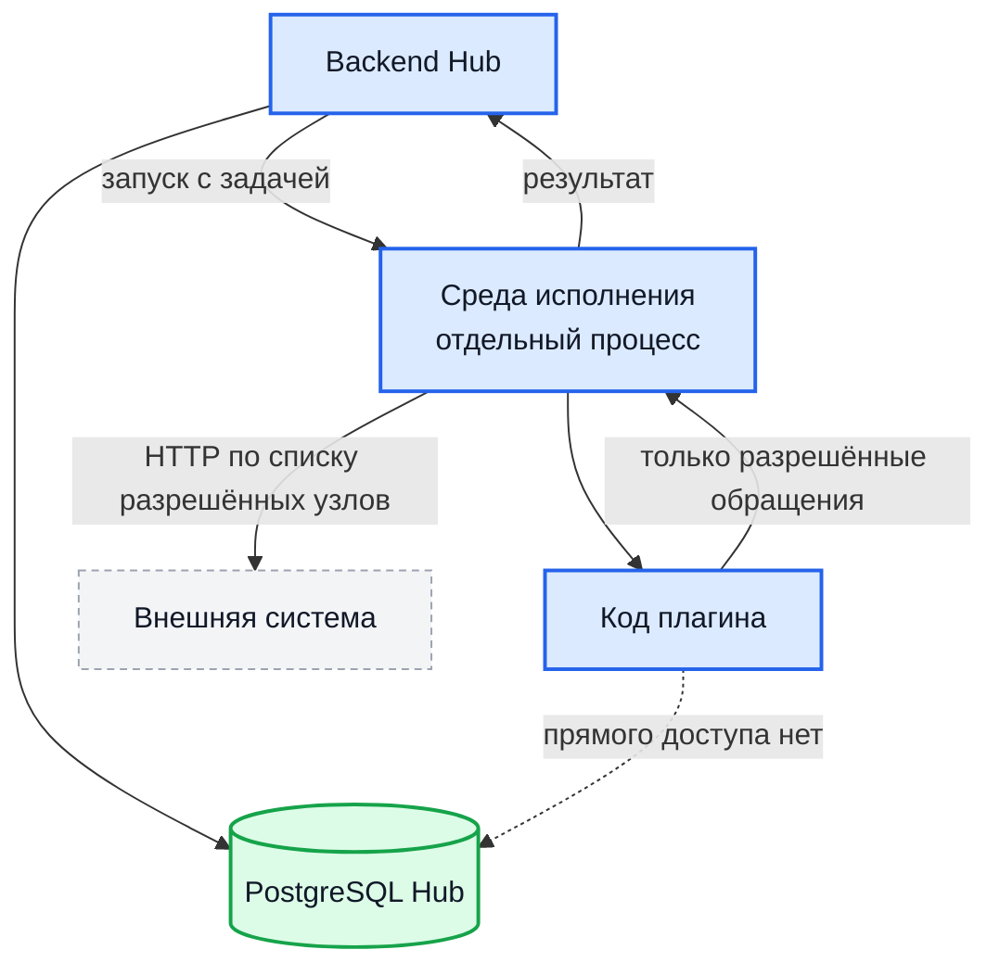

# Плагины

Плагины расширяют Hub, не требуя его пересборки: добавляют сведения к
находкам из ваших систем учёта, приносят находки из внешних источников,
добавляют каналы уведомлений и провайдеров учёта задач.

Главное свойство: **плагин исполняется в отдельном процессе**, а не внутри
backend. У него нет прямого доступа к базе данных Hub, и всё общение с
внешним миром идёт через фиксированный набор обращений к среде исполнения.

С 0.33 плагины несут интеграции целиком: шесть каналов уведомлений, три
провайдера задач, обогащение и источники находок — всё это плагины, а не код
ядра.

## Что умеют плагины

| Возможность | Что делает | Плагины в поставке |
| --- | --- | --- |
| `finding_enricher` — обогащение находок | Добавляет находке метки по данным внешней системы | БДУ ФСТЭК, Threat Intelligence, Metabase CMDB |
| `finding_source` — источник находок | Периодически опрашивает внешнюю систему и приносит из неё находки | FleetDM |
| Канал уведомлений | Добавляет способ доставки уведомлений | Telegram, Slack, Microsoft Teams, Mattermost, MAX, почта |
| `ticketing_provider` — учёт задач | Заводит и ведёт задачи во внешнем трекере | Jira, GitHub Issues, Trello |

Подробности по каналам — в [Уведомлениях](integration-notifications.md), по
задачам — в [Учёте задач](integration-jira.md).

## Два способа исполнения

| | Tier 1 — WASM | Tier 2 — нативный |
| --- | --- | --- |
| Как исполняется | Модуль WebAssembly в песочнице внутри среды исполнения | Отдельный процесс, общение по gRPC |
| Доступ к системе | Только через обращения к среде исполнения | Только через обращения к среде исполнения, плюс изоляция средствами ОС |
| Когда используется | Обогащение, простые источники | Каналы уведомлений, провайдеры задач, тяжёлые источники |
| Разрешение оператора | Не требуется | **Требуется**: источнику каталога отдельно разрешается исполнение нативных плагинов |

!!! warning "Нативный плагин исполняется вне песочницы WASM"

    Поэтому разрешение на нативные плагины — решение о доверии, и Hub не
    принимает его за оператора. На свежей инсталляции официальный каталог
    подключён, а нативные плагины (все шесть каналов уведомлений, все три
    провайдера задач) видны, но **не ставятся**, пока источнику не выдано
    разрешение. Отказ не молчаливый: такие записи в каталоге помечены, кнопка
    установки выключена, а карточка объясняет причину и куда нажать.

    Выдача и отзыв разрешения записываются в журнал аудита.

## Модель изоляции

Плагину доступен фиксированный набор обращений к среде исполнения:

| Обращение | Назначение |
| --- | --- |
| Выполнить HTTP-запрос | Единственный способ обратиться наружу |
| Получить секрет | Токен доступа к внешней системе |
| Получить секрет проекта | Тот же механизм, но со значением, заданным для конкретного проекта |
| Отправить письмо | Отправку выполняет Hub; плагин не называет SMTP-сервер и не может доставить письмо чужому адресату |
| Спросить, известен ли CVE | Плагин узнаёт, что Hub уже знает, и не резолвит это заново. В ответе только идентификаторы, без значений |
| Записать сообщение в журнал | Диагностика |

Секрет выдаётся **под конкретное событие**: для какого проекта его сейчас
можно прочитать, решает Hub, а не плагин. Значения секретов вычищаются из
журналов и записей аудита точной заменой, а не по образцу.

Исходящие обращения ограничены:

- по умолчанию запрещены схема `http` и обращения к локальным и внутренним
  адресам — это защита от подделки запросов на стороне сервера;
- разрешённые узлы задаются либо в описании плагина, либо через его
  настройки: если адрес внешней системы вводит администратор (как
  `mattermost_base_url` у Mattermost), он же и становится разрешённым;
- ослабить ограничения можно переменными `PLUGIN_EGRESS_ALLOW_HTTP`,
  `PLUGIN_EGRESS_ALLOW_LOCAL_DIAL`, `PLUGIN_EGRESS_ALLOWLIST` — делайте это
  осознанно.

Секреты плагина хранятся отдельно от его обычных настроек: поля, помеченные
как секретные, нельзя записать через обычное сохранение настроек — попытка
отклоняется.

## Каталог и установка

Плагины распространяются как артефакты реестра образов, подписанные ключом
издателя.

!!! note "Официальный каталог подключён из коробки"

    Источник `hub-official` заводится при установке и обновлении —
    регистрировать его руками не нужно. Инсталляции, зарегистрировавшие тот же
    каталог раньше, дубля не получают; удалённая запись при следующем
    обновлении не возвращается. Разрешение на нативные плагины при этом **не
    выдаётся** — см. выше.

Порядок работы:

1. **Просмотреть каталог.** Раздел плагинов в административном интерфейсе:
   список с описаниями, поиском и панелью подробностей — там же видны
   координаты артефакта и история версий.
2. **Установить плагин.** Проверяются подпись, совместимость с этой версией
   Hub и версия артефакта. Несовместимый плагин отклоняется при установке, а
   не при первом вызове.
3. **Заполнить настройки и секреты**, затем включить плагин. Плагин проверяет
   свою конфигурацию при сохранении — ошибка видна сразу, а не при первой
   доставке.

Дополнительно:

- **Выбор версии и откат.** Запись каталога несёт всю историю
  (`available_versions`); в панели подробностей можно поставить конкретную
  версию. Понижение требует подтверждения: более старая версия могла быть
  отозвана из-за уязвимости, и защита от отката для неё снимается. У записи без
  истории выбор не показывается.
- **Установка из файла** (sideload) — для закрытых контуров и отладки.
- **Отзыв подписи по digest'у**: отозванный артефакт не ставится, а перечень
  отзывов можно перечитать внеочередным запросом.
- Свои источники каталога добавляются рядом с официальным; ограничения на них
  задают `PLUGIN_CATALOG_ALLOW_HTTP`, `PLUGIN_CATALOG_ALLOW_LOCAL_DIAL`,
  `PLUGIN_CATALOG_ALLOWLIST`, а на загрузку самих артефактов — `PLUGIN_OCI_*`.

!!! note "Изменение набора возможностей при обновлении"

    Если новая версия плагина заявляет возможности, которых не было у
    установленной, обновление не применяется молча — требуется явное
    подтверждение администратора
    (`POST /api/v1/admin/installed-plugins/<id>/acknowledge-capability-change`).
    Так обновление не может незаметно расширить права плагина.

## Обогащение находок

Плагин обогащения получает находку и возвращает набор меток. Метки
сохраняются у находки и доступны для отбора, поиска и правил маршрутизации.
Метки обогащения защищены от ручной правки — руками ставятся свои теги, см.
[Жизненный цикл находки](findings.md).

Запускается двумя способами:

- **автоматически** — появление находки ставит фоновую задачу обогащения;
- **вручную** — кнопкой в карточке находки
  (`POST /api/v1/findings/<id>/enrich-tags/<plugin_id>`), что удобно для
  находок, накопленных до установки плагина.

Частота ручного обогащения ограничена переменной
`ENRICH_TAGS_RATE_LIMIT_PER_MINUTE`.

Список доступных плагинов обогащения отдаёт
`GET /api/v1/plugins/capabilities/finding-enrichers`.

## Источники находок

Плагин-источник опрашивает внешнюю систему по расписанию и приносит из неё
находки. Расписание задаётся в описании плагина и переопределяется при
установке; опрос можно запустить вручную —
`POST /api/v1/admin/installed-plugins/<id>/sync-now`.

Принесённые находки проходят **тот же путь**, что и загруженные извне: та же
дедупликация, те же состояния, те же интеграции.

Проход по большому парку разбит на куски и сообщает, куда уходит время:
источник перестал быть чёрным ящиком на часы. Плагин при этом спрашивает Hub,
какие CVE тому уже известны, и тратит бюджет обогащения только на новое.

Перечень установленных источников инвентаря отдаёт
`GET /api/v1/plugins/capabilities/inventory-sources`.

!!! warning "Пустой ответ и удалённые узлы"

    Плагин-источник обязан сообщать об ошибке, если не смог опросить свою
    систему. Пустой корректный ответ означает «в системе действительно ноль
    узлов» — а это, в свою очередь, может привести к массовому закрытию
    находок как относящихся к исчезнувшим узлам.

    Hub дополнительно защищён: если опрос вернул пустой перечень, а сведения
    об узлах в базе есть, сверка исчезнувших узлов не выполняется. Но это
    вторая линия обороны, а не замена корректному поведению плагина.

## Каналы уведомлений

Плагин-канал добавляет способ доставки. Его настройки задаются **на уровне
проекта**: у разных проектов могут быть разные получатели и разные токены.

| Метод и путь | Назначение |
| --- | --- |
| `GET /api/v1/projects/<id>/plugin-channels` | Доступные каналы проекта |
| `GET /api/v1/projects/<id>/plugin-channels/<plugin_id>/config` | Настройки канала |
| `PUT /api/v1/projects/<id>/plugin-channels/<plugin_id>/config` | Изменение настроек |

Для изменения требуется право `manage_notifications`. Оно даёт доступ к
токенам ботов — выдавайте его так же осторожно, как административные права.

Секрет канала (`bot_token`, `webhook_url`) никогда не возвращается в ответах и
не затирается пустым значением при сохранении.

## Провайдеры учёта задач

Плагин-провайдер заводит задачи во внешнем трекере и ведёт их дальше: цели
заведения, шаблоны полей, привязка существующей задачи, опрос статусов,
переходы, приём вебхуков. Разбор вебхука делает плагин, решение принимает Hub.

Настройка — попроектная, из интерфейса. Подробности и порядок перехода со
встроенной интеграции Jira — в [Учёте задач](integration-jira.md).

## Настройки среды исполнения

Общие:

| Переменная | Назначение |
| --- | --- |
| `PLUGIN_RUNNER_GLOBAL_LIMIT` | Предел одновременно работающих процессов плагинов |
| `PLUGIN_RUNNER_PER_PLUGIN_LIMIT` | Предел одновременных запусков одного плагина |
| `PLUGIN_RUNNER_KEEP_WARM_SECONDS` | Сколько держать процесс готовым после работы |
| `PLUGIN_FINDING_SOURCE_SYNC_WORKERS` | Параллелизм опроса источников |
| `WASM_RUNNER_BINARY_PATH` | Путь к исполняемому файлу среды исполнения |

Число обработчиков очереди обогащения выводится из
`PLUGIN_RUNNER_PER_PLUGIN_LIMIT`: оно на единицу меньше, чтобы задачи
обогащения не занимали все доступные запуски плагина и не блокировали ручной
вызов.

Нативные плагины (Tier 2) — отдельная группа с префиксом `PLUGIN_NATIVE_`:
ограничение памяти, тайм-ауты вызова и остановки, политика перезапуска после
аварийного завершения, аренда процесса при нескольких репликах и ограничение
частоты обращений. Значения по умолчанию рассчитаны на то, что аварийно
завершающийся плагин не должен ни перезапускаться бесконечно, ни оставаться
выключенным навсегда. Полный перечень — в
[переменных Hub](env-hub.md#плагины).

## Плагины в поставке

Официальный каталог содержит тринадцать плагинов:

| Плагин | Возможность | Что делает |
| --- | --- | --- |
| `bdu-fstec-enricher` | Обогащение | Сведения из банка данных угроз ФСТЭК по номеру CVE: идентификатор БДУ, уровень опасности, статус устранения. Работает по зеркалу публичной выгрузки |
| `threat-intel-enricher` | Обогащение | CVSS и затронутые продукты, признак активной эксплуатации по каталогу CISA KEV, репутация адреса. Обращения к внешним сервисам репутации выключены по умолчанию |
| `metabase-cmdb` | Обогащение | Сведения об узле из таблицы Metabase по адресу находки: владелец, окружение, роль. Соответствие «колонка → тег» задаёт администратор |
| `fleetdm` | Источник находок | Узлы и их уязвимости из FleetDM; команды сопоставляются с продуктами, удалённый узел закрывает свои находки |
| `telegram-notifier` | Канал | Доставка через бота Telegram |
| `slack-notifier` | Канал | Входящий webhook Slack |
| `teams-notifier` | Канал | Webhook Microsoft Teams (Workflows) |
| `mattermost-notifier` | Канал | Входящий webhook Mattermost; адрес сервера задаётся при установке |
| `maxru-notifier` | Канал | Бот MAX |
| `email-notifier` | Канал | Письмо на каждого адресата; отправку выполняет Hub |
| `jira-ticketing` | Учёт задач | Задачи в Jira: шаблоны полей, курируемый список проектов, маркер против дублей, переходы, комментарии, вебхуки |
| `github-issues-ticketing` | Учёт задач | Issue в GitHub: комментарии, переходы, ссылка на форму создания |
| `trello-ticketing` | Учёт задач | Карточки Trello; «переход» выражается перемещением между списками |

Точный набор настроек каждого плагина и перечень переносимых полей заданы в
его описании в каталоге и могут отличаться между версиями.
