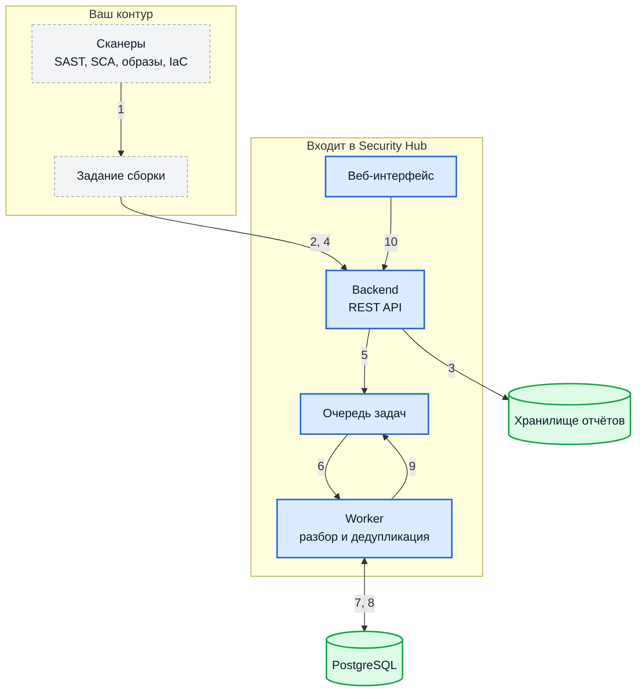
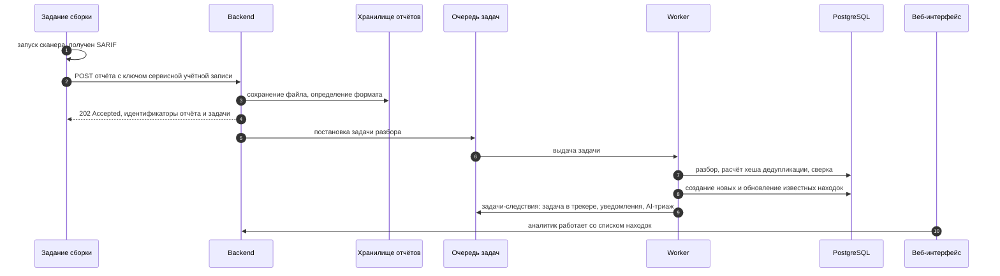
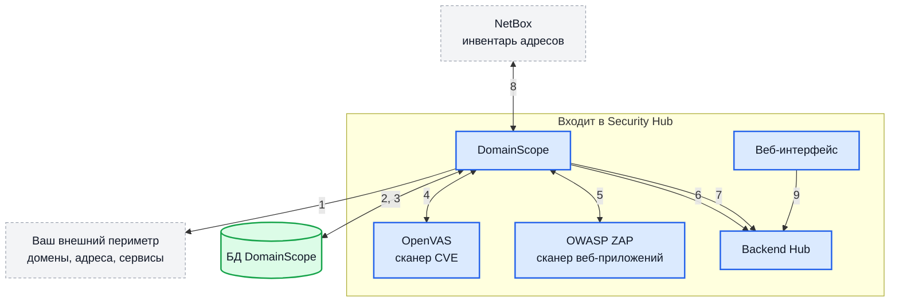
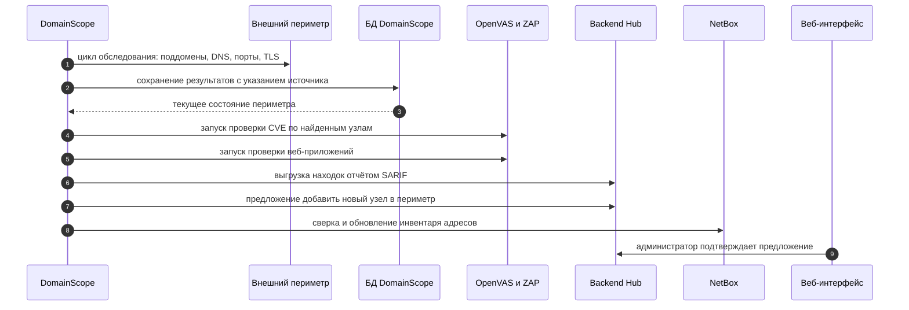
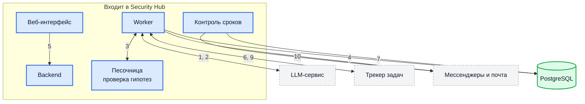
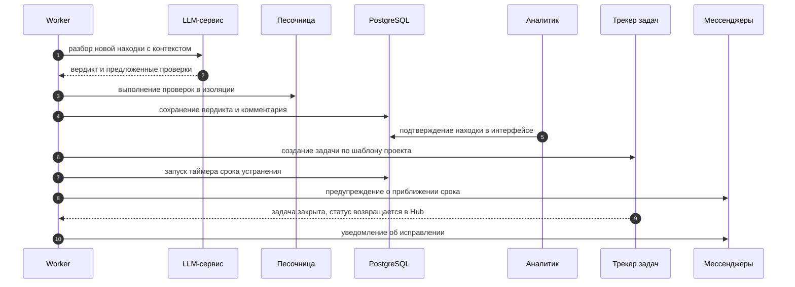
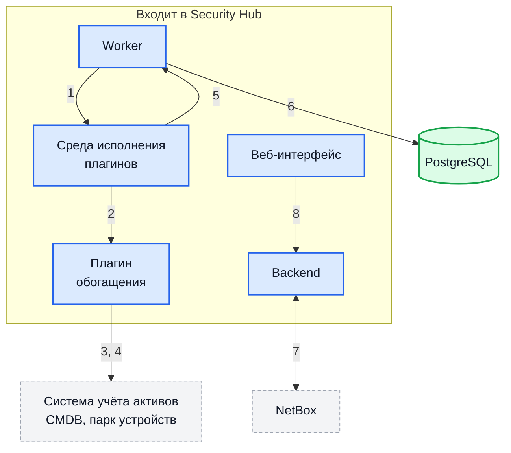
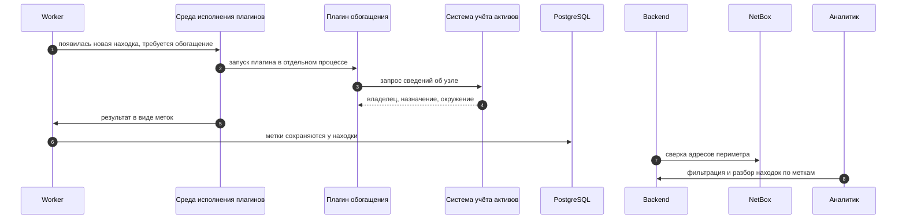

# Сценарии применения

Эта страница отвечает на вопрос «из чего складывается работающее решение
целиком» для четырёх сценариев, ради которых Security Hub обычно и внедряют.
Для каждого показано, кто с кем взаимодействует, в каком порядке и что при
этом входит в поставку, а что вы разворачиваете и администрируете сами.

Security Hub — место, где находки сводятся воедино и получают жизненный цикл.
Он не заменяет ни сканеры, ни систему сборки, ни трекер задач: без них
сценарии не работают, поэтому на схемах эти компоненты показаны явно.

!!! info "Как читать схемы"

    Одна и та же нотация используется на всех схемах ниже:

    - **Синие блоки со сплошной рамкой** — компоненты, входящие в поставку
      Security Hub: backend, worker, веб-интерфейс, DomainScope, плагины.
    - **Серые блоки с пунктирной рамкой** — то, что вы разворачиваете и
      администрируете сами: система сборки и её сканеры, трекер задач, мессенджеры,
      провайдер SSO, NetBox, LLM-сервис.
    - **Блоки-цилиндры** — хранилища данных.

    Двусторонние обмены показаны одной стрелкой с двумя номерами (например
    «4, 7»), а порядок шагов — отдельной схемой последовательности: так на
    структурной схеме не возникает пересечений. Номера шагов совпадают на
    обеих схемах и в таблице под ними.

    Backend, worker и база данных во всех сценариях одни и те же и
    разворачиваются один раз — см. [Развёртывание](prerequisites.md).

## Сценарий 1. Консолидация находок из системы сборки

Самый частый сценарий. У команды уже есть сканеры в конвейере сборки:
статический анализ, проверка зависимостей, образов контейнеров,
конфигураций инфраструктуры. Каждый пишет свой отчёт, и никто не видит общей
картины. Security Hub становится единой точкой: конвейер отправляет отчёт,
Hub разбирает его, убирает дубликаты и ведёт находки дальше.

### Кто с кем взаимодействует

### В каком порядке это происходит

### Расшифровка шагов

| Шаг | Что происходит |
| --- | --- |
| 1 | Задание сборки запускает сканер и получает отчёт в формате SARIF 2.1.0. Поддерживается также прямой приём формата выгрузки SonarQube. |
| 2 | Задание отправляет файл на `POST /api/v1/products/<id>/reports` с заголовком `X-API-Key`. Ключ принадлежит сервисной учётной записи с правом загрузки в этот продукт. |
| 3 | Backend проверяет ключ и права, сохраняет файл в хранилище отчётов и определяет формат — по явному полю `format` либо по содержимому. |
| 4 | Backend сразу отвечает `202 Accepted` и возвращает идентификатор отчёта и идентификатор фоновой задачи. Обработка асинхронная: счётчиков найденного в этом ответе нет. |
| 5 | Backend создаёт запись отчёта в состоянии «ожидает» и ставит задачу разбора в очередь. |
| 6 | Worker забирает задачу из очереди. |
| 7 | Worker разбирает файл под [жёсткими лимитами](integration-sarif.md#жёсткие-лимиты-безопасности) и для каждого результата считает хеш дедупликации по правилу и местоположению — имя сканера в хеш не входит. |
| 8 | Находки, которых ещё не было, создаются со статусом «новая»; уже известные обновляются, к ним добавляется ещё один источник. |
| 9 | Worker ставит в очередь задачи-следствия: создание задачи в трекере, уведомления, разбор языковой моделью — каждая только если соответствующая интеграция включена. |
| 10 | Аналитик видит находки в интерфейсе: подтверждает, отклоняет как ложное срабатывание, назначает срок, передаёт в работу. |

### Что нужно с вашей стороны

- Сканеры, умеющие выгружать SARIF. Формат стандартный: его поддерживают
  распространённые инструменты статического анализа, проверки зависимостей,
  образов и конфигураций.
- Сервисная учётная запись в Hub и ключ к ней, положенный в защищённые
  переменные вашей системы сборки. Ключ показывается один раз при создании.
- Продукт в Hub, в который загружаются отчёты. Продукты группируются в
  проекты; права выдаются на любом из двух уровней.

Подробности настройки: [Загрузка SARIF](integration-sarif.md).

## Сценарий 2. Непрерывное обследование внешнего периметра

Второй сценарий не требует ни системы сборки, ни собственных сканеров.
DomainScope самостоятельно обследует периметр по заданному списку доменов и
диапазонов адресов: находит поддомены, проверяет, что за ними отвечает,
сканирует порты, сертификаты и веб-приложения — и отдаёт результат в Hub тем
же способом, что и внешние сканеры, в формате SARIF.

Отдельно DomainScope предлагает расширить периметр: обнаружив адрес или домен,
которого нет в списке, он отправляет предложение, а администратор Hub
подтверждает или отклоняет его в интерфейсе. Периметр не расширяется
автоматически.

### Кто с кем взаимодействует

### В каком порядке это происходит

### Расшифровка шагов

| Шаг | Что происходит |
| --- | --- |
| 1 | DomainScope по расписанию обходит периметр: перебирает поддомены, разрешает имена, сканирует порты, снимает параметры TLS-сертификатов. Периодичность каждого цикла настраивается отдельно. |
| 2 | Результаты сохраняются в собственную базу DomainScope с пометкой, откуда узел стал известен, — это позволяет потом разобраться в происхождении каждой записи. |
| 3 | Следующий цикл сверяется с сохранённым состоянием и видит изменения: появившийся порт, исчезнувший узел, истекающий сертификат. |
| 4 | По найденным узлам запускается проверка известных уязвимостей через OpenVAS. |
| 5 | По найденным веб-сервисам запускается активная проверка через OWASP ZAP. |
| 6 | DomainScope формирует отчёт SARIF и загружает его в Hub — тем же эндпоинтом и с тем же видом ключа, что и любой внешний сканер. Дальше находка проходит тот же путь, что в сценарии 1. |
| 7 | Обнаружив узел вне заданного периметра, DomainScope отправляет предложение о его добавлении. |
| 8 | Опционально: DomainScope сверяется с NetBox — берёт оттуда адреса и зоны как источник периметра и возвращает обнаруженное. |
| 9 | Администратор Hub видит предложение в интерфейсе и принимает решение. Периметр не расширяется без подтверждения. |

### Что нужно с вашей стороны

- Отдельный экземпляр PostgreSQL для DomainScope — с базой Hub он не
  разделяется.
- Разрешённый исходящий доступ к обследуемому периметру и, если сканеры
  обновляют свои базы, к источникам обновлений.
- Согласование факта активного сканирования: OpenVAS и OWASP ZAP выполняют
  активные проверки, а не только наблюдение.

Подробности: [Обзор DomainScope](domainscope-overview.md),
[Управление сканерами](domainscope-scanners.md).

## Сценарий 3. Триаж, задачи и контроль сроков

Находка сама по себе ничего не меняет. Этот сценарий — про то, что происходит
между «сканер что-то сообщил» и «проблема устранена»: кто разбирает поток,
как отсеивается шум, как работа попадает к исполнителю и что происходит,
когда срок выходит.

Все три механизма — разбор языковой моделью, задачи в трекере и уведомления —
включаются независимо друг от друга. Ни один не включён по умолчанию.

### Кто с кем взаимодействует

### В каком порядке это происходит

### Расшифровка шагов

| Шаг | Что происходит |
| --- | --- |
| 1 | Если разбор языковой моделью включён, worker отправляет ей находку с контекстом: правило, местоположение, фрагмент кода или параметры сервиса. |
| 2 | Модель возвращает вердикт — например, «похоже на ложное срабатывание» с оценкой уверенности — и, при необходимости, набор проверок, которые подтвердили бы или опровергли догадку. |
| 3 | Проверки выполняются в изолированной песочнице с ограниченным набором разрешённых команд, лимитом времени и лимитом объёма вывода. Сама модель ничего не запускает. |
| 4 | Вердикт и обоснование сохраняются как комментарий к находке. Автоматически статус меняется только у находок, которых ещё не касался человек. |
| 5 | Аналитик просматривает находку и принимает решение: подтвердить, отклонить как ложное срабатывание, принять риск на срок, отложить до внешнего события. |
| 6 | При подтверждении, если проект привязан к провайдеру задач, worker создаёт задачу по шаблону проекта. Цель заведения выбирается из курируемого списка, тип задачи может зависеть от того, какой сканер нашёл проблему. Повторное заведение исключено маркером в самой задаче. |
| 7 | С переходом в работу запускается таймер срока устранения. Срок зависит от критичности и настроек проекта. |
| 8 | При приближении срока и при его нарушении отправляются уведомления в настроенные каналы. |
| 9 | Закрытие задачи возвращается в Hub двумя путями: вебхуком от трекера и опросом статусов по расписанию — второй работает и в закрытом контуре, где трекер до Hub не дотягивается. |
| 10 | Об исправлении отправляется уведомление; закрытые за период находки могут собираться в сводку. |

### Что нужно с вашей стороны

- **Для разбора языковой моделью** — доступ к LLM-сервису, совместимому по
  API, и решение о том, какие данные о находках допустимо ему передавать. В
  промышленной среде адрес сервиса обязан использовать `https`.
- **Для задач** — установленный плагин провайдера (Jira, GitHub Issues,
  Trello), учётная запись с правом создавать задачи в нужных целях и шаблон
  задачи. Плагин ходит только к адресам, объявленным в его описании или
  заданным администратором при установке: локальные и внутренние адреса
  запрещены по умолчанию — это защита от подделки запросов на стороне сервера.
- **Для уведомлений** — установленный плагин канала и его настройки в проекте:
  бот Telegram или MAX, входящий webhook Slack, Teams или Mattermost либо
  параметры SMTP.

Оба вида плагинов — нативные, поэтому источнику каталога нужно разрешение на
исполнение нативных плагинов.

Подробности: [AI-триаж и песочница](integration-llm.md),
[Учёт задач](integration-jira.md), [Уведомления](integration-notifications.md),
[Плагины](plugins.md).

## Сценарий 4. Связь находок с инвентарём

Находка «на адресе 203.0.113.10 открыт порт 8080 с известной уязвимостью»
превращается в работу только тогда, когда понятно, чей это узел, что на нём
крутится и кому писать. Эти сведения лежат не в сканере, а в системе учёта
активов — NetBox, CMDB, системе управления парком устройств.

Security Hub забирает их двумя способами: собственной интеграцией с NetBox и
плагинами, которые исполняются в изолированном процессе и общаются с внешними
системами через ограниченный набор разрешённых обращений.

### Кто с кем взаимодействует

### В каком порядке это происходит

### Расшифровка шагов

| Шаг | Что происходит |
| --- | --- |
| 1 | Появление находки ставит фоновую задачу обогащения. Обогащение можно запустить и вручную для уже существующих находок. |
| 2 | Плагин запускается **в отдельном процессе**, а не внутри backend. Прямого доступа к базе данных Hub у него нет. |
| 3 | Всё общение с внешним миром идёт через фиксированный набор из четырёх обращений к среде исполнения: выполнить HTTP-запрос, получить секрет, получить секрет проекта, записать сообщение в журнал. Адреса, к которым плагину разрешено обращаться, ограничены списком; секреты выдаются по запросу и в самом плагине не хранятся. |
| 4 | Система учёта возвращает сведения об узле: владелец, назначение, окружение. |
| 5 | Плагин возвращает результат в виде меток. |
| 6 | Метки сохраняются у находки и становятся доступны для фильтрации, поиска и правил маршрутизации. |
| 7 | Параллельно работает собственная интеграция с NetBox: адреса и зоны оттуда служат источником периметра, а в карточке находки адрес становится ссылкой на поиск в NetBox. |
| 8 | Аналитик отбирает находки по владельцу, окружению или назначению узла — а не только по критичности. |

### Что нужно с вашей стороны

- Система учёта активов с доступным API и учётная запись только на чтение.
- Решение о том, какие поля из неё допустимо переносить в Hub.
- Для NetBox — токен доступа и договорённость о метках, по которым
  различаются учтённые и обнаруженные адреса.

Подробности: [Плагины](plugins.md), [NetBox](integration-netbox.md),
[Происхождение записей](domainscope-trails.md).
